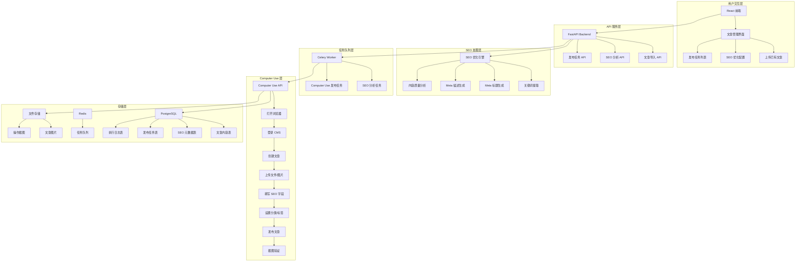

# CMS 自动化系统 - Computer Use 重构方案

**文档版本**: v1.0
**创建日期**: 2025-10-25
**核心目标**: SEO 优化现有内容 + Computer Use 自动发布

---

## 执行摘要

### 🎯 核心需求确认

根据您的明确要求：

1. ✅ **核心功能**: SEO 优化现有文章内容
2. ✅ **技术方案**: 必须使用 Computer Use API
3. ✅ **主要工作流**:
   - 分析现有文章内容
   - 提取/生成 SEO 关键词
   - 生成优化的 meta 标题和描述
   - 通过 Computer Use 操作浏览器发布
   - 支持文件上传（图片等）

4. ❌ **非核心**: AI 生成新文章内容

### 📊 与现有实现的关系

```
现有实现 (FastAPI + Messages API)
    ↓
保留部分基础设施:
    ✅ PostgreSQL 数据库
    ✅ Celery 任务队列
    ✅ React 前端（需重构）
    ✅ Docker 部署
    ↓
重构核心业务逻辑:
    ❌ 删除 Messages API 文章生成
    ❌ 删除 WordPress REST API 集成
    ❌ 删除自动标签功能
    ↓
新增 Computer Use 功能:
    ✅ SEO 关键词提取引擎
    ✅ Computer Use API 集成
    ✅ 浏览器自动化流程
    ✅ 截图验证机制
    ✅ 文件上传处理
```

---

## 一、系统架构设计

### 1.1 整体架构图



### 1.2 核心组件

| 组件 | 技术栈 | 职责 | 状态 |
|------|--------|------|------|
| **前端界面** | React + TypeScript | 文章管理、任务监控 | 需重构 |
| **API 服务** | FastAPI | REST API 接口 | 保留框架 |
| **SEO 引擎** | Python + Claude API | 关键词提取、元数据生成 | **新增** ✨ |
| **Computer Use** | Anthropic SDK | 浏览器自动化 | **新增** ✨ |
| **任务队列** | Celery + Redis | 异步任务处理 | 保留 |
| **数据库** | PostgreSQL | 数据持久化 | 重构表结构 |
| **文件存储** | 本地/S3 | 文章图片、截图 | **新增** ✨ |

---

## 二、核心工作流程

### 2.1 完整业务流程

```
第一步: 导入已有文章
┌─────────────────────────────────────────┐
│ 用户操作                                 │
│ • 批量上传文章（CSV/JSON/数据库导入）    │
│ • 或手动粘贴文章内容                     │
│ • 附带图片文件（可选）                   │
└──────────────┬──────────────────────────┘
               ↓
┌─────────────────────────────────────────┐
│ 系统处理                                 │
│ • 解析文章结构（标题、正文、图片）       │
│ • 存储到数据库 (articles 表)             │
│ • 上传图片到文件存储                     │
│ • 状态: imported                         │
└──────────────┬──────────────────────────┘
               ↓

第二步: SEO 分析与优化
┌─────────────────────────────────────────┐
│ 用户操作                                 │
│ • 选择文章并点击"SEO 优化"               │
│ • 或批量选择多篇文章                     │
└──────────────┬──────────────────────────┘
               ↓
┌─────────────────────────────────────────┐
│ Celery 任务: seo_analysis_task           │
│                                          │
│ 1. 内容分析                              │
│    • 提取主题关键词（5-10 个）           │
│    • 识别核心概念                        │
│    • 分析内容长度和结构                  │
│                                          │
│ 2. Claude API 生成优化元数据              │
│    • SEO 标题（50-60 字符）              │
│    • Meta 描述（150-160 字符）           │
│    • 建议的 Focus Keyword                │
│    • 相关长尾关键词                      │
│                                          │
│ 3. 保存结果                              │
│    • 更新 seo_metadata 表                │
│    • 状态: seo_optimized                 │
└──────────────┬──────────────────────────┘
               ↓

第三步: 审核与调整
┌─────────────────────────────────────────┐
│ 用户操作                                 │
│ • 查看 SEO 优化建议                      │
│ • 手动修改 SEO 字段（可选）              │
│ • 批准发布                               │
└──────────────┬──────────────────────────┘
               ↓

第四步: Computer Use 自动发布
┌─────────────────────────────────────────┐
│ Celery 任务: computer_use_publish_task   │
│                                          │
│ 1. 启动 Computer Use 会话                │
│    • 启动 Chrome 浏览器                  │
│    • 设置屏幕分辨率 1920x1080            │
│                                          │
│ 2. 登录 WordPress (或其他 CMS)           │
│    • 导航到登录页                        │
│    • 输入用户名/密码                     │
│    • 等待登录成功                        │
│    • 截图: login_success.png             │
│                                          │
│ 3. 创建新文章                            │
│    • 点击 "新建文章"                     │
│    • 等待编辑器加载                      │
│    • 截图: editor_loaded.png             │
│                                          │
│ 4. 填写内容                              │
│    • 标题栏: 粘贴标题                    │
│    • 正文区: 粘贴 HTML 内容              │
│    • 等待内容加载完成                    │
│    • 截图: content_filled.png            │
│                                          │
│ 5. 上传图片（如有）                      │
│    • 点击 "添加媒体" 按钮                │
│    • 选择文件上传                        │
│    • 等待上传完成                        │
│    • 插入到文章中                        │
│    • 截图: images_uploaded.png           │
│                                          │
│ 6. 填写 SEO 字段                         │
│    • 滚动到 Yoast SEO / Rank Math 插件   │
│    • SEO 标题: 粘贴优化的标题            │
│    • Meta 描述: 粘贴优化的描述           │
│    • Focus 关键词: 填写主关键词          │
│    • 截图: seo_fields_filled.png         │
│                                          │
│ 7. 设置分类和标签                        │
│    • 勾选相关分类                        │
│    • 添加标签                            │
│    • 截图: taxonomy_set.png              │
│                                          │
│ 8. 发布文章                              │
│    • 点击 "发布" 按钮                    │
│    • 确认发布                            │
│    • 等待发布成功提示                    │
│    • 截图: published_success.png         │
│                                          │
│ 9. 验证并记录                            │
│    • 获取文章 URL                        │
│    • 访问文章页面验证                    │
│    • 截图: article_live.png              │
│    • 保存所有截图到数据库                │
│    • 更新状态: published                 │
└──────────────┬──────────────────────────┘
               ↓

第五步: 完成与报告
┌─────────────────────────────────────────┐
│ 系统输出                                 │
│ • 发布成功通知                           │
│ • 文章 URL                               │
│ • 操作日志和截图                         │
│ • 性能指标（耗时、成本）                 │
└─────────────────────────────────────────┘
```

---

## 三、数据库设计

### 3.1 核心表结构

#### articles 表（文章内容）
```sql
CREATE TABLE articles (
    id SERIAL PRIMARY KEY,

    -- 基础信息
    title VARCHAR(500) NOT NULL,
    content TEXT NOT NULL,              -- HTML 或 Markdown
    excerpt TEXT,                       -- 摘要
    author_name VARCHAR(200),
    source VARCHAR(200),                -- 来源（如 "外包作者"）

    -- 分类和标签
    category VARCHAR(100),
    tags TEXT[],                        -- 数组类型

    -- 媒体文件
    featured_image_path VARCHAR(500),
    additional_images JSONB,            -- 额外图片列表

    -- 状态跟踪
    status VARCHAR(50) DEFAULT 'imported',
    -- imported: 已导入
    -- seo_optimized: SEO 已优化
    -- ready_to_publish: 等待发布
    -- publishing: 发布中
    -- published: 已发布
    -- failed: 发布失败

    -- 发布信息
    published_url VARCHAR(500),
    cms_post_id VARCHAR(100),           -- CMS 中的文章 ID

    -- 时间戳
    created_at TIMESTAMP DEFAULT NOW(),
    updated_at TIMESTAMP DEFAULT NOW(),
    published_at TIMESTAMP,

    -- 元数据
    metadata JSONB                      -- 其他自定义字段
);

-- 索引
CREATE INDEX idx_articles_status ON articles(status);
CREATE INDEX idx_articles_created_at ON articles(created_at);
```

#### seo_metadata 表（SEO 元数据）
```sql
CREATE TABLE seo_metadata (
    id SERIAL PRIMARY KEY,
    article_id INTEGER REFERENCES articles(id) ON DELETE CASCADE,

    -- SEO 核心字段
    seo_title VARCHAR(60) NOT NULL,              -- 优化的 SEO 标题
    meta_description VARCHAR(160) NOT NULL,      -- Meta 描述
    focus_keyword VARCHAR(100),                  -- 主关键词

    -- 关键词列表
    primary_keywords TEXT[],                     -- 主要关键词（3-5 个）
    secondary_keywords TEXT[],                   -- 次要关键词（5-10 个）
    long_tail_keywords TEXT[],                   -- 长尾关键词

    -- SEO 分析结果
    keyword_density JSONB,                       -- 关键词密度分析
    -- {
    --   "React": 2.5,
    --   "state management": 1.8,
    --   ...
    -- }

    readability_score FLOAT,                     -- 可读性评分
    content_quality_score FLOAT,                 -- 内容质量评分

    -- AI 生成信息
    generated_by VARCHAR(50) DEFAULT 'claude',   -- AI 模型
    generation_cost DECIMAL(10, 4),              -- 生成成本
    generation_tokens INTEGER,

    -- 优化建议
    suggestions JSONB,                           -- SEO 优化建议
    -- {
    --   "title_length": "optimal",
    --   "keyword_placement": "good",
    --   "suggestions": ["添加更多内链", "增加图片 alt 文本"]
    -- }

    -- 时间戳
    created_at TIMESTAMP DEFAULT NOW(),
    updated_at TIMESTAMP DEFAULT NOW(),

    -- 约束
    CONSTRAINT unique_article_seo UNIQUE(article_id)
);
```

#### publish_tasks 表（发布任务）
```sql
CREATE TABLE publish_tasks (
    id SERIAL PRIMARY KEY,
    article_id INTEGER REFERENCES articles(id) ON DELETE CASCADE,

    -- 任务信息
    task_id VARCHAR(100) UNIQUE,                 -- Celery 任务 ID
    cms_type VARCHAR(50) DEFAULT 'wordpress',    -- CMS 类型
    cms_url VARCHAR(500) NOT NULL,               -- CMS 地址

    -- 任务状态
    status VARCHAR(50) DEFAULT 'pending',
    -- pending: 等待执行
    -- running: 执行中
    -- screenshot_saved: 截图已保存
    -- completed: 成功
    -- failed: 失败
    -- retrying: 重试中

    -- 执行信息
    retry_count INTEGER DEFAULT 0,
    max_retries INTEGER DEFAULT 3,
    error_message TEXT,

    -- Computer Use 会话信息
    session_id VARCHAR(100),
    screenshots JSONB,                           -- 截图列表
    -- [
    --   {"step": "login", "path": "screenshots/xxx_login.png", "timestamp": "..."},
    --   {"step": "content_filled", "path": "screenshots/xxx_content.png", ...}
    -- ]

    -- 性能指标
    started_at TIMESTAMP,
    completed_at TIMESTAMP,
    duration_seconds INTEGER,

    -- 时间戳
    created_at TIMESTAMP DEFAULT NOW(),
    updated_at TIMESTAMP DEFAULT NOW()
);

-- 索引
CREATE INDEX idx_publish_tasks_status ON publish_tasks(status);
CREATE INDEX idx_publish_tasks_article ON publish_tasks(article_id);
```

#### execution_logs 表（执行日志）
```sql
CREATE TABLE execution_logs (
    id SERIAL PRIMARY KEY,
    task_id INTEGER REFERENCES publish_tasks(id) ON DELETE CASCADE,

    -- 日志信息
    log_level VARCHAR(20),                       -- INFO, WARNING, ERROR
    step_name VARCHAR(100),                      -- 步骤名称
    message TEXT,
    details JSONB,                               -- 详细信息

    -- Computer Use 操作记录
    action_type VARCHAR(50),                     -- click, type, screenshot, wait
    action_target VARCHAR(200),                  -- 操作目标（如 "login button"）
    action_result VARCHAR(50),                   -- success, failed, timeout

    -- 截图
    screenshot_path VARCHAR(500),

    -- 时间戳
    created_at TIMESTAMP DEFAULT NOW()
);

-- 索引
CREATE INDEX idx_execution_logs_task ON execution_logs(task_id);
CREATE INDEX idx_execution_logs_level ON execution_logs(log_level);
```

---

## 四、SEO 优化引擎设计

### 4.1 SEO 分析服务 (backend/src/services/seo_optimizer/)

#### seo_analyzer.py
```python
"""
SEO 关键词提取和元数据生成服务
"""

from typing import Dict, List, Optional
import anthropic
from bs4 import BeautifulSoup
import re
from collections import Counter

class SEOAnalyzer:
    def __init__(self, anthropic_client: anthropic.AsyncAnthropic):
        self.client = anthropic_client

    async def analyze_article(
        self,
        title: str,
        content: str,
        target_audience: Optional[str] = None
    ) -> Dict:
        """
        分析文章并生成 SEO 优化建议

        Args:
            title: 原始文章标题
            content: 文章内容（HTML 或纯文本）
            target_audience: 目标受众（可选）

        Returns:
            {
                "seo_title": "优化的 SEO 标题",
                "meta_description": "Meta 描述",
                "focus_keyword": "主关键词",
                "primary_keywords": ["关键词1", "关键词2", ...],
                "secondary_keywords": [...],
                "long_tail_keywords": [...],
                "keyword_density": {"keyword": 2.5, ...},
                "readability_score": 8.5,
                "suggestions": [...]
            }
        """

        # 1. 清理 HTML，提取纯文本
        clean_text = self._clean_html(content)

        # 2. 提取关键词（基础方法）
        basic_keywords = self._extract_keywords(clean_text)

        # 3. 使用 Claude API 进行深度分析
        seo_data = await self._generate_seo_metadata(
            title=title,
            content=clean_text,
            basic_keywords=basic_keywords,
            target_audience=target_audience
        )

        # 4. 分析关键词密度
        seo_data["keyword_density"] = self._analyze_keyword_density(
            clean_text,
            seo_data["primary_keywords"]
        )

        # 5. 可读性评分
        seo_data["readability_score"] = self._calculate_readability(clean_text)

        # 6. SEO 建议
        seo_data["suggestions"] = self._generate_suggestions(seo_data, clean_text)

        return seo_data

    def _clean_html(self, html_content: str) -> str:
        """清理 HTML 标签，提取纯文本"""
        soup = BeautifulSoup(html_content, 'html.parser')

        # 移除 script 和 style 标签
        for script in soup(["script", "style"]):
            script.decompose()

        text = soup.get_text()

        # 清理多余空格
        lines = (line.strip() for line in text.splitlines())
        chunks = (phrase.strip() for line in lines for phrase in line.split("  "))
        text = ' '.join(chunk for chunk in chunks if chunk)

        return text

    def _extract_keywords(self, text: str, top_n: int = 20) -> List[str]:
        """
        基础关键词提取（基于词频）
        使用简单的词频统计 + 停用词过滤
        """
        # 转小写
        text = text.lower()

        # 移除标点
        text = re.sub(r'[^\w\s]', ' ', text)

        # 分词
        words = text.split()

        # 停用词（简化版，实际应用需要完整列表）
        stop_words = {
            'the', 'a', 'an', 'and', 'or', 'but', 'in', 'on', 'at',
            'to', 'for', 'of', 'with', 'by', 'from', 'as', 'is',
            'was', 'are', 'been', 'be', 'have', 'has', 'had',
            'this', 'that', 'these', 'those', 'it', 'its', 'they'
        }

        # 过滤停用词和短词
        filtered_words = [
            word for word in words
            if word not in stop_words and len(word) > 3
        ]

        # 词频统计
        word_freq = Counter(filtered_words)

        # 返回 top N 关键词
        return [word for word, _ in word_freq.most_common(top_n)]

    async def _generate_seo_metadata(
        self,
        title: str,
        content: str,
        basic_keywords: List[str],
        target_audience: Optional[str]
    ) -> Dict:
        """
        使用 Claude API 生成高质量 SEO 元数据
        """

        # 截取内容前 2000 字符（避免超过 token 限制）
        content_preview = content[:2000] if len(content) > 2000 else content

        prompt = f"""
你是一位专业的 SEO 专家。请分析以下文章并生成优化的 SEO 元数据。

**原始标题**: {title}

**文章内容预览**:
{content_preview}

**初步关键词**: {', '.join(basic_keywords[:10])}

{"**目标受众**: " + target_audience if target_audience else ""}

请提供以下 SEO 优化建议：

1. **SEO 优化标题** (50-60 字符)
   - 必须包含主关键词
   - 吸引点击
   - 清晰描述内容

2. **Meta 描述** (150-160 字符)
   - 包含主关键词
   - 吸引用户点击
   - 准确总结内容

3. **主关键词** (Focus Keyword)
   - 最核心的一个关键词或短语

4. **主要关键词** (3-5 个)
   - 文章的核心主题词

5. **次要关键词** (5-10 个)
   - 相关的支持性关键词

6. **长尾关键词** (3-5 个)
   - 更具体的长尾搜索词

请以 JSON 格式返回结果：
```json
{{
  "seo_title": "优化的 SEO 标题",
  "meta_description": "Meta 描述文字",
  "focus_keyword": "主关键词",
  "primary_keywords": ["关键词1", "关键词2", "关键词3"],
  "secondary_keywords": ["词1", "词2", "词3", "词4", "词5"],
  "long_tail_keywords": ["长尾词1", "长尾词2", "长尾词3"]
}}
```

注意：
- SEO 标题必须在 50-60 字符之间
- Meta 描述必须在 150-160 字符之间
- 所有关键词都应该与文章内容高度相关
- 考虑搜索意图和用户需求
"""

        response = await self.client.messages.create(
            model="claude-sonnet-4-5-20250929",
            max_tokens=2000,
            messages=[{
                "role": "user",
                "content": prompt
            }]
        )

        # 提取 JSON
        response_text = response.content[0].text

        # 简单的 JSON 提取（实际应用需要更健壮的解析）
        import json
        import re

        # 尝试提取 JSON 代码块
        json_match = re.search(r'```json\s*(\{.*?\})\s*```', response_text, re.DOTALL)
        if json_match:
            json_str = json_match.group(1)
        else:
            # 尝试直接解析整个响应
            json_str = response_text

        try:
            seo_data = json.loads(json_str)

            # 验证字段长度
            if len(seo_data.get("seo_title", "")) > 60:
                seo_data["seo_title"] = seo_data["seo_title"][:60]

            if len(seo_data.get("meta_description", "")) > 160:
                seo_data["meta_description"] = seo_data["meta_description"][:160]

            return seo_data

        except json.JSONDecodeError as e:
            # 解析失败，返回基础版本
            return {
                "seo_title": title[:60],
                "meta_description": content[:160],
                "focus_keyword": basic_keywords[0] if basic_keywords else "",
                "primary_keywords": basic_keywords[:5],
                "secondary_keywords": basic_keywords[5:15],
                "long_tail_keywords": []
            }

    def _analyze_keyword_density(
        self,
        text: str,
        keywords: List[str]
    ) -> Dict[str, float]:
        """
        计算关键词密度

        Returns:
            {"关键词": 密度百分比, ...}
        """
        text_lower = text.lower()
        total_words = len(text_lower.split())

        density = {}
        for keyword in keywords:
            keyword_lower = keyword.lower()
            count = text_lower.count(keyword_lower)
            density[keyword] = round((count / total_words) * 100, 2) if total_words > 0 else 0

        return density

    def _calculate_readability(self, text: str) -> float:
        """
        计算可读性评分（Flesch Reading Ease）

        简化版本，实际应用可以使用 textstat 库
        """
        import re

        sentences = re.split(r'[.!?]+', text)
        sentences = [s.strip() for s in sentences if s.strip()]

        words = text.split()

        if len(sentences) == 0 or len(words) == 0:
            return 0

        avg_sentence_length = len(words) / len(sentences)

        # 简化的评分（实际 Flesch 公式还需要音节数）
        # 这里简单用字符数估算
        avg_word_length = sum(len(word) for word in words) / len(words)

        # 0-10 分制
        readability = 10 - (avg_sentence_length / 20) - (avg_word_length / 2)
        readability = max(0, min(10, readability))

        return round(readability, 1)

    def _generate_suggestions(self, seo_data: Dict, text: str) -> List[str]:
        """
        生成 SEO 优化建议
        """
        suggestions = []

        # 检查 SEO 标题长度
        seo_title_len = len(seo_data.get("seo_title", ""))
        if seo_title_len < 50:
            suggestions.append("SEO 标题偏短，建议增加到 50-60 字符")
        elif seo_title_len > 60:
            suggestions.append("SEO 标题偏长，建议缩减到 60 字符以内")

        # 检查 Meta 描述长度
        meta_desc_len = len(seo_data.get("meta_description", ""))
        if meta_desc_len < 150:
            suggestions.append("Meta 描述偏短，建议增加到 150-160 字符")
        elif meta_desc_len > 160:
            suggestions.append("Meta 描述偏长，建议缩减到 160 字符以内")

        # 检查关键词密度
        keyword_density = seo_data.get("keyword_density", {})
        for keyword, density in keyword_density.items():
            if density < 0.5:
                suggestions.append(f"关键词 '{keyword}' 密度偏低 ({density}%)，建议增加使用频率")
            elif density > 3.0:
                suggestions.append(f"关键词 '{keyword}' 密度偏高 ({density}%)，可能被视为关键词堆砌")

        # 检查可读性
        readability = seo_data.get("readability_score", 0)
        if readability < 5:
            suggestions.append("文章可读性较低，建议使用更简单的句子结构")

        # 检查内容长度
        word_count = len(text.split())
        if word_count < 300:
            suggestions.append(f"文章偏短 ({word_count} 字)，建议增加到至少 500 字")
        elif word_count > 3000:
            suggestions.append(f"文章较长 ({word_count} 字)，考虑拆分为多篇")

        return suggestions
```

---

## 五、Computer Use 集成

### 5.1 Computer Use 发布服务

#### computer_use_publisher.py
```python
"""
Computer Use 浏览器自动化发布服务
"""

import os
import base64
from typing import Dict, List, Optional
from datetime import datetime
import anthropic
from pathlib import Path

class ComputerUsePublisher:
    def __init__(self, anthropic_client: anthropic.Anthropic):
        self.client = anthropic_client
        self.screenshot_dir = Path("screenshots")
        self.screenshot_dir.mkdir(exist_ok=True)

    async def publish_article(
        self,
        article: Dict,
        seo_metadata: Dict,
        cms_config: Dict
    ) -> Dict:
        """
        使用 Computer Use 发布文章到 CMS

        Args:
            article: {
                "title": "文章标题",
                "content": "HTML 内容",
                "images": [{"path": "...", "alt": "..."}],
                "category": "分类",
                "tags": ["标签1", "标签2"]
            }
            seo_metadata: {
                "seo_title": "SEO 标题",
                "meta_description": "Meta 描述",
                "focus_keyword": "关键词"
            }
            cms_config: {
                "cms_type": "wordpress",
                "url": "https://your-site.com",
                "username": "admin",
                "password": "xxx"
            }

        Returns:
            {
                "success": True/False,
                "article_url": "https://...",
                "screenshots": [...],
                "error": "错误信息"
            }
        """

        screenshots = []
        session_id = f"publish_{datetime.now().strftime('%Y%m%d_%H%M%S')}"

        try:
            # 构建系统提示词
            system_prompt = self._build_system_prompt(
                article, seo_metadata, cms_config
            )

            # 初始化 Computer Use 会话
            messages = [{
                "role": "user",
                "content": "开始执行 CMS 文章发布任务"
            }]

            # 执行自动化流程
            max_turns = 50  # 最多交互轮次

            for turn in range(max_turns):
                response = self.client.messages.create(
                    model="claude-sonnet-4-5-20250929",
                    max_tokens=4096,
                    system=[{
                        "type": "text",
                        "text": system_prompt
                    }],
                    messages=messages,
                    tools=[{
                        "type": "computer_20241022",
                        "name": "computer",
                        "display_width_px": 1920,
                        "display_height_px": 1080,
                        "display_number": 1
                    }]
                )

                # 处理响应
                assistant_message = {
                    "role": "assistant",
                    "content": []
                }

                for content_block in response.content:
                    assistant_message["content"].append(content_block)

                    # 如果是文本输出
                    if content_block.type == "text":
                        print(f"[Claude]: {content_block.text}")

                        # 检查是否完成
                        if "任务完成" in content_block.text or "发布成功" in content_block.text:
                            # 提取文章 URL
                            import re
                            url_match = re.search(r'https?://[^\s]+', content_block.text)
                            article_url = url_match.group(0) if url_match else None

                            return {
                                "success": True,
                                "article_url": article_url,
                                "screenshots": screenshots,
                                "session_id": session_id
                            }

                    # 如果是工具调用
                    elif content_block.type == "tool_use":
                        tool_name = content_block.name
                        tool_input = content_block.input

                        print(f"[Tool]: {tool_name} - {tool_input.get('action', '')}")

                        # 这里实际上不需要手动执行，Claude Computer Use 会自动执行
                        # 但我们需要获取截图

                        # Computer Use 会自动返回截图在 tool_result 中
                        # 我们在下一轮处理

                messages.append(assistant_message)

                # 如果响应中没有工具调用，说明完成
                if response.stop_reason == "end_turn":
                    break

                # 添加工具结果（如果有）
                if response.stop_reason == "tool_use":
                    # 等待 Claude 返回的 tool_result
                    # 在实际 Computer Use 中，tool_result 会自动包含截图

                    tool_results = []
                    for content_block in response.content:
                        if content_block.type == "tool_use":
                            # 保存截图（如果有）
                            # 注意：实际 API 返回的截图在 tool_result 中
                            screenshot_path = self._save_screenshot(
                                session_id,
                                f"step_{turn}_{content_block.name}",
                                None  # 实际使用时从 tool_result 获取
                            )
                            if screenshot_path:
                                screenshots.append({
                                    "step": content_block.name,
                                    "path": str(screenshot_path),
                                    "timestamp": datetime.now().isoformat()
                                })

                            tool_results.append({
                                "type": "tool_result",
                                "tool_use_id": content_block.id,
                                "content": "执行成功"  # 实际使用时从系统获取
                            })

                    if tool_results:
                        messages.append({
                            "role": "user",
                            "content": tool_results
                        })

            # 如果循环结束还没完成，视为超时
            return {
                "success": False,
                "error": "任务执行超时",
                "screenshots": screenshots,
                "session_id": session_id
            }

        except Exception as e:
            return {
                "success": False,
                "error": str(e),
                "screenshots": screenshots,
                "session_id": session_id
            }

    def _build_system_prompt(
        self,
        article: Dict,
        seo_metadata: Dict,
        cms_config: Dict
    ) -> str:
        """
        构建 Computer Use 系统提示词
        """

        cms_type = cms_config.get("cms_type", "wordpress")

        if cms_type == "wordpress":
            return self._build_wordpress_prompt(article, seo_metadata, cms_config)
        else:
            raise ValueError(f"不支持的 CMS 类型: {cms_type}")

    def _build_wordpress_prompt(
        self,
        article: Dict,
        seo_metadata: Dict,
        cms_config: Dict
    ) -> str:
        """
        构建 WordPress 专用提示词
        """

        prompt = f"""
你是一位专业的 WordPress 内容发布专家，使用 Anthropic Computer Use 工具来自动化发布文章。

## 任务目标
将以下文章发布到 WordPress 网站，确保所有 SEO 字段正确填写。

## CMS 配置
- CMS 类型: WordPress
- 网站 URL: {cms_config['url']}
- 登录用户名: {cms_config['username']}
- 登录密码: {cms_config['password']}

## 文章信息
**标题**: {article['title']}

**分类**: {article.get('category', '未分类')}

**标签**: {', '.join(article.get('tags', []))}

**正文内容**:
{article['content'][:500]}...
[内容较长，请在操作时粘贴完整内容]

## SEO 优化信息
**SEO 标题**: {seo_metadata['seo_title']}

**Meta 描述**: {seo_metadata['meta_description']}

**Focus Keyword**: {seo_metadata.get('focus_keyword', '')}

## 操作步骤（请严格按顺序执行）

### 第 1 步：打开浏览器并登录
1. 使用 computer 工具打开 Chrome 浏览器
2. 导航到登录页面: {cms_config['url']}/wp-admin
3. 等待页面加载完成（观察页面截图）
4. 在用户名输入框输入: {cms_config['username']}
5. 在密码输入框输入: {cms_config['password']}
6. 点击 "登录" 按钮
7. 等待登录成功，确认进入 WordPress 后台
8. **截图保存**: 登录成功后的后台首页

### 第 2 步：创建新文章
1. 点击左侧菜单的 "文章" → "写文章"（或 "Posts" → "Add New"）
2. 等待编辑器加载完成
3. **截图保存**: 编辑器加载完成

### 第 3 步：填写文章标题
1. 在标题输入框（通常在页面顶部）输入文章标题
2. 确认标题显示正确
3. **截图保存**: 标题已填写

### 第 4 步：填写文章内容
1. 点击正文编辑区域
2. 如果是经典编辑器：切换到 "文本" 模式（HTML 模式）
3. 如果是块编辑器（Gutenberg）：
   - 添加 "HTML" 块或 "自定义 HTML" 块
   - 或者直接粘贴内容（会自动转换）
4. 粘贴文章完整内容
5. 等待内容加载完成
6. **截图保存**: 内容已填写

### 第 5 步：上传图片（如有）
{self._build_image_upload_instructions(article.get('images', []))}

### 第 6 步：设置分类和标签
1. 在右侧边栏找到 "分类目录"（Categories）
2. 勾选分类: {article.get('category', '未分类')}
3. 在 "标签"（Tags）输入框输入标签（用逗号分隔）: {', '.join(article.get('tags', []))}
4. **截图保存**: 分类和标签已设置

### 第 7 步：填写 SEO 字段
1. 滚动页面到底部，找到 SEO 插件区域（Yoast SEO 或 Rank Math）
2. 如果是 Yoast SEO:
   - 在 "SEO 标题" 输入框填写: {seo_metadata['seo_title']}
   - 在 "Meta 描述" 输入框填写: {seo_metadata['meta_description']}
   - 在 "Focus 关键词" 输入框填写: {seo_metadata.get('focus_keyword', '')}
3. 如果是 Rank Math:
   - 点击 "Edit snippet" 编辑片段
   - 在 "Title" 输入框填写: {seo_metadata['seo_title']}
   - 在 "Description" 输入框填写: {seo_metadata['meta_description']}
   - 在 "Focus Keyword" 输入框填写: {seo_metadata.get('focus_keyword', '')}
4. **截图保存**: SEO 字段已填写

### 第 8 步：发布文章
1. 在右上角找到 "发布" 按钮（或 "Publish"）
2. 点击 "发布" 按钮
3. 如果出现二次确认弹窗，再次点击 "发布"
4. 等待发布成功提示
5. **截图保存**: 发布成功页面

### 第 9 步：验证文章
1. 在发布成功提示中，点击 "查看文章"（View Post）链接
2. 在新标签页中打开文章页面
3. 确认文章正确显示
4. 复制文章 URL（浏览器地址栏）
5. **截图保存**: 文章前台页面

### 第 10 步：完成任务
1. 返回结果，格式如下:
   "任务完成！文章已成功发布。
   文章 URL: [复制的 URL]
   所有截图已保存。"

## 重要注意事项
1. **每个关键步骤都必须截图**，以便验证操作正确性
2. **等待页面加载**：每次操作后都要等待 2-3 秒，确保页面完全加载
3. **错误处理**：如果遇到错误（如登录失败、网络超时），请报告具体错误信息
4. **UI 识别**：根据截图观察页面元素位置，灵活调整点击坐标
5. **完整内容**：确保文章内容完整粘贴，不要遗漏

## 开始执行
现在请开始执行上述步骤，逐步完成文章发布任务。每完成一个步骤，简要说明当前进度。
"""

        return prompt

    def _build_image_upload_instructions(self, images: List[Dict]) -> str:
        """
        构建图片上传指令
        """
        if not images:
            return "（本文无图片，跳过此步骤）"

        instructions = "1. 点击 '添加媒体' 或 '添加图片' 按钮\n"

        for i, img in enumerate(images, 1):
            instructions += f"{i + 1}. 上传图片: {img.get('path', '')}\n"
            instructions += f"   - Alt 文本: {img.get('alt', '')}\n"
            if img.get('caption'):
                instructions += f"   - 标题: {img['caption']}\n"

        instructions += f"{len(images) + 2}. 插入图片到文章中\n"
        instructions += f"{len(images) + 3}. **截图保存**: 图片已上传\n"

        return instructions

    def _save_screenshot(
        self,
        session_id: str,
        step_name: str,
        screenshot_data: Optional[bytes]
    ) -> Optional[Path]:
        """
        保存截图到本地
        """
        if not screenshot_data:
            return None

        filename = f"{session_id}_{step_name}.png"
        filepath = self.screenshot_dir / filename

        with open(filepath, 'wb') as f:
            f.write(screenshot_data)

        return filepath
```

---

## 六、API 端点设计

### 6.1 文章管理 API

```python
# backend/src/api/routes/articles.py

from fastapi import APIRouter, UploadFile, File, Form, HTTPException
from typing import List, Optional
import json

router = APIRouter(prefix="/v1/articles", tags=["articles"])

@router.post("/import")
async def import_article(
    title: str = Form(...),
    content: str = Form(...),
    category: Optional[str] = Form(None),
    tags: Optional[str] = Form(None),  # JSON 数组字符串
    featured_image: Optional[UploadFile] = File(None),
    additional_images: Optional[List[UploadFile]] = File(None)
):
    """
    导入已有文章

    支持表单提交或 JSON 批量导入
    """
    # 处理标签
    tags_list = json.loads(tags) if tags else []

    # 保存文章到数据库
    article_id = await article_service.create_article(
        title=title,
        content=content,
        category=category,
        tags=tags_list,
        status="imported"
    )

    # 上传图片（如有）
    if featured_image:
        image_path = await file_service.upload_file(featured_image)
        await article_service.update_featured_image(article_id, image_path)

    if additional_images:
        image_paths = []
        for img in additional_images:
            path = await file_service.upload_file(img)
            image_paths.append(path)
        await article_service.update_additional_images(article_id, image_paths)

    return {
        "article_id": article_id,
        "status": "imported",
        "message": "文章导入成功"
    }

@router.post("/import/batch")
async def import_articles_batch(file: UploadFile = File(...)):
    """
    批量导入文章（CSV 或 JSON 文件）
    """
    # 读取文件
    content = await file.read()

    if file.filename.endswith('.csv'):
        articles = await csv_parser.parse(content)
    elif file.filename.endswith('.json'):
        articles = json.loads(content)
    else:
        raise HTTPException(400, "仅支持 CSV 或 JSON 格式")

    # 批量导入
    results = []
    for article_data in articles:
        article_id = await article_service.create_article(**article_data)
        results.append({"id": article_id, "title": article_data["title"]})

    return {
        "total": len(results),
        "imported": results
    }

@router.get("/{article_id}")
async def get_article(article_id: int):
    """获取文章详情"""
    article = await article_service.get_article(article_id)
    if not article:
        raise HTTPException(404, "文章不存在")

    # 同时获取 SEO 元数据（如果有）
    seo_metadata = await seo_service.get_metadata(article_id)

    return {
        "article": article,
        "seo_metadata": seo_metadata
    }

@router.get("/")
async def list_articles(
    status: Optional[str] = None,
    page: int = 1,
    per_page: int = 20
):
    """获取文章列表"""
    articles = await article_service.list_articles(
        status=status,
        page=page,
        per_page=per_page
    )

    total = await article_service.count_articles(status=status)

    return {
        "articles": articles,
        "total": total,
        "page": page,
        "per_page": per_page
    }
```

### 6.2 SEO 优化 API

```python
# backend/src/api/routes/seo.py

from fastapi import APIRouter, HTTPException
from src.services.seo_optimizer.seo_analyzer import SEOAnalyzer
from src.workers.tasks import seo_analysis_task

router = APIRouter(prefix="/v1/seo", tags=["seo"])

@router.post("/analyze/{article_id}")
async def analyze_article_seo(article_id: int):
    """
    分析文章并生成 SEO 优化建议

    异步任务，返回 task_id
    """
    # 检查文章是否存在
    article = await article_service.get_article(article_id)
    if not article:
        raise HTTPException(404, "文章不存在")

    # 提交 Celery 任务
    task = seo_analysis_task.delay(article_id)

    return {
        "task_id": task.id,
        "article_id": article_id,
        "status": "processing",
        "message": "SEO 分析任务已提交"
    }

@router.get("/analyze/{article_id}/status")
async def get_seo_analysis_status(article_id: int):
    """获取 SEO 分析状态"""
    seo_metadata = await seo_service.get_metadata(article_id)

    if not seo_metadata:
        return {
            "status": "pending",
            "message": "SEO 分析尚未开始"
        }

    return {
        "status": "completed",
        "seo_metadata": seo_metadata
    }

@router.put("/metadata/{article_id}")
async def update_seo_metadata(article_id: int, seo_data: dict):
    """
    手动更新 SEO 元数据

    允许用户修改 AI 生成的 SEO 字段
    """
    await seo_service.update_metadata(article_id, seo_data)

    return {
        "article_id": article_id,
        "message": "SEO 元数据已更新"
    }
```

### 6.3 发布任务 API

```python
# backend/src/api/routes/publish.py

from fastapi import APIRouter, HTTPException
from src.workers.tasks import computer_use_publish_task

router = APIRouter(prefix="/v1/publish", tags=["publish"])

@router.post("/submit/{article_id}")
async def submit_publish_task(article_id: int, cms_config: dict):
    """
    提交发布任务

    Args:
        article_id: 文章 ID
        cms_config: {
            "cms_type": "wordpress",
            "url": "https://your-site.com",
            "username": "admin",
            "password": "xxx"
        }
    """
    # 检查文章和 SEO 元数据是否就绪
    article = await article_service.get_article(article_id)
    if not article:
        raise HTTPException(404, "文章不存在")

    seo_metadata = await seo_service.get_metadata(article_id)
    if not seo_metadata:
        raise HTTPException(400, "请先完成 SEO 优化")

    # 创建发布任务记录
    task_record = await publish_service.create_task(
        article_id=article_id,
        cms_config=cms_config
    )

    # 提交 Celery 任务（Computer Use）
    celery_task = computer_use_publish_task.delay(
        article_id=article_id,
        cms_config=cms_config
    )

    # 更新任务记录
    await publish_service.update_task(
        task_record["id"],
        task_id=celery_task.id
    )

    return {
        "task_id": task_record["id"],
        "celery_task_id": celery_task.id,
        "status": "pending",
        "message": "发布任务已提交"
    }

@router.get("/tasks/{task_id}/status")
async def get_publish_task_status(task_id: int):
    """获取发布任务状态"""
    task = await publish_service.get_task(task_id)

    if not task:
        raise HTTPException(404, "任务不存在")

    return task

@router.get("/tasks/{task_id}/screenshots")
async def get_task_screenshots(task_id: int):
    """获取任务执行截图"""
    screenshots = await publish_service.get_screenshots(task_id)

    return {
        "task_id": task_id,
        "screenshots": screenshots
    }
```

---

## 七、前端界面设计

### 7.1 文章管理页面

```typescript
// frontend/src/pages/ArticleManagement.tsx

import React, { useState } from 'react';
import { ArticleImportForm } from '../components/ArticleImport/ArticleImportForm';
import { ArticleList } from '../components/ArticleList/ArticleList';
import { SEOOptimizer } from '../components/SEO/SEOOptimizer';

export const ArticleManagement: React.FC = () => {
  const [selectedArticle, setSelectedArticle] = useState(null);
  const [view, setView] = useState<'list' | 'import' | 'seo' | 'publish'>('list');

  return (
    <div className="container mx-auto p-6">
      <header className="mb-6">
        <h1 className="text-3xl font-bold">文章管理</h1>
        <p className="text-gray-600">导入、优化、发布文章内容</p>
      </header>

      {/* 导航标签 */}
      <nav className="flex gap-4 mb-6 border-b">
        <button
          onClick={() => setView('list')}
          className={`pb-2 px-4 ${view === 'list' ? 'border-b-2 border-primary-600' : ''}`}
        >
          文章列表
        </button>
        <button
          onClick={() => setView('import')}
          className={`pb-2 px-4 ${view === 'import' ? 'border-b-2 border-primary-600' : ''}`}
        >
          导入文章
        </button>
        {selectedArticle && (
          <>
            <button
              onClick={() => setView('seo')}
              className={`pb-2 px-4 ${view === 'seo' ? 'border-b-2 border-primary-600' : ''}`}
            >
              SEO 优化
            </button>
            <button
              onClick={() => setView('publish')}
              className={`pb-2 px-4 ${view === 'publish' ? 'border-b-2 border-primary-600' : ''}`}
            >
              发布
            </button>
          </>
        )}
      </nav>

      {/* 内容区 */}
      {view === 'list' && (
        <ArticleList onSelectArticle={setSelectedArticle} />
      )}

      {view === 'import' && (
        <ArticleImportForm />
      )}

      {view === 'seo' && selectedArticle && (
        <SEOOptimizer article={selectedArticle} />
      )}

      {view === 'publish' && selectedArticle && (
        <PublishManager article={selectedArticle} />
      )}
    </div>
  );
};
```

### 7.2 文章导入表单

```typescript
// frontend/src/components/ArticleImport/ArticleImportForm.tsx

import React, { useState } from 'react';
import { useForm } from 'react-hook-form';
import { useMutation } from 'react-query';
import axios from 'axios';

interface ArticleImportData {
  title: string;
  content: string;
  category?: string;
  tags?: string[];
  featured_image?: File;
}

export const ArticleImportForm: React.FC = () => {
  const { register, handleSubmit, reset } = useForm<ArticleImportData>();
  const [importMode, setImportMode] = useState<'single' | 'batch'>('single');

  const importMutation = useMutation(
    async (data: ArticleImportData) => {
      const formData = new FormData();
      formData.append('title', data.title);
      formData.append('content', data.content);
      if (data.category) formData.append('category', data.category);
      if (data.tags) formData.append('tags', JSON.stringify(data.tags));
      if (data.featured_image) formData.append('featured_image', data.featured_image);

      const response = await axios.post('/v1/articles/import', formData);
      return response.data;
    },
    {
      onSuccess: () => {
        alert('文章导入成功！');
        reset();
      }
    }
  );

  return (
    <div className="max-w-4xl mx-auto">
      <div className="mb-4 flex gap-4">
        <button
          onClick={() => setImportMode('single')}
          className={`px-4 py-2 rounded ${
            importMode === 'single' ? 'bg-primary-600 text-white' : 'bg-gray-200'
          }`}
        >
          单篇导入
        </button>
        <button
          onClick={() => setImportMode('batch')}
          className={`px-4 py-2 rounded ${
            importMode === 'batch' ? 'bg-primary-600 text-white' : 'bg-gray-200'
          }`}
        >
          批量导入 (CSV/JSON)
        </button>
      </div>

      {importMode === 'single' ? (
        <form onSubmit={handleSubmit((data) => importMutation.mutate(data))}>
          <div className="space-y-4">
            <div>
              <label className="block font-medium mb-1">文章标题 *</label>
              <input
                {...register('title', { required: true })}
                className="w-full border rounded px-3 py-2"
                placeholder="输入文章标题"
              />
            </div>

            <div>
              <label className="block font-medium mb-1">文章内容 * (HTML 或 Markdown)</label>
              <textarea
                {...register('content', { required: true })}
                className="w-full border rounded px-3 py-2 min-h-[300px] font-mono text-sm"
                placeholder="粘贴文章 HTML 或 Markdown 内容..."
              />
            </div>

            <div className="grid grid-cols-2 gap-4">
              <div>
                <label className="block font-medium mb-1">分类</label>
                <input
                  {...register('category')}
                  className="w-full border rounded px-3 py-2"
                  placeholder="如：技术、商业"
                />
              </div>

              <div>
                <label className="block font-medium mb-1">标签 (用逗号分隔)</label>
                <input
                  {...register('tags')}
                  className="w-full border rounded px-3 py-2"
                  placeholder="如：React, JavaScript, 前端"
                />
              </div>
            </div>

            <div>
              <label className="block font-medium mb-1">特色图片（可选）</label>
              <input
                type="file"
                accept="image/*"
                {...register('featured_image')}
                className="w-full border rounded px-3 py-2"
              />
            </div>

            <button
              type="submit"
              disabled={importMutation.isLoading}
              className="bg-primary-600 text-white px-6 py-2 rounded hover:bg-primary-700 disabled:opacity-50"
            >
              {importMutation.isLoading ? '导入中...' : '导入文章'}
            </button>
          </div>
        </form>
      ) : (
        <BatchImportForm />
      )}
    </div>
  );
};
```

### 7.3 SEO 优化界面

```typescript
// frontend/src/components/SEO/SEOOptimizer.tsx

import React, { useState, useEffect } from 'react';
import { useMutation, useQuery } from 'react-query';
import axios from 'axios';

interface SEOOptimizerProps {
  article: {
    id: number;
    title: string;
    content: string;
  };
}

export const SEOOptimizer: React.FC<SEOOptimizerProps> = ({ article }) => {
  const [seoData, setSeoData] = useState(null);

  // 触发 SEO 分析
  const analyzeMutation = useMutation(
    async () => {
      const response = await axios.post(`/v1/seo/analyze/${article.id}`);
      return response.data;
    },
    {
      onSuccess: (data) => {
        // 轮询检查分析状态
        checkAnalysisStatus();
      }
    }
  );

  // 检查分析状态
  const { data: analysisStatus } = useQuery(
    ['seo-status', article.id],
    async () => {
      const response = await axios.get(`/v1/seo/analyze/${article.id}/status`);
      return response.data;
    },
    {
      enabled: !!analyzeMutation.data,
      refetchInterval: 2000, // 每 2 秒轮询一次
      onSuccess: (data) => {
        if (data.status === 'completed') {
          setSeoData(data.seo_metadata);
        }
      }
    }
  );

  return (
    <div className="max-w-4xl mx-auto">
      <div className="bg-white rounded-lg shadow p-6">
        <h2 className="text-2xl font-bold mb-4">SEO 优化</h2>

        {!seoData && !analyzeMutation.isLoading && (
          <div className="text-center py-8">
            <p className="text-gray-600 mb-4">
              点击按钮开始 SEO 分析，AI 将为您生成优化的元数据
            </p>
            <button
              onClick={() => analyzeMutation.mutate()}
              className="bg-primary-600 text-white px-6 py-3 rounded-lg hover:bg-primary-700"
            >
              开始 SEO 分析
            </button>
          </div>
        )}

        {analyzeMutation.isLoading && (
          <div className="text-center py-8">
            <div className="animate-spin rounded-full h-12 w-12 border-b-2 border-primary-600 mx-auto mb-4"></div>
            <p>正在分析文章内容，生成 SEO 元数据...</p>
          </div>
        )}

        {seoData && (
          <div className="space-y-6">
            {/* SEO 标题 */}
            <div>
              <label className="block font-medium mb-2">
                SEO 标题 ({seoData.seo_title.length}/60 字符)
              </label>
              <input
                value={seoData.seo_title}
                onChange={(e) => setSeoData({...seoData, seo_title: e.target.value})}
                className="w-full border rounded px-3 py-2"
                maxLength={60}
              />
              <p className="text-sm text-gray-500 mt-1">
                {seoData.seo_title.length >= 50 && seoData.seo_title.length <= 60
                  ? '✅ 长度最佳'
                  : '⚠️ 建议 50-60 字符'}
              </p>
            </div>

            {/* Meta 描述 */}
            <div>
              <label className="block font-medium mb-2">
                Meta 描述 ({seoData.meta_description.length}/160 字符)
              </label>
              <textarea
                value={seoData.meta_description}
                onChange={(e) => setSeoData({...seoData, meta_description: e.target.value})}
                className="w-full border rounded px-3 py-2 min-h-[80px]"
                maxLength={160}
              />
              <p className="text-sm text-gray-500 mt-1">
                {seoData.meta_description.length >= 150 && seoData.meta_description.length <= 160
                  ? '✅ 长度最佳'
                  : '⚠️ 建议 150-160 字符'}
              </p>
            </div>

            {/* Focus 关键词 */}
            <div>
              <label className="block font-medium mb-2">主关键词 (Focus Keyword)</label>
              <input
                value={seoData.focus_keyword}
                onChange={(e) => setSeoData({...seoData, focus_keyword: e.target.value})}
                className="w-full border rounded px-3 py-2"
              />
            </div>

            {/* 主要关键词 */}
            <div>
              <label className="block font-medium mb-2">主要关键词</label>
              <div className="flex flex-wrap gap-2">
                {seoData.primary_keywords.map((keyword, i) => (
                  <span key={i} className="bg-blue-100 text-blue-800 px-3 py-1 rounded-full text-sm">
                    {keyword}
                  </span>
                ))}
              </div>
            </div>

            {/* 关键词密度 */}
            <div>
              <label className="block font-medium mb-2">关键词密度分析</label>
              <div className="bg-gray-50 p-4 rounded">
                {Object.entries(seoData.keyword_density).map(([keyword, density]) => (
                  <div key={keyword} className="flex justify-between items-center mb-2">
                    <span>{keyword}</span>
                    <div className="flex items-center gap-2">
                      <div className="w-32 bg-gray-200 rounded-full h-2">
                        <div
                          className={`h-2 rounded-full ${
                            density > 3 ? 'bg-red-500' : density >= 0.5 ? 'bg-green-500' : 'bg-yellow-500'
                          }`}
                          style={{ width: `${Math.min(density * 20, 100)}%` }}
                        ></div>
                      </div>
                      <span className="text-sm text-gray-600">{density}%</span>
                    </div>
                  </div>
                ))}
              </div>
            </div>

            {/* SEO 建议 */}
            {seoData.suggestions && seoData.suggestions.length > 0 && (
              <div>
                <label className="block font-medium mb-2">优化建议</label>
                <ul className="bg-yellow-50 border border-yellow-200 rounded p-4 space-y-2">
                  {seoData.suggestions.map((suggestion, i) => (
                    <li key={i} className="flex items-start gap-2">
                      <span className="text-yellow-600">⚠️</span>
                      <span className="text-sm">{suggestion}</span>
                    </li>
                  ))}
                </ul>
              </div>
            )}

            {/* 保存按钮 */}
            <div className="flex gap-4">
              <button
                onClick={() => saveSeOData()}
                className="bg-primary-600 text-white px-6 py-2 rounded hover:bg-primary-700"
              >
                保存 SEO 元数据
              </button>
              <button
                onClick={() => analyzeMutation.mutate()}
                className="bg-gray-200 px-6 py-2 rounded hover:bg-gray-300"
              >
                重新分析
              </button>
            </div>
          </div>
        )}
      </div>
    </div>
  );
};
```

---

## 八、实施计划

### 8.1 开发阶段划分

#### **Phase 1: 基础架构重构 (2 周)**

**Week 1: 数据库与 API 框架**
- [ ] 重新设计数据库表结构
  - articles 表
  - seo_metadata 表
  - publish_tasks 表
  - execution_logs 表
- [ ] 迁移现有数据库
- [ ] 实现文章导入 API
  - 单篇导入
  - 批量导入 (CSV/JSON)
- [ ] 实现文章查询 API

**Week 2: SEO 优化引擎**
- [ ] 开发 SEO 分析服务
  - 关键词提取
  - Claude API 集成（Meta 生成）
  - 关键词密度分析
  - 可读性评分
- [ ] 实现 SEO 分析 API
- [ ] 实现 Celery 异步任务
- [ ] 单元测试

---

#### **Phase 2: Computer Use 集成 (2-3 周)**

**Week 3-4: Computer Use 核心功能**
- [ ] 研究 Computer Use API 文档
- [ ] 搭建测试环境（沙盒 VM）
- [ ] 实现 WordPress 自动化流程
  - 登录
  - 创建文章
  - 填写内容
  - 上传图片
  - 填写 SEO 字段
  - 发布
- [ ] 截图保存机制
- [ ] 错误处理和重试逻辑

**Week 5: 其他 CMS 支持（可选）**
- [ ] 扩展到其他 CMS 平台
  - Drupal
  - Joomla
  - 自定义 CMS

---

#### **Phase 3: 前端重构 (1-2 周)**

**Week 6: UI 开发**
- [ ] 文章导入界面
  - 单篇导入表单
  - 批量导入
  - 文件上传
- [ ] 文章列表界面
  - 状态筛选
  - 搜索功能
- [ ] SEO 优化界面
  - 分析触发
  - 元数据编辑
  - 关键词可视化
- [ ] 发布任务界面
  - 任务提交
  - 进度监控
  - 截图查看

**Week 7: 集成与优化**
- [ ] API 集成
- [ ] 实时状态更新 (WebSocket 或轮询)
- [ ] UI/UX 优化

---

#### **Phase 4: 测试与调优 (1 周)**

**Week 8: 全面测试**
- [ ] 单元测试
- [ ] 集成测试
- [ ] E2E 测试
  - 完整工作流测试
  - 多种文章类型测试
  - 并发测试
- [ ] Computer Use 可靠性测试
- [ ] 性能测试
- [ ] 成本优化

---

#### **Phase 5: 部署与上线 (1 周)**

**Week 9: 生产部署**
- [ ] 生产环境配置
- [ ] Docker 镜像构建
- [ ] 部署到服务器
- [ ] 监控和日志配置
- [ ] 备份方案
- [ ] 文档编写
  - 用户手册
  - API 文档
  - 运维文档

---

### 8.2 人员配置建议

| 角色 | 人数 | 主要职责 |
|------|------|----------|
| **后端工程师** | 1-2 | 数据库、API、SEO 引擎、Computer Use 集成 |
| **前端工程师** | 1 | React 界面开发 |
| **测试工程师** | 1 | 测试用例、自动化测试 |
| **DevOps** | 0.5 | 部署、监控、运维 |

**总工作量**: 约 **6-9 周** (1.5-2 个月)

---

### 8.3 风险评估

| 风险 | 概率 | 影响 | 缓解措施 |
|------|------|------|----------|
| **Computer Use API 限制** | 中 | 高 | 充分测试 Beta 限制，准备降级方案（如 Selenium） |
| **UI 识别不稳定** | 中 | 中 | 多轮测试，优化提示词，增加重试机制 |
| **成本超预算** | 低 | 中 | 监控 API 成本，设置预算告警 |
| **性能问题** | 低 | 中 | 并发控制，任务队列优化 |
| **WordPress 更新破坏兼容性** | 中 | 高 | 多版本测试，版本锁定，监控 UI 变化 |

---

## 九、成本估算

### 9.1 开发成本

**人力成本** (按美国市场):
- 后端工程师: $80/小时 × 320 小时 = $25,600
- 前端工程师: $75/小时 × 160 小时 = $12,000
- 测试工程师: $60/小时 × 80 小时 = $4,800
- DevOps: $90/小时 × 40 小时 = $3,600

**总开发成本**: ~$46,000

（如果您是独立开发，时间成本约 6-9 周全职）

---

### 9.2 运行成本

#### Computer Use API 成本

**预估**（Claude Computer Use Beta）:
- 每篇文章处理: 5,000-10,000 tokens
- 成本: $0.50-1.00 / 篇

**每月 100 篇**:
- API 成本: $50-100 / 月

#### SEO 分析成本

**Messages API** (Claude 3.5 Sonnet):
- 每篇文章: ~2,000 tokens
- 成本: $0.04-0.06 / 篇

**每月 100 篇**:
- API 成本: $4-6 / 月

#### 基础设施成本

**服务器** (AWS/DigitalOcean):
- CPU: 4 核
- RAM: 16 GB
- 存储: 200 GB SSD
- 成本: $80-120 / 月

**数据库** (PostgreSQL):
- 托管服务: $20-40 / 月

**Redis**:
- 托管服务: $10-20 / 月

**文件存储** (S3):
- ~10 GB / 月: $0.23 / 月

**总运行成本**: ~$165-286 / 月

---

### 9.3 ROI 分析

**传统方案成本**:
- 人工发布: $20/篇 × 100 篇 = $2,000/月

**自动化方案成本**:
- 系统运行: $165-286/月

**节省**:
- $1,714-1,835 / 月
- $20,568-22,020 / 年

**投资回本**: 2-3 个月

---

## 十、后续优化方向

### 10.1 短期优化（3 个月内）

1. **多 CMS 平台支持**
   - Drupal
   - Joomla
   - Ghost
   - Medium

2. **增强 SEO 功能**
   - 内链建议
   - 外链质量检查
   - 图片 Alt 文本优化
   - Schema 标记生成

3. **批量操作优化**
   - 并发发布控制
   - 批量 SEO 分析
   - 进度条和通知

4. **内容质量检查**
   - 语法检查
   - 抄袭检测
   - 品牌一致性

---

### 10.2 长期规划（6-12 个月）

1. **AI 辅助编辑**
   - 内容改写建议
   - 语气调整
   - 长度优化

2. **多语言支持**
   - 内容翻译
   - 多语言 SEO

3. **Analytics 集成**
   - Google Analytics
   - SEO 排名追踪
   - 流量分析

4. **A/B 测试**
   - 标题 A/B 测试
   - Meta 描述测试
   - 自动优化

---

## 总结

### ✅ 核心优势

1. **完全对齐需求**
   - SEO 优化为核心
   - Computer Use 浏览器自动化
   - 处理已有内容

2. **高度自动化**
   - 从导入到发布全流程自动化
   - 最少人工干预

3. **灵活适配**
   - 支持任何有 UI 的 CMS
   - 不依赖 API 可用性

4. **可验证性**
   - 每步截图
   - 完整日志
   - 审计追踪

---

### 🎯 下一步行动

1. **确认技术方案** ✅
2. **准备开发环境**
   - 搭建沙盒 VM
   - 申请 Computer Use API 访问
   - 准备测试 WordPress 站点
3. **开始 Phase 1 开发**
   - 数据库设计
   - API 框架
   - SEO 引擎
4. **持续迭代优化**

---

**需要您确认的问题**:

1. 是否开始按此方案重构？
2. 开发时间表是否可接受（6-9 周）？
3. 成本预算是否在可接受范围？
4. 是否需要调整任何技术细节？

请确认后，我可以立即开始协助您实施！🚀
