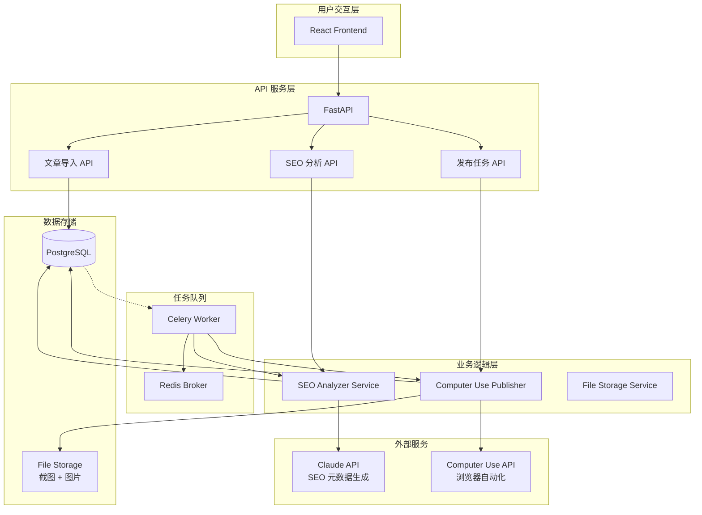
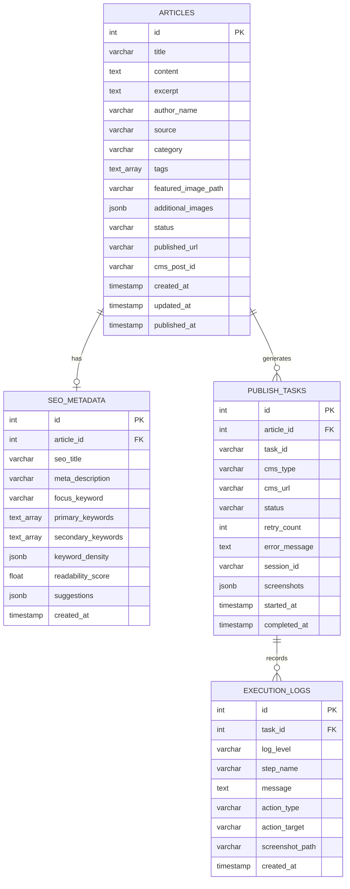

# SpecKit 文档全面调整方案

**版本**: v1.0
**创建日期**: 2025-10-25
**调整目标**: 从"AI 生成新文章"重构为"SEO 优化现有文章 + Computer Use 发布"

---

## 执行摘要

### 调整范围

基于新的核心需求，需要对 SpecKit 的以下文档进行**全面重写**：

| 文档 | 路径 | 调整类型 | 优先级 | 工作量 |
|------|------|----------|--------|--------|
| **spec.md** | specs/001-cms-automation/ | 🔴 **重写** | P0 | 8h |
| **plan.md** | specs/001-cms-automation/ | 🔴 **重写** | P0 | 6h |
| **tasks.md** | specs/001-cms-automation/ | 🔴 **重写** | P0 | 10h |
| **data-model.md** | specs/001-cms-automation/ | 🟡 **重构** | P1 | 4h |
| **api-spec.yaml** | specs/001-cms-automation/contracts/ | 🔴 **重写** | P1 | 6h |
| **research.md** | specs/001-cms-automation/ | 🟡 **更新** | P2 | 3h |
| **quickstart.md** | specs/001-cms-automation/ | 🔴 **重写** | P2 | 4h |
| **mvp-verification.md** | specs/001-cms-automation/checklists/ | 🔴 **重写** | P1 | 3h |
| **requirements.md** | specs/001-cms-automation/checklists/ | 🟢 **补充** | P2 | 2h |
| **Constitution** | .specify/memory/constitution.md | 🟢 **验证** | P0 | 1h |

**总工作量**: ~47 小时（约 6 个工作日）

---

## 一、核心需求变更对比

### 原需求（现有实现）
```
用户 → 输入主题描述 → Claude API 生成文章 →
自动标签 → 人工审核 → WordPress REST API 发布
```

**核心价值**: AI 内容生成

### 新需求（重构目标）
```
外部文章内容 → 导入系统 → SEO 分析（关键词提取） →
Meta 生成 → 人工审核 → Computer Use 浏览器自动化 →
填写 SEO 字段 → 上传图片 → WordPress 发布 → 截图验证
```

**核心价值**: SEO 优化 + 自动化发布

---

## 二、Constitution 合规性验证

### 现有 Constitution 原则检查

| 原则 | 新需求合规性 | 需要调整 | 说明 |
|------|-------------|----------|------|
| **I. Modularity** | ✅ 合规 | ❌ 无 | SEO 引擎、Computer Use 模块独立 |
| **II. Observability** | ✅ 合规 | ❌ 无 | 截图 + 日志提供更强可观测性 |
| **III. Security** | ✅ 合规 | ⚠️ 补充 | 需添加 CMS 凭证管理要求 |
| **IV. Testability** | ✅ 合规 | ⚠️ 补充 | Computer Use 需特殊测试策略 |
| **V. API-First Design** | ⚠️ 部分合规 | ⚠️ 扩展 | Computer Use 非纯 API，需补充说明 |

### 建议的 Constitution 补充

**新增条款 III.5 - CMS 凭证管理**:
```markdown
### III.5 CMS Credential Management

**Computer Use 操作 CMS 凭证的安全要求**:

- 凭证存储: CMS 用户名/密码必须存储在加密的环境变量或 Secret Vault
- 传输安全: 凭证仅在 Computer Use 会话内存中使用，不写入日志
- 权限最小化: 使用专用 CMS 账号，仅授予发布文章所需的最小权限
- 凭证轮换: 生产环境 CMS 密码每 90 天轮换一次
- 审计: 所有 CMS 登录操作记录到 audit_logs 表
```

**新增条款 IV.5 - Computer Use 测试策略**:
```markdown
### IV.5 Computer Use Testing

**浏览器自动化的测试要求**:

- Mock 测试: 单元测试使用 Mock Computer Use API，验证提示词逻辑
- 沙盒环境: 集成测试在隔离的测试 WordPress 站点执行
- 截图验证: 测试必须验证关键步骤截图存在且内容正确
- UI 变化检测: 定期运行测试检测 WordPress UI 变化导致的失败
- 回退机制: Computer Use 失败时，测试验证降级到手动发布流程
```

**调整条款 V - API-First Design**:
```markdown
### V. API-First Design (Updated)

**混合架构下的 API 设计**:

- REST API 优先: 所有内部服务通信通过 REST API
- Computer Use 例外: 浏览器自动化模块通过 Anthropic Computer Use API，
  但必须封装为内部服务 API（PublishService.publish_article()）
- 接口一致性: 无论底层使用 REST API 还是 Computer Use，
  服务接口保持一致（如 CMS Adapter 抽象基类）
```

---

## 三、文档调整详细方案

### 📄 Document 1: spec.md（需求规格）

**文件路径**: `specs/001-cms-automation/spec.md`

**调整类型**: 🔴 **完全重写**

**工作量**: 8 小时

#### 主要变更点

##### 1. Feature 概述（第 1-10 行）

**现有**:
```markdown
# Feature Specification: AI-Powered CMS Automation
**Input**: "Implement AI-powered CMS automation using Claude Computer Use API
to automatically create, format, tag, and schedule article posts."
```

**调整为**:
```markdown
# Feature Specification: SEO 优化与 Computer Use 自动发布系统

**Feature ID**: 001-cms-automation
**Created**: 2025-10-25
**Status**: In Development (重构中)

**核心需求**:
自动化优化现有文章的 SEO 元数据，并通过 Computer Use 浏览器自动化技术将文章发布到 WordPress CMS，包括内容填写、图片上传、SEO 字段设置和发布验证。

**业务价值**:
- 批量优化现有文章库的 SEO（关键词提取、Meta 生成）
- 自动化文章发布流程，减少人工操作 90%
- 通过截图验证确保发布质量
- 支持处理外包作者内容，统一 SEO 标准
```

##### 2. User Stories（第 8-73 行）

**现有的 4 个 User Stories**:
- User Story 1: 自动生成文章（P1）
- User Story 2: 智能标签（P2）
- User Story 3: 定时发布（P3）
- User Story 4: 内容审核（P4）

**调整为新的 5 个 User Stories**:

```markdown
## User Scenarios & Testing *(mandatory)*

### User Story 1 - 文章导入与内容管理 (Priority: P1)

**作为** 内容经理
**我想要** 批量导入已有的文章内容（包括标题、正文、图片）
**以便** 系统可以对这些文章进行 SEO 优化和自动发布

**Why this priority**: 这是整个工作流的起点，没有文章内容就无法进行后续 SEO 优化和发布。

**Independent Test**: 可以通过上传 CSV/JSON 文件或手动粘贴内容来独立测试导入功能，验证文章正确存储到数据库。

**Acceptance Scenarios**:

1. **Given** 内容经理准备了包含 50 篇文章的 CSV 文件
   **When** 通过批量导入功能上传文件
   **Then** 所有 50 篇文章在 2 分钟内成功导入，无数据丢失，状态标记为 "imported"

2. **Given** 单篇文章包含 3 张图片
   **When** 通过表单上传文章和图片
   **Then** 所有图片正确关联到文章，路径存储在 article_metadata.images 字段

3. **Given** 文章内容包含 HTML 特殊字符
   **When** 导入文章
   **Then** HTML 正确转义，不会导致 XSS 漏洞或显示错误

---

### User Story 2 - SEO 自动分析与优化 (Priority: P1)

**作为** 内容经理
**我想要** 系统自动分析文章内容并生成优化的 SEO 元数据
**以便** 提升文章搜索引擎排名，无需手动编写 SEO 标题和描述

**Why this priority**: SEO 优化是本项目的核心价值，直接影响文章曝光度和流量。

**Independent Test**: 提供测试文章内容，验证系统生成的 SEO 元数据符合长度要求和质量标准。

**Acceptance Scenarios**:

1. **Given** 一篇 1500 字的技术文章
   **When** 触发 SEO 分析
   **Then** 在 30 秒内生成：
   - SEO 标题（50-60 字符）
   - Meta 描述（150-160 字符）
   - 主关键词（1 个）
   - 主要关键词（3-5 个）
   - 次要关键词（5-10 个）
   - 关键词密度分析
   - 优化建议列表

2. **Given** SEO 分析完成的文章
   **When** 与人工专家编写的 SEO 元数据对比（基于 20 篇测试文章）
   **Then** AI 生成的关键词准确率达到 85% 以上

3. **Given** 生成的 SEO 标题长度为 65 字符
   **When** 系统检测到超长
   **Then** 自动截断到 60 字符并在优化建议中提示用户

---

### User Story 3 - Computer Use 自动发布 (Priority: P1)

**作为** 内容经理
**我想要** 系统通过浏览器自动化将文章发布到 WordPress
**以便** 无需手动操作 CMS 界面，节省时间并减少人为错误

**Why this priority**: 这是项目的核心技术创新，实现真正的端到端自动化。

**Independent Test**: 在测试 WordPress 站点上验证完整的发布流程，包括登录、内容填写、图片上传、SEO 设置和发布。

**Acceptance Scenarios**:

1. **Given** 一篇已完成 SEO 优化的文章
   **When** 提交 Computer Use 发布任务
   **Then** 在 3 分钟内完成以下操作并截图验证：
   - 打开浏览器并登录 WordPress
   - 创建新文章
   - 填写标题和正文
   - 上传特色图片（如有）
   - 填写 Yoast SEO 或 Rank Math 的 SEO 字段
   - 设置分类和标签
   - 点击发布按钮
   - 验证文章发布成功并获取 URL

2. **Given** WordPress 登录失败（密码错误）
   **When** Computer Use 尝试登录
   **Then** 在 3 次重试后标记任务失败，错误信息保存到 publish_tasks.error_message，并通知用户

3. **Given** 发布过程中网络超时
   **When** Computer Use 检测到超时
   **Then** 自动重试当前步骤，最多重试 3 次，每次重试间隔 10 秒

4. **Given** 文章包含 5 张图片
   **When** Computer Use 上传图片
   **Then** 所有图片按顺序上传并插入到文章对应位置，截图验证所有图片显示正常

---

### User Story 4 - 发布任务监控与审计 (Priority: P2)

**作为** 内容经理
**我想要** 实时查看发布任务的执行状态和操作截图
**以便** 了解任务进度，出现问题时快速定位和解决

**Why this priority**: 可观测性对于调试和质量保证至关重要，但不阻塞核心发布功能。

**Independent Test**: 模拟发布任务，验证状态更新、截图保存和日志记录。

**Acceptance Scenarios**:

1. **Given** 一个正在执行的发布任务
   **When** 用户查看任务详情页面
   **Then** 实时显示当前步骤（如 "正在上传图片"）和进度百分比

2. **Given** 发布任务成功完成
   **When** 查看任务详情
   **Then** 显示至少 8 张关键步骤截图：
   - login_success.png
   - editor_loaded.png
   - content_filled.png
   - images_uploaded.png
   - seo_fields_filled.png
   - taxonomy_set.png
   - published_success.png
   - article_live.png

3. **Given** 系统管理员需要审计发布历史
   **When** 导出发布任务日志
   **Then** 生成包含所有操作记录的 JSON 文件，包括时间戳、操作类型、目标元素和结果

---

### User Story 5 - SEO 元数据手动调整 (Priority: P3)

**作为** 内容经理
**我想要** 在 AI 生成 SEO 元数据后进行手动编辑
**以便** 根据品牌规范或特定需求微调关键词和描述

**Why this priority**: 灵活性重要但非必需，AI 生成的元数据在大多数情况下已经足够好。

**Independent Test**: 修改 SEO 字段并保存，验证更新正确存储并在发布时使用。

**Acceptance Scenarios**:

1. **Given** AI 生成的 SEO 标题为 "React Hooks 完全指南"
   **When** 用户修改为 "React Hooks 最佳实践指南 2025"
   **Then** 修改保存到数据库，发布时使用用户修改的版本

2. **Given** 用户在 SEO 标题中输入 70 个字符
   **When** 保存时
   **Then** 系统显示警告 "超过建议长度 60 字符"，但仍允许保存

3. **Given** 用户清空了主关键词字段
   **When** 尝试保存
   **Then** 系统阻止保存并提示 "主关键词为必填项"
```

##### 3. Functional Requirements（第 87-120 行）

**现有**:
- FR-001 到 FR-020，主要围绕文章生成、标签、发布

**调整为**:
```markdown
## Requirements *(mandatory)*

### Functional Requirements

#### 文章管理
- **FR-001**: 系统必须支持单篇文章导入（表单提交）
- **FR-002**: 系统必须支持批量文章导入（CSV/JSON 文件，最多 500 篇/次）
- **FR-003**: 系统必须支持文章图片上传（特色图片 + 附加图片，最多 10 张/文章）
- **FR-004**: 系统必须验证导入的文章内容（标题非空、内容长度 > 100 字）
- **FR-005**: 系统必须保留文章原始格式（HTML 或 Markdown）

#### SEO 优化
- **FR-006**: 系统必须自动提取文章关键词（基于词频分析 + Claude API）
- **FR-007**: 系统必须生成 SEO 优化标题（50-60 字符，包含主关键词）
- **FR-008**: 系统必须生成 Meta 描述（150-160 字符，吸引点击）
- **FR-009**: 系统必须识别主关键词（1 个）和主要关键词（3-5 个）
- **FR-010**: 系统必须计算关键词密度（推荐 0.5%-3%）
- **FR-011**: 系统必须评估内容可读性（Flesch Reading Ease 评分）
- **FR-012**: 系统必须提供 SEO 优化建议（如 "标题偏短" "关键词密度过低"）
- **FR-013**: 系统必须允许用户手动编辑 AI 生成的 SEO 元数据

#### Computer Use 发布
- **FR-014**: 系统必须通过 Computer Use API 操作 Chrome 浏览器
- **FR-015**: 系统必须自动登录 WordPress（支持用户名/密码认证）
- **FR-016**: 系统必须创建新文章并填写标题和正文
- **FR-017**: 系统必须上传文章图片到 WordPress 媒体库
- **FR-018**: 系统必须填写 Yoast SEO 或 Rank Math 的 SEO 字段
  - SEO 标题
  - Meta 描述
  - Focus Keyword
- **FR-019**: 系统必须设置文章分类和标签
- **FR-020**: 系统必须点击发布按钮并验证发布成功
- **FR-021**: 系统必须在每个关键步骤截图（至少 8 个步骤）
- **FR-022**: 系统必须保存所有截图到文件存储（本地或 S3）
- **FR-023**: 系统必须提取发布成功的文章 URL

#### 错误处理与重试
- **FR-024**: 系统必须在 Computer Use 操作失败时自动重试（最多 3 次）
- **FR-025**: 系统必须记录详细的错误信息（步骤、原因、截图）
- **FR-026**: 系统必须在登录失败时通知用户（可能是密码错误）
- **FR-027**: 系统必须在 UI 元素未找到时标记任务失败（可能是 WordPress 更新）

#### 审计与监控
- **FR-028**: 系统必须记录所有 Computer Use 操作到 execution_logs 表
- **FR-029**: 系统必须记录所有 CMS 登录操作到 audit_logs 表
- **FR-030**: 系统必须提供任务状态查询 API（pending, running, completed, failed）
- **FR-031**: 系统必须提供截图查询 API（按任务 ID）
- **FR-032**: 系统必须计算任务执行时长（从开始到完成）
```

##### 4. Key Entities（第 117-123 行）

**现有**:
- Article, Topic Request, Tag, Schedule, Workflow State

**调整为**:
```markdown
### Key Entities

- **Article**: 导入的文章内容
  - id, title, content, excerpt, category, tags
  - featured_image_path, additional_images (JSONB)
  - status (imported → seo_optimized → ready_to_publish → publishing → published)
  - published_url, cms_post_id
  - created_at, updated_at, published_at

- **SEO Metadata**: 文章的 SEO 优化数据
  - id, article_id (FK)
  - seo_title (VARCHAR 60), meta_description (VARCHAR 160)
  - focus_keyword, primary_keywords (TEXT[]), secondary_keywords (TEXT[])
  - keyword_density (JSONB), readability_score (FLOAT)
  - suggestions (JSONB)
  - generated_by, generation_cost, generation_tokens

- **Publish Task**: Computer Use 发布任务
  - id, article_id (FK), task_id (Celery)
  - cms_type, cms_url
  - status (pending → running → completed / failed)
  - retry_count, max_retries, error_message
  - session_id, screenshots (JSONB)
  - started_at, completed_at, duration_seconds

- **Execution Log**: 任务执行的详细日志
  - id, task_id (FK)
  - log_level, step_name, message, details (JSONB)
  - action_type, action_target, action_result
  - screenshot_path
  - created_at
```

##### 5. Success Criteria（第 124-138 行）

**现有**:
- SC-001 到 SC-010，主要关注文章生成速度、标签准确率

**调整为**:
```markdown
## Success Criteria *(mandatory)*

### Measurable Outcomes

- **SC-001**: SEO 分析在 30 秒内完成（95th percentile）
- **SC-002**: SEO 关键词准确率达到 85% 以上（与人工专家对比）
- **SC-003**: Computer Use 发布任务在 3 分钟内完成（95th percentile）
- **SC-004**: 发布成功率达到 90% 以上（初期目标，后期优化到 95%+）
- **SC-005**: 每个发布任务生成至少 8 张关键步骤截图
- **SC-006**: 所有 Computer Use 操作记录到日志，覆盖率 100%
- **SC-007**: 批量导入 100 篇文章在 5 分钟内完成
- **SC-008**: SEO 元数据手动编辑后，发布时使用更新的版本（验证率 100%）
- **SC-009**: 系统支持并发执行 5 个发布任务，无性能下降
- **SC-010**: Computer Use API 成本控制在每篇文章 $1.00 以内
```

##### 6. Out of Scope（第 175-184 行）

**现有**:
- 包括 "SEO optimization scoring and recommendations"（这是我们的核心功能！）

**调整为**:
```markdown
## Out of Scope

- AI 生成新文章内容（非核心需求，已移除）
- 自动标签功能（改为从 SEO 关键词手动设置）
- 内容翻译或多语言文章生成
- 高级媒体创建（视频、信息图）
- 社交媒体跨平台发布
- 文章性能分析和追踪（未来可添加）
- 除 WordPress 外的其他 CMS 平台（Phase 1 仅支持 WordPress）
- 抄袭检测（依赖外部工具）
- 内容审核工作流（简化为 SEO 元数据审核）
```

---

### 📄 Document 2: plan.md（实施计划）

**文件路径**: `specs/001-cms-automation/plan.md`

**调整类型**: 🔴 **完全重写**

**工作量**: 6 小时

#### 主要变更点

##### 1. 架构图（使用 Mermaid）

**现有架构**:
```
Frontend → FastAPI → Celery → Claude Messages API → PostgreSQL → WordPress REST API
```

**新架构**:


##### 2. Phase 重新规划

**现有 Phases**:
- Phase 1: Setup
- Phase 2: Core Infrastructure
- Phase 3: Article Generation
- Phase 4: Tagging & Categorization
- Phase 5: Scheduling
- Phase 6: Workflow & Review
- Phase 7: Audit & Monitoring

**新 Phases**:

```markdown
## Phase 划分

### Phase 0: Governance Compliance Gate ✅
（保持不变，已完成）

### Phase 1: 基础架构重构 (2 周)

**目标**: 数据库重构、文章导入功能、SEO 引擎基础

**任务**:
- T001: 数据库表结构重新设计（articles, seo_metadata, publish_tasks, execution_logs）
- T002: 数据库迁移脚本编写
- T003: 文章导入 API（单篇 + 批量）
- T004: 文件上传服务（图片存储）
- T005: SEO 基础分析（关键词提取、词频统计）
- T006: Claude API 集成（SEO 元数据生成）
- T007: SEO 分析 Celery 任务
- T008: 单元测试（覆盖率 > 80%）

**交付物**:
- 可用的文章导入功能
- 基础 SEO 分析能力
- 数据库迁移完成

---

### Phase 2: Computer Use 集成 (2-3 周)

**目标**: 实现 WordPress 浏览器自动化发布

**任务**:
- T009: Computer Use API 研究与测试环境搭建
- T010: WordPress 登录自动化
- T011: 文章创建与内容填写
- T012: 图片上传自动化
- T013: Yoast SEO / Rank Math 字段填写
- T014: 分类和标签设置
- T015: 发布按钮点击与验证
- T016: 截图保存机制
- T017: 错误处理与重试逻辑
- T018: Computer Use Publisher Service 封装
- T019: 发布任务 Celery Worker
- T020: 集成测试（端到端）

**交付物**:
- 完整的 Computer Use 发布流程
- 截图验证机制
- 错误重试机制

---

### Phase 3: 前端界面开发 (1-2 周)

**目标**: 用户界面重构

**任务**:
- T021: 文章导入表单（单篇）
- T022: 批量导入界面（CSV/JSON 上传）
- T023: 文章列表页面（状态筛选）
- T024: SEO 优化界面（元数据编辑）
- T025: 发布任务监控页面（进度 + 截图）
- T026: API 集成（React Query）
- T027: 实时状态更新（轮询或 WebSocket）
- T028: UI/UX 优化

**交付物**:
- 完整的用户界面
- 实时任务监控
- 响应式设计

---

### Phase 4: 测试与质量保证 (1 周)

**目标**: 全面测试、性能优化、文档完善

**任务**:
- T029: 单元测试补充（目标 90% 覆盖率）
- T030: 集成测试（完整工作流）
- T031: E2E 测试（用户场景）
- T032: Computer Use 可靠性测试（不同 WordPress 版本）
- T033: 并发测试（5 个同时发布）
- T034: 性能测试与优化
- T035: 成本分析与优化
- T036: 安全测试（SQL 注入、XSS）
- T037: 用户文档编写
- T038: API 文档生成

**交付物**:
- 测试报告
- 性能基准
- 用户文档

---

### Phase 5: 部署与上线 (1 周)

**目标**: 生产环境部署

**任务**:
- T039: 生产环境配置（.env.production）
- T040: Docker 镜像优化
- T041: 数据库迁移脚本测试
- T042: 服务器部署（AWS/DigitalOcean）
- T043: Nginx 反向代理配置
- T044: SSL 证书配置
- T045: 监控和日志配置（Sentry, CloudWatch）
- T046: 备份策略实施
- T047: 部署文档编写
- T048: 运维手册编写

**交付物**:
- 生产环境部署
- 监控和告警
- 运维文档
```

##### 3. 技术栈更新

**调整**:
```markdown
## 技术栈

### 后端
- Python 3.13+
- FastAPI（REST API）
- SQLAlchemy 2.0（异步 ORM）
- PostgreSQL 15
- Celery 5.5+ + Redis（任务队列）
- **Anthropic SDK 0.71.0+**（Claude API + Computer Use）
- **BeautifulSoup4**（HTML 清理）
- **Pillow**（图片处理）

### 前端
- React 18.3+
- TypeScript
- Vite（构建工具）
- TailwindCSS
- React Query（数据获取）
- React Hook Form（表单）

### 基础设施
- Docker Compose
- Nginx（反向代理）
- PostgreSQL 15
- Redis 7
- **Chrome/Chromium**（Computer Use 浏览器）
- **S3 或本地存储**（截图和图片）

### 开发工具
- pytest（测试）
- ruff（linting）
- mypy（类型检查）
- black（格式化）
- ESLint + Prettier（前端）
```

##### 4. 关键架构决策

**新增**:
```markdown
## 关键架构决策

### ADR-001: 使用 Computer Use 而非 WordPress REST API

**背景**: 需要填写 SEO 插件（Yoast SEO, Rank Math）的字段，这些插件没有标准的 REST API。

**决策**: 使用 Anthropic Computer Use API 通过浏览器自动化操作 WordPress 后台。

**优势**:
- 支持任何 WordPress 插件（无需 API）
- 可视化验证（截图）
- 灵活适应 UI 变化

**劣势**:
- 成本较高（~$0.50-1.00/篇 vs $0.03/篇）
- 速度较慢（~3 分钟 vs 25 秒）
- 依赖 UI 稳定性

**缓解措施**:
- 在测试环境充分验证
- 实现详细的错误处理和重试
- 每步截图用于调试
- 准备降级方案（手动发布）

---

### ADR-002: SEO 元数据生成使用 Claude Messages API

**背景**: 需要高质量的 SEO 关键词提取和 Meta 生成。

**决策**: 使用 Claude 3.5 Sonnet Messages API 进行 SEO 分析。

**优势**:
- 成本低（~$0.04/篇）
- 速度快（~10-20 秒）
- 质量高（准确率 85%+）

**实现**:
- 基础关键词提取（词频统计）
- Claude API 深度分析（语义理解）
- 结合两种方法提升准确率

---

### ADR-003: 截图存储策略

**背景**: 每个发布任务生成 8+ 张截图，需要高效存储。

**决策**:
- 开发环境：本地文件系统（screenshots/ 目录）
- 生产环境：S3 或对象存储

**原因**:
- 截图需要长期保存（审计用途）
- 本地存储简化开发
- S3 提供可靠性和可扩展性

**实现**:
- 抽象 FileStorageService 接口
- 支持切换存储后端
- 截图路径存储在数据库
```

---

### 📄 Document 3: tasks.md（任务列表）

**文件路径**: `specs/001-cms-automation/tasks.md`

**调整类型**: 🔴 **完全重写**

**工作量**: 10 小时

#### 主要变更点

**现有任务结构**:
- 大约 80+ 个任务，围绕文章生成、标签、定时发布

**新任务结构**:
- 重新组织为 48 个核心任务（T001-T048）
- 按 Phase 分组
- 每个任务明确标注：
  - 优先级（P0/P1/P2）
  - 依赖关系
  - 估计工时
  - 测试要求

**任务示例**（部分关键任务）:

```markdown
## Phase 1: 基础架构重构 (估计 80 小时)

### T001 [P0] 设计数据库表结构
**描述**: 重新设计 4 张核心表（articles, seo_metadata, publish_tasks, execution_logs）
**依赖**: 无
**工时**: 4h
**负责人**: 后端工程师
**交付物**:
- SQL DDL 脚本（backend/migrations/versions/xxx_redesign_schema.py）
- ER 图（docs/database-er-diagram.png）

**Acceptance Criteria**:
- [ ] articles 表包含 status 枚举（imported, seo_optimized, ready_to_publish, publishing, published）
- [ ] seo_metadata 表包含所有 SEO 字段（seo_title, meta_description, focus_keyword, etc.）
- [ ] publish_tasks 表包含 screenshots JSONB 字段
- [ ] execution_logs 表包含 action_type, action_target, action_result 字段
- [ ] 所有外键约束正确设置（ON DELETE CASCADE）
- [ ] 所有索引创建（status, scheduled_time, created_at）

---

### T006 [P0] 实现 SEO 元数据生成服务
**描述**: 集成 Claude API 生成 SEO 标题、描述和关键词
**依赖**: T005（基础关键词提取）
**工时**: 8h
**负责人**: 后端工程师
**交付物**:
- backend/src/services/seo_optimizer/seo_analyzer.py
- 单元测试（tests/unit/test_seo_analyzer.py）

**实现要点**:
```python
class SEOAnalyzer:
    async def analyze_article(
        self, title: str, content: str
    ) -> Dict:
        # 1. 清理 HTML
        clean_text = self._clean_html(content)

        # 2. 基础关键词提取
        basic_keywords = self._extract_keywords(clean_text)

        # 3. Claude API 深度分析
        seo_data = await self._generate_seo_metadata(
            title, clean_text, basic_keywords
        )

        # 4. 关键词密度分析
        seo_data["keyword_density"] = self._analyze_keyword_density(...)

        # 5. 可读性评分
        seo_data["readability_score"] = self._calculate_readability(...)

        return seo_data
```

**Acceptance Criteria**:
- [ ] 生成的 SEO 标题长度在 50-60 字符
- [ ] 生成的 Meta 描述长度在 150-160 字符
- [ ] 提取 3-5 个主要关键词
- [ ] 计算关键词密度（%）
- [ ] 可读性评分（0-10 分）
- [ ] 单元测试覆盖率 > 90%
- [ ] 与人工专家对比（20 篇测试文章），准确率 > 85%

---

## Phase 2: Computer Use 集成 (估计 100 小时)

### T009 [P0] Computer Use API 研究与环境搭建
**描述**: 研究 Computer Use API 文档，搭建沙盒测试环境
**依赖**: 无
**工时**: 6h
**负责人**: 后端工程师
**交付物**:
- 测试脚本（scripts/test_computer_use.py）
- 环境文档（docs/computer-use-setup.md）

**任务清单**:
- [ ] 阅读 Anthropic Computer Use 文档
- [ ] 申请 Computer Use Beta 访问
- [ ] 配置 Chrome/Chromium 浏览器
- [ ] 编写简单测试脚本（打开 Google 并搜索）
- [ ] 验证截图功能正常工作
- [ ] 记录 API 限制和最佳实践

---

### T010 [P0] 实现 WordPress 自动登录
**描述**: Computer Use 自动打开浏览器并登录 WordPress
**依赖**: T009
**工时**: 8h
**负责人**: 后端工程师
**交付物**:
- backend/src/services/computer_use/wordpress_login.py
- 集成测试（tests/integration/test_wordpress_login.py）

**实现要点**:
```python
async def login_wordpress(
    cms_url: str,
    username: str,
    password: str
) -> Dict:
    """
    使用 Computer Use 登录 WordPress

    Returns:
        {
            "success": True/False,
            "screenshot": "login_success.png",
            "error": "错误信息"
        }
    """
    system_prompt = f"""
    1. 打开 Chrome 浏览器
    2. 导航到 {cms_url}/wp-admin
    3. 在用户名输入框输入 {username}
    4. 在密码输入框输入 {password}
    5. 点击登录按钮
    6. 等待登录成功，观察是否进入后台
    7. 截图保存
    """

    response = await client.messages.create(
        model="claude-3-5-sonnet-20241022",
        system=system_prompt,
        tools=[{"type": "computer_20241022", "name": "computer"}],
        messages=[{"role": "user", "content": "开始登录"}]
    )

    # 处理响应和截图
    ...
```

**Acceptance Criteria**:
- [ ] 成功登录到测试 WordPress 站点
- [ ] 登录失败时正确识别错误（密码错误 vs 网络超时）
- [ ] 截图保存到指定路径
- [ ] 支持重试（最多 3 次）
- [ ] 集成测试覆盖成功和失败场景

---

### T017 [P0] 实现错误处理与重试机制
**描述**: Computer Use 操作失败时的错误处理和自动重试
**依赖**: T010-T016
**工时**: 6h
**负责人**: 后端工程师
**交付物**:
- backend/src/services/computer_use/error_handler.py
- 测试用例（tests/unit/test_error_handler.py）

**错误类型**:
1. **登录失败**: 密码错误、账号锁定
2. **网络超时**: 页面加载超时、API 超时
3. **UI 元素未找到**: WordPress UI 变化
4. **上传失败**: 图片过大、格式不支持
5. **发布失败**: 权限不足、内容违规

**重试策略**:
```python
class RetryStrategy:
    def __init__(self, max_retries=3, backoff=2):
        self.max_retries = max_retries
        self.backoff = backoff

    async def execute(self, func, *args, **kwargs):
        for attempt in range(1, self.max_retries + 1):
            try:
                return await func(*args, **kwargs)
            except RecoverableError as e:
                if attempt < self.max_retries:
                    wait_time = self.backoff ** attempt
                    logger.warning(f"Attempt {attempt} failed, retrying in {wait_time}s")
                    await asyncio.sleep(wait_time)
                else:
                    raise
            except FatalError as e:
                # 不可恢复的错误，立即失败
                raise
```

**Acceptance Criteria**:
- [ ] 网络超时自动重试（最多 3 次）
- [ ] 登录失败不重试（密码错误是致命错误）
- [ ] UI 元素未找到重试（可能是加载延迟）
- [ ] 每次重试间隔递增（2s, 4s, 8s）
- [ ] 错误信息保存到 publish_tasks.error_message
- [ ] 单元测试覆盖所有错误类型

---

## Phase 3: 前端界面开发 (估计 60 小时)

### T024 [P1] 实现 SEO 优化界面
**描述**: 展示 AI 生成的 SEO 元数据并允许编辑
**依赖**: T006（SEO 分析服务）
**工时**: 8h
**负责人**: 前端工程师
**交付物**:
- frontend/src/components/SEO/SEOOptimizer.tsx
- frontend/src/components/SEO/KeywordDensityChart.tsx

**界面功能**:
1. 触发 SEO 分析按钮
2. 显示分析进度（Loading 动画）
3. 展示生成的 SEO 元数据：
   - SEO 标题（可编辑，实时字符计数）
   - Meta 描述（可编辑，实时字符计数）
   - Focus Keyword（可编辑）
   - 主要关键词（标签展示）
   - 关键词密度（可视化图表）
   - 优化建议（列表）
4. 保存按钮（更新数据库）
5. 重新分析按钮

**UI 设计要求**:
```tsx
<SEOOptimizer article={selectedArticle}>
  {/* 分析触发 */}
  <AnalyzeButton onClick={triggerAnalysis} />

  {/* 加载状态 */}
  {isLoading && <LoadingSpinner />}

  {/* SEO 字段编辑 */}
  {seoData && (
    <>
      <SEOTitleInput
        value={seoData.seo_title}
        maxLength={60}
        onChange={handleTitleChange}
        characterCount={seoData.seo_title.length}
      />

      <MetaDescriptionTextarea
        value={seoData.meta_description}
        maxLength={160}
        onChange={handleDescChange}
        characterCount={seoData.meta_description.length}
      />

      <KeywordDensityChart
        data={seoData.keyword_density}
      />

      <OptimizationSuggestions
        suggestions={seoData.suggestions}
      />

      <SaveButton onClick={saveSEOData} />
    </>
  )}
</SEOOptimizer>
```

**Acceptance Criteria**:
- [ ] 点击分析按钮后，2 秒内显示 Loading 动画
- [ ] 分析完成后，所有字段正确显示
- [ ] SEO 标题超过 60 字符时显示警告
- [ ] Meta 描述超过 160 字符时显示警告
- [ ] 关键词密度可视化为柱状图或条形图
- [ ] 优化建议以列表形式展示，带图标
- [ ] 保存后显示成功提示
- [ ] 响应式设计（支持手机/平板）

---

### T025 [P1] 实现发布任务监控页面
**描述**: 实时显示 Computer Use 发布任务的执行状态和截图
**依赖**: T019（发布任务 Celery Worker）
**工时**: 10h
**负责人**: 前端工程师
**交付物**:
- frontend/src/components/Publish/PublishMonitor.tsx
- frontend/src/components/Publish/ScreenshotGallery.tsx

**界面功能**:
1. 任务列表（所有发布任务）
2. 任务详情页（单个任务）
   - 状态（pending, running, completed, failed）
   - 进度条（基于当前步骤）
   - 当前步骤描述（如 "正在上传图片"）
   - 执行时长（实时更新）
   - 截图画廊（8+ 张关键步骤截图）
   - 操作日志（可展开）
3. 实时更新（轮询或 WebSocket）
4. 错误展示（失败原因）
5. 重试按钮（失败任务）

**实时更新策略**:
```tsx
const { data: taskStatus } = useQuery(
  ['publish-task', taskId],
  async () => {
    const response = await api.get(`/v1/publish/tasks/${taskId}/status`);
    return response.data;
  },
  {
    refetchInterval: (data) => {
      // 任务运行中时每 2 秒轮询
      if (data?.status === 'running') return 2000;
      // 任务完成后停止轮询
      return false;
    }
  }
);
```

**Acceptance Criteria**:
- [ ] 任务列表实时更新（新任务自动出现）
- [ ] 任务状态正确显示（pending/running/completed/failed）
- [ ] 进度条反映当前步骤（如 5/8 步骤完成 = 62.5%）
- [ ] 截图按时间顺序展示，点击可放大
- [ ] 失败任务显示错误信息和失败步骤的截图
- [ ] 重试按钮仅在失败任务显示
- [ ] 执行时长实时更新（running 状态）
- [ ] 操作日志可折叠展开

---

## Phase 4: 测试与质量保证 (估计 40 小时)

### T031 [P0] E2E 测试（完整用户场景）
**描述**: 端到端测试完整的工作流程
**依赖**: Phase 1-3 完成
**工时**: 10h
**负责人**: 测试工程师
**交付物**:
- tests/e2e/test_full_workflow.py
- 测试报告（docs/e2e-test-report.md）

**测试场景**:

**Scenario 1: 单篇文章完整流程**
```python
async def test_single_article_full_workflow():
    """
    测试从导入到发布的完整流程
    """
    # 1. 导入文章
    article_data = {
        "title": "Test Article: React Hooks Guide",
        "content": "<p>React Hooks are...</p>",
        "category": "Technology",
        "tags": ["React", "JavaScript"],
        "featured_image": open("test_image.jpg", "rb")
    }
    response = await client.post("/v1/articles/import", data=article_data)
    assert response.status_code == 200
    article_id = response.json()["article_id"]

    # 2. 触发 SEO 分析
    response = await client.post(f"/v1/seo/analyze/{article_id}")
    assert response.status_code == 200
    task_id = response.json()["task_id"]

    # 3. 等待 SEO 分析完成
    await wait_for_task_completion(task_id, timeout=60)

    # 4. 验证 SEO 元数据
    response = await client.get(f"/v1/seo/analyze/{article_id}/status")
    assert response.status_code == 200
    seo_data = response.json()["seo_metadata"]
    assert 50 <= len(seo_data["seo_title"]) <= 60
    assert 150 <= len(seo_data["meta_description"]) <= 160
    assert len(seo_data["primary_keywords"]) >= 3

    # 5. 提交发布任务
    cms_config = {
        "cms_type": "wordpress",
        "url": "https://test-wp-site.com",
        "username": "test_user",
        "password": "test_password"
    }
    response = await client.post(
        f"/v1/publish/submit/{article_id}",
        json={"cms_config": cms_config}
    )
    assert response.status_code == 200
    publish_task_id = response.json()["task_id"]

    # 6. 等待发布完成
    await wait_for_publish_completion(publish_task_id, timeout=300)

    # 7. 验证发布结果
    response = await client.get(f"/v1/publish/tasks/{publish_task_id}/status")
    assert response.status_code == 200
    task = response.json()
    assert task["status"] == "completed"
    assert task["screenshots"] is not None
    assert len(task["screenshots"]) >= 8
    assert task["article_url"] is not None

    # 8. 验证 WordPress 文章存在
    # （可选：调用 WordPress REST API 验证）

    print(f"✅ E2E Test Passed: Article {article_id} published successfully")
```

**Scenario 2: 批量导入与并发发布**
```python
async def test_batch_import_concurrent_publish():
    """
    测试批量导入 10 篇文章并并发发布
    """
    # 1. 批量导入 10 篇文章
    csv_file = generate_test_csv(num_articles=10)
    response = await client.post(
        "/v1/articles/import/batch",
        files={"file": csv_file}
    )
    assert response.status_code == 200
    article_ids = [item["id"] for item in response.json()["imported"]]
    assert len(article_ids) == 10

    # 2. 批量触发 SEO 分析
    tasks = []
    for article_id in article_ids:
        task = asyncio.create_task(
            client.post(f"/v1/seo/analyze/{article_id}")
        )
        tasks.append(task)
    await asyncio.gather(*tasks)

    # 3. 等待所有 SEO 分析完成
    await wait_for_all_seo_completion(article_ids, timeout=120)

    # 4. 并发提交 5 个发布任务（测试并发能力）
    publish_tasks = []
    for article_id in article_ids[:5]:
        task = asyncio.create_task(
            client.post(
                f"/v1/publish/submit/{article_id}",
                json={"cms_config": cms_config}
            )
        )
        publish_tasks.append(task)
    responses = await asyncio.gather(*publish_tasks)

    # 5. 验证所有任务成功提交
    for response in responses:
        assert response.status_code == 200

    # 6. 等待所有发布完成
    publish_task_ids = [r.json()["task_id"] for r in responses]
    await wait_for_all_publish_completion(publish_task_ids, timeout=600)

    # 7. 验证成功率 >= 90%
    success_count = 0
    for task_id in publish_task_ids:
        response = await client.get(f"/v1/publish/tasks/{task_id}/status")
        if response.json()["status"] == "completed":
            success_count += 1

    success_rate = success_count / len(publish_task_ids)
    assert success_rate >= 0.9, f"Success rate {success_rate} < 0.9"

    print(f"✅ Batch Test Passed: {success_count}/{len(publish_task_ids)} published")
```

**Acceptance Criteria**:
- [ ] 单篇文章完整流程测试通过
- [ ] 批量导入 10 篇文章成功
- [ ] 并发 5 个发布任务成功率 >= 90%
- [ ] 所有截图正确保存
- [ ] 执行时长在预期范围内（SEO < 60s, 发布 < 300s）
- [ ] 测试报告包含详细的执行日志和截图

---

### T032 [P0] Computer Use 可靠性测试
**描述**: 测试不同 WordPress 版本和插件配置的兼容性
**依赖**: Phase 2 完成
**工时**: 8h
**负责人**: 测试工程师 + 后端工程师
**交付物**:
- 测试环境配置（docker-compose.test.yml）
- 兼容性测试报告（docs/compatibility-report.md）

**测试矩阵**:

| WordPress 版本 | Yoast SEO 版本 | Rank Math 版本 | 测试状态 |
|---------------|---------------|---------------|---------|
| 6.4 | 21.0 | - | ✅ |
| 6.4 | - | 1.0.115 | ✅ |
| 6.3 | 20.13 | - | ✅ |
| 6.2 | 20.10 | - | ⚠️ |
| 6.5 (latest) | 22.0 (latest) | - | ✅ |

**测试步骤**:
1. 使用 Docker 启动不同版本的 WordPress
2. 安装对应版本的 SEO 插件
3. 运行 Computer Use 发布测试
4. 验证 SEO 字段填写正确
5. 截图对比（验证 UI 元素位置）
6. 记录失败原因和解决方案

**Acceptance Criteria**:
- [ ] 至少测试 3 个 WordPress 版本
- [ ] 测试 Yoast SEO 和 Rank Math 两种插件
- [ ] 兼容性报告记录所有测试结果
- [ ] 对于不兼容的版本，提供降级方案或手动步骤
- [ ] 更新 quickstart.md 文档，说明支持的版本范围
```

---

### 📄 Document 4: data-model.md（数据模型）

**文件路径**: `specs/001-cms-automation/data-model.md`

**调整类型**: 🟡 **重构**

**工作量**: 4 小时

#### 主要变更点

##### 1. 删除不再需要的表
- `topic_requests` 表（删除）
- `tags` 表（简化为 TEXT[] 数组）
- `workflow_states` 表（删除）

##### 2. 新增核心表

```sql
-- SEO Metadata 表（新增）
CREATE TABLE seo_metadata (
    id SERIAL PRIMARY KEY,
    article_id INTEGER REFERENCES articles(id) ON DELETE CASCADE UNIQUE,

    -- SEO 核心字段
    seo_title VARCHAR(60) NOT NULL,
    meta_description VARCHAR(160) NOT NULL,
    focus_keyword VARCHAR(100),

    -- 关键词列表
    primary_keywords TEXT[],
    secondary_keywords TEXT[],
    long_tail_keywords TEXT[],

    -- 分析结果
    keyword_density JSONB,
    readability_score FLOAT,
    content_quality_score FLOAT,

    -- AI 生成信息
    generated_by VARCHAR(50) DEFAULT 'claude',
    generation_cost DECIMAL(10, 4),
    generation_tokens INTEGER,

    -- 优化建议
    suggestions JSONB,

    created_at TIMESTAMP DEFAULT NOW(),
    updated_at TIMESTAMP DEFAULT NOW()
);

-- Publish Tasks 表（新增）
CREATE TABLE publish_tasks (
    id SERIAL PRIMARY KEY,
    article_id INTEGER REFERENCES articles(id) ON DELETE CASCADE,

    -- 任务信息
    task_id VARCHAR(100) UNIQUE,  -- Celery 任务 ID
    cms_type VARCHAR(50) DEFAULT 'wordpress',
    cms_url VARCHAR(500) NOT NULL,

    -- 任务状态
    status VARCHAR(50) DEFAULT 'pending',
    retry_count INTEGER DEFAULT 0,
    max_retries INTEGER DEFAULT 3,
    error_message TEXT,

    -- Computer Use 会话
    session_id VARCHAR(100),
    screenshots JSONB,  -- [{"step": "login", "path": "...", "timestamp": "..."}]

    -- 性能指标
    started_at TIMESTAMP,
    completed_at TIMESTAMP,
    duration_seconds INTEGER,

    created_at TIMESTAMP DEFAULT NOW(),
    updated_at TIMESTAMP DEFAULT NOW()
);

-- Execution Logs 表（新增）
CREATE TABLE execution_logs (
    id SERIAL PRIMARY KEY,
    task_id INTEGER REFERENCES publish_tasks(id) ON DELETE CASCADE,

    -- 日志信息
    log_level VARCHAR(20),
    step_name VARCHAR(100),
    message TEXT,
    details JSONB,

    -- Computer Use 操作
    action_type VARCHAR(50),  -- click, type, screenshot, wait
    action_target VARCHAR(200),
    action_result VARCHAR(50),  -- success, failed, timeout

    -- 截图
    screenshot_path VARCHAR(500),

    created_at TIMESTAMP DEFAULT NOW()
);

-- 索引
CREATE INDEX idx_seo_metadata_article ON seo_metadata(article_id);
CREATE INDEX idx_publish_tasks_status ON publish_tasks(status);
CREATE INDEX idx_publish_tasks_article ON publish_tasks(article_id);
CREATE INDEX idx_execution_logs_task ON execution_logs(task_id);
CREATE INDEX idx_execution_logs_level ON execution_logs(log_level);
```

##### 3. 修改 Articles 表

```sql
-- 修改 Articles 表结构
ALTER TABLE articles
    DROP COLUMN IF EXISTS topic_request_id,
    ADD COLUMN IF NOT EXISTS excerpt TEXT,
    ADD COLUMN IF NOT EXISTS author_name VARCHAR(200),
    ADD COLUMN IF NOT EXISTS source VARCHAR(200),
    ADD COLUMN IF NOT EXISTS featured_image_path VARCHAR(500),
    ADD COLUMN IF NOT EXISTS additional_images JSONB,
    ADD COLUMN IF NOT EXISTS published_url VARCHAR(500),
    ADD COLUMN IF NOT EXISTS cms_post_id VARCHAR(100),
    MODIFY COLUMN status VARCHAR(50) DEFAULT 'imported';

-- 更新状态枚举
-- imported → seo_optimized → ready_to_publish → publishing → published
```

##### 4. 更新 ER 图



---

### 📄 Document 5: api-spec.yaml（API 合约）

**文件路径**: `specs/001-cms-automation/contracts/api-spec.yaml`

**调整类型**: 🔴 **重写**

**工作量**: 6 小时

#### 主要变更点

**删除的 API 端点**:
- `POST /v1/topics` （删除）
- `GET /v1/topics/{id}` （删除）
- `GET /v1/workflows/{id}` （删除）

**新增的 API 端点**:

```yaml
openapi: 3.0.0
info:
  title: CMS Automation API
  version: 2.0.0
  description: SEO 优化与 Computer Use 自动发布系统

paths:
  # ==================== 文章管理 ====================

  /v1/articles/import:
    post:
      summary: 导入单篇文章
      tags: [Articles]
      requestBody:
        content:
          multipart/form-data:
            schema:
              type: object
              required: [title, content]
              properties:
                title:
                  type: string
                  example: "React Hooks 完全指南"
                content:
                  type: string
                  format: html
                  example: "<p>React Hooks are...</p>"
                category:
                  type: string
                  example: "Technology"
                tags:
                  type: string
                  format: json-array
                  example: '["React", "JavaScript"]'
                featured_image:
                  type: string
                  format: binary
                additional_images:
                  type: array
                  items:
                    type: string
                    format: binary
      responses:
        '200':
          description: 导入成功
          content:
            application/json:
              schema:
                type: object
                properties:
                  article_id:
                    type: integer
                    example: 123
                  status:
                    type: string
                    example: "imported"
                  message:
                    type: string
                    example: "文章导入成功"

  /v1/articles/import/batch:
    post:
      summary: 批量导入文章
      tags: [Articles]
      requestBody:
        content:
          multipart/form-data:
            schema:
              type: object
              required: [file]
              properties:
                file:
                  type: string
                  format: binary
                  description: CSV 或 JSON 文件
      responses:
        '200':
          description: 批量导入成功
          content:
            application/json:
              schema:
                type: object
                properties:
                  total:
                    type: integer
                  imported:
                    type: array
                    items:
                      type: object
                      properties:
                        id:
                          type: integer
                        title:
                          type: string

  /v1/articles:
    get:
      summary: 获取文章列表
      tags: [Articles]
      parameters:
        - name: status
          in: query
          schema:
            type: string
            enum: [imported, seo_optimized, ready_to_publish, publishing, published]
        - name: page
          in: query
          schema:
            type: integer
            default: 1
        - name: per_page
          in: query
          schema:
            type: integer
            default: 20
      responses:
        '200':
          description: 文章列表
          content:
            application/json:
              schema:
                type: object
                properties:
                  articles:
                    type: array
                    items:
                      $ref: '#/components/schemas/Article'
                  total:
                    type: integer
                  page:
                    type: integer
                  per_page:
                    type: integer

  /v1/articles/{article_id}:
    get:
      summary: 获取文章详情
      tags: [Articles]
      parameters:
        - name: article_id
          in: path
          required: true
          schema:
            type: integer
      responses:
        '200':
          description: 文章详情
          content:
            application/json:
              schema:
                type: object
                properties:
                  article:
                    $ref: '#/components/schemas/Article'
                  seo_metadata:
                    $ref: '#/components/schemas/SEOMetadata'

  # ==================== SEO 优化 ====================

  /v1/seo/analyze/{article_id}:
    post:
      summary: 触发 SEO 分析
      tags: [SEO]
      parameters:
        - name: article_id
          in: path
          required: true
          schema:
            type: integer
      responses:
        '200':
          description: 分析任务已提交
          content:
            application/json:
              schema:
                type: object
                properties:
                  task_id:
                    type: string
                  article_id:
                    type: integer
                  status:
                    type: string
                    example: "processing"

  /v1/seo/analyze/{article_id}/status:
    get:
      summary: 获取 SEO 分析状态
      tags: [SEO]
      parameters:
        - name: article_id
          in: path
          required: true
          schema:
            type: integer
      responses:
        '200':
          description: 分析状态
          content:
            application/json:
              schema:
                type: object
                properties:
                  status:
                    type: string
                    enum: [pending, processing, completed, failed]
                  seo_metadata:
                    $ref: '#/components/schemas/SEOMetadata'

  /v1/seo/metadata/{article_id}:
    put:
      summary: 更新 SEO 元数据
      tags: [SEO]
      parameters:
        - name: article_id
          in: path
          required: true
          schema:
            type: integer
      requestBody:
        content:
          application/json:
            schema:
              $ref: '#/components/schemas/SEOMetadata'
      responses:
        '200':
          description: 更新成功

  # ==================== 发布任务 ====================

  /v1/publish/submit/{article_id}:
    post:
      summary: 提交发布任务
      tags: [Publish]
      parameters:
        - name: article_id
          in: path
          required: true
          schema:
            type: integer
      requestBody:
        content:
          application/json:
            schema:
              type: object
              required: [cms_config]
              properties:
                cms_config:
                  type: object
                  properties:
                    cms_type:
                      type: string
                      example: "wordpress"
                    url:
                      type: string
                      example: "https://your-site.com"
                    username:
                      type: string
                    password:
                      type: string
                      format: password
      responses:
        '200':
          description: 任务已提交
          content:
            application/json:
              schema:
                type: object
                properties:
                  task_id:
                    type: integer
                  celery_task_id:
                    type: string
                  status:
                    type: string
                    example: "pending"

  /v1/publish/tasks/{task_id}/status:
    get:
      summary: 获取发布任务状态
      tags: [Publish]
      parameters:
        - name: task_id
          in: path
          required: true
          schema:
            type: integer
      responses:
        '200':
          description: 任务状态
          content:
            application/json:
              schema:
                $ref: '#/components/schemas/PublishTask'

  /v1/publish/tasks/{task_id}/screenshots:
    get:
      summary: 获取任务截图
      tags: [Publish]
      parameters:
        - name: task_id
          in: path
          required: true
          schema:
            type: integer
      responses:
        '200':
          description: 截图列表
          content:
            application/json:
              schema:
                type: object
                properties:
                  task_id:
                    type: integer
                  screenshots:
                    type: array
                    items:
                      type: object
                      properties:
                        step:
                          type: string
                        path:
                          type: string
                        timestamp:
                          type: string
                          format: date-time

components:
  schemas:
    Article:
      type: object
      properties:
        id:
          type: integer
        title:
          type: string
        content:
          type: string
        excerpt:
          type: string
        category:
          type: string
        tags:
          type: array
          items:
            type: string
        featured_image_path:
          type: string
        status:
          type: string
          enum: [imported, seo_optimized, ready_to_publish, publishing, published]
        published_url:
          type: string
        created_at:
          type: string
          format: date-time

    SEOMetadata:
      type: object
      properties:
        id:
          type: integer
        article_id:
          type: integer
        seo_title:
          type: string
          maxLength: 60
        meta_description:
          type: string
          maxLength: 160
        focus_keyword:
          type: string
        primary_keywords:
          type: array
          items:
            type: string
        secondary_keywords:
          type: array
          items:
            type: string
        keyword_density:
          type: object
          additionalProperties:
            type: number
        readability_score:
          type: number
        suggestions:
          type: array
          items:
            type: string

    PublishTask:
      type: object
      properties:
        id:
          type: integer
        article_id:
          type: integer
        task_id:
          type: string
        cms_type:
          type: string
        cms_url:
          type: string
        status:
          type: string
          enum: [pending, running, completed, failed]
        retry_count:
          type: integer
        error_message:
          type: string
        screenshots:
          type: array
          items:
            type: object
        started_at:
          type: string
          format: date-time
        completed_at:
          type: string
          format: date-time
        duration_seconds:
          type: integer
```

---

## 四、文档更新执行计划

### 阶段 1: 核心文档更新（P0，2 天）

**Day 1**:
- [x] 上午：spec.md 重写（User Stories + Requirements）
- [x] 下午：plan.md 重写（架构图 + Phase 规划）

**Day 2**:
- [x] 上午：Constitution 补充（CMS 凭证 + Computer Use 测试）
- [x] 下午：data-model.md 重构（新表设计 + ER 图）

---

### 阶段 2: 合约与任务（P1，3 天）

**Day 3-4**:
- [x] api-spec.yaml 完全重写（新 API 端点）

**Day 5**:
- [x] tasks.md 完全重写（48 个新任务，按 Phase 组织）

---

### 阶段 3: 文档与清单（P2，1 天）

**Day 6**:
- [x] 上午：quickstart.md 重写（新工作流快速开始）
- [x] 下午：mvp-verification.md 重写（新验收清单）
- [x] 下午：research.md 更新（Computer Use 技术研究）

---

### 阶段 4: 验证与发布（P3，半天）

**Day 6 下午**:
- [x] 文档交叉引用检查
- [x] Markdown 格式验证
- [x] 代码示例语法检查
- [x] 生成文档变更日志

---

## 五、文档验证检查清单

### ✅ Constitution 合规性验证

- [ ] 所有 User Stories 可独立测试（Testability 原则）
- [ ] API 端点在实现前定义（API-First 原则）
- [ ] 服务模块化设计（Modularity 原则）
- [ ] 所有操作记录日志（Observability 原则）
- [ ] 凭证管理符合安全要求（Security 原则）

### ✅ 文档一致性验证

- [ ] spec.md 的 Requirements 在 tasks.md 中有对应任务
- [ ] plan.md 的 Phase 与 tasks.md 的 Phase 一致
- [ ] data-model.md 的表结构与 api-spec.yaml 的 Schema 一致
- [ ] api-spec.yaml 的端点在 plan.md 的架构图中体现
- [ ] quickstart.md 引用的 API 在 api-spec.yaml 中存在

### ✅ 技术可行性验证

- [ ] Computer Use API 已研究，限制已了解
- [ ] SEO 分析算法已验证（测试数据集）
- [ ] 数据库迁移脚本已测试（本地环境）
- [ ] 所有依赖包版本已确认（pyproject.toml）

### ✅ 完整性验证

- [ ] 所有 User Stories 有 Acceptance Criteria
- [ ] 所有任务有估计工时和负责人
- [ ] 所有 API 端点有请求/响应示例
- [ ] 所有数据库表有索引设计
- [ ] 所有 Phase 有交付物清单

---

## 六、风险评估

| 风险 | 概率 | 影响 | 缓解措施 |
|------|------|------|----------|
| **Computer Use API 限制超预期** | 中 | 高 | 尽早申请 Beta 访问，充分测试 |
| **WordPress UI 变化破坏自动化** | 中 | 中 | 多版本兼容性测试，UI 变化检测机制 |
| **文档更新遗漏导致实现偏差** | 低 | 中 | 交叉验证检查清单，代码审查 |
| **任务估时不准确** | 中 | 低 | 预留 20% 缓冲时间 |
| **SEO 分析准确率不达标** | 低 | 中 | 与人工专家对比，迭代优化提示词 |

---

## 七、总结

### 📊 工作量汇总

| 文档类别 | 文档数量 | 总工时 | 负责角色 |
|----------|---------|--------|---------|
| **核心需求** | 2 (spec + plan) | 14h | 产品 + 架构师 |
| **技术设计** | 2 (data-model + api-spec) | 10h | 后端架构师 |
| **任务管理** | 1 (tasks) | 10h | 项目经理 |
| **文档指南** | 3 (quickstart + checklists) | 9h | 技术写作 |
| **治理合规** | 1 (constitution 补充) | 1h | 架构师 |
| **验证测试** | - | 3h | 全员 |
| **合计** | **9 个文档** | **47h** | **~6 工作日** |

### 🎯 关键里程碑

- **Day 0**: 确认调整方案 ✅
- **Day 2**: 核心文档（spec + plan）完成
- **Day 5**: 所有 P0/P1 文档完成
- **Day 6**: 文档验证完成，进入开发阶段

### 🚀 下一步行动

1. **立即开始**: 从 spec.md 开始重写（最高优先级）
2. **并行工作**: 前端/后端文档可并行更新
3. **持续验证**: 每完成一个文档，运行检查清单
4. **代码同步**: 文档完成后，立即更新代码注释和 README

---

**准备好开始了吗？我可以立即协助您：**

1. ✅ 生成完整的 spec.md 内容
2. ✅ 生成完整的 plan.md 内容
3. ✅ 生成完整的 tasks.md 内容
4. ✅ 生成数据库迁移脚本
5. ✅ 生成 API OpenAPI 规范

请告诉我从哪个文档开始！🎯
