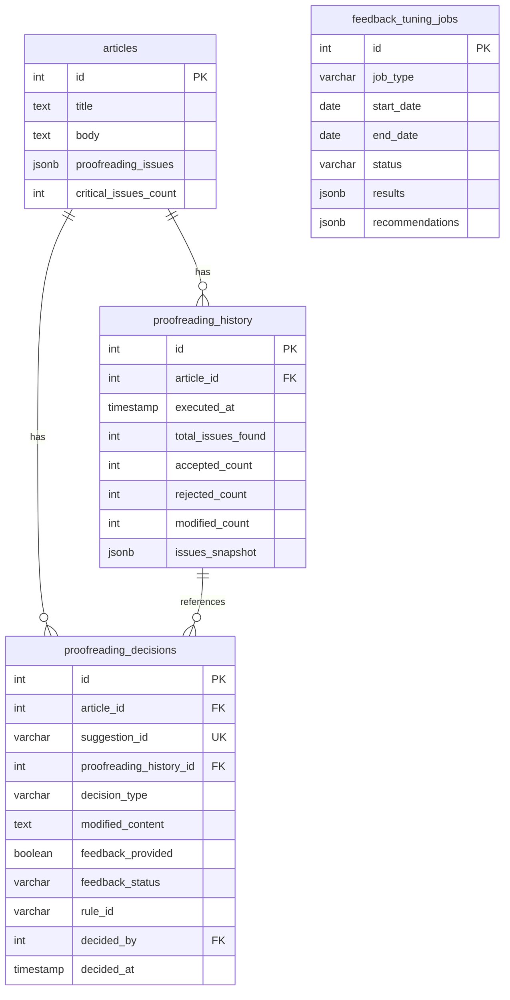

# T7.1 校对决策与反馈数据库Schema设计

**任务ID**: T7.1 [US2][P0] Proofreading 决策与反馈调优批次迁移
**创建日期**: 2025-11-02
**版本**: 1.0
**状态**: 设计评审中
**预计工时**: 10小时

---

## 1. 设计概述

### 1.1 目标

为校对系统建立用户决策反馈机制，支持：
- 记录用户对校对建议的决策（接受/拒绝/修改）
- 收集用户反馈用于规则优化
- 追踪规则有效性和用户偏好
- 支持批量反馈处理和规则调优

### 1.2 数据流

```
用户查看校对建议 → 做出决策（接受/拒绝/修改）→ 记录到数据库
    ↓                      ↓                        ↓
前端UI展示        提供反馈（可选）         统计分析
    ↓                      ↓                        ↓
Article.proofreading_issues  proofreading_decisions  feedback_tuning_jobs
```

### 1.3 设计原则

- **数据完整性**: 使用外键约束确保引用完整性
- **查询性能**: 合理设计索引，支持高频查询
- **可扩展性**: JSONB字段存储灵活数据
- **审计追踪**: 记录所有决策的时间和用户
- **统计友好**: 便于聚合分析和报表生成

---

## 2. 数据库表设计

### 2.1 表: proofreading_decisions（校对决策表）

**用途**: 记录用户对每条校对建议的决策

```sql
CREATE TABLE proofreading_decisions (
    -- 主键
    id SERIAL PRIMARY KEY,

    -- 关联信息
    article_id INTEGER NOT NULL,
    suggestion_id VARCHAR(100) NOT NULL,
    proofreading_history_id INTEGER,

    -- 决策核心数据
    decision_type VARCHAR(20) NOT NULL,
    decision_rationale TEXT,
    modified_content TEXT,

    -- 原始建议信息（快照）
    original_text TEXT NOT NULL,
    suggested_text TEXT NOT NULL,
    rule_id VARCHAR(20) NOT NULL,
    rule_category VARCHAR(10),
    issue_position JSONB,

    -- 反馈数据
    feedback_provided BOOLEAN DEFAULT FALSE,
    feedback_category VARCHAR(50),
    feedback_notes TEXT,
    feedback_status VARCHAR(20) DEFAULT 'pending',

    -- 审计字段
    decided_by INTEGER NOT NULL,
    decided_at TIMESTAMP NOT NULL DEFAULT CURRENT_TIMESTAMP,
    created_at TIMESTAMP NOT NULL DEFAULT CURRENT_TIMESTAMP,
    updated_at TIMESTAMP NOT NULL DEFAULT CURRENT_TIMESTAMP,

    -- 外键约束
    CONSTRAINT fk_article
        FOREIGN KEY (article_id)
        REFERENCES articles(id)
        ON DELETE CASCADE,

    -- 唯一约束：同一文章的同一建议只能有一条决策
    CONSTRAINT uq_article_suggestion
        UNIQUE (article_id, suggestion_id)
);

-- 索引设计
CREATE INDEX idx_proofreading_decisions_article_id
    ON proofreading_decisions(article_id);

CREATE INDEX idx_proofreading_decisions_rule_id
    ON proofreading_decisions(rule_id);

CREATE INDEX idx_proofreading_decisions_feedback_status
    ON proofreading_decisions(feedback_status)
    WHERE feedback_provided = TRUE;

CREATE INDEX idx_proofreading_decisions_decided_at
    ON proofreading_decisions(decided_at);

CREATE INDEX idx_proofreading_decisions_decision_type
    ON proofreading_decisions(decision_type);

-- 复合索引用于统计查询
CREATE INDEX idx_proofreading_decisions_stats
    ON proofreading_decisions(rule_category, decision_type, decided_at);

-- 注释
COMMENT ON TABLE proofreading_decisions IS '校对决策记录表，存储用户对校对建议的接受、拒绝或修改决策';
COMMENT ON COLUMN proofreading_decisions.suggestion_id IS '建议的唯一标识符，对应proofreading_issues中的某条建议';
COMMENT ON COLUMN proofreading_decisions.decision_type IS '决策类型：accepted(接受)/rejected(拒绝)/modified(修改)';
COMMENT ON COLUMN proofreading_decisions.modified_content IS '仅当decision_type=modified时，存储用户修改后的内容';
COMMENT ON COLUMN proofreading_decisions.feedback_status IS '反馈处理状态：pending/in_progress/completed/failed';
```

### 2.2 表: proofreading_history（校对历史表）

**用途**: 记录每次校对执行的历史和统计信息

```sql
CREATE TABLE proofreading_history (
    -- 主键
    id SERIAL PRIMARY KEY,

    -- 关联信息
    article_id INTEGER NOT NULL,

    -- 执行信息
    executed_at TIMESTAMP NOT NULL DEFAULT CURRENT_TIMESTAMP,
    execution_duration_ms INTEGER,
    engine_version VARCHAR(20),

    -- 问题统计
    total_issues_found INTEGER DEFAULT 0,
    critical_issues_count INTEGER DEFAULT 0,
    warning_issues_count INTEGER DEFAULT 0,
    info_issues_count INTEGER DEFAULT 0,

    -- 决策统计
    accepted_count INTEGER DEFAULT 0,
    rejected_count INTEGER DEFAULT 0,
    modified_count INTEGER DEFAULT 0,
    pending_count INTEGER DEFAULT 0,

    -- 反馈统计
    feedback_provided_count INTEGER DEFAULT 0,
    pending_feedback_count INTEGER DEFAULT 0,

    -- 分引擎统计
    deterministic_issues_count INTEGER DEFAULT 0,
    ai_issues_count INTEGER DEFAULT 0,

    -- 结果快照
    issues_snapshot JSONB NOT NULL,
    config_snapshot JSONB,

    -- 审计字段
    executed_by INTEGER,
    created_at TIMESTAMP NOT NULL DEFAULT CURRENT_TIMESTAMP,

    -- 外键约束
    CONSTRAINT fk_history_article
        FOREIGN KEY (article_id)
        REFERENCES articles(id)
        ON DELETE CASCADE
);

-- 索引设计
CREATE INDEX idx_proofreading_history_article_id
    ON proofreading_history(article_id);

CREATE INDEX idx_proofreading_history_executed_at
    ON proofreading_history(executed_at DESC);

-- 部分索引：只索引有待处理反馈的记录
CREATE INDEX idx_proofreading_history_pending_feedback
    ON proofreading_history(article_id)
    WHERE pending_feedback_count > 0;

-- 注释
COMMENT ON TABLE proofreading_history IS '校对执行历史记录表，存储每次校对的执行结果和统计信息';
COMMENT ON COLUMN proofreading_history.issues_snapshot IS '校对问题的完整快照，JSONB格式存储所有检测到的问题';
COMMENT ON COLUMN proofreading_history.config_snapshot IS '校对配置快照，记录执行时使用的规则配置';
```

### 2.3 表: feedback_tuning_jobs（反馈调优任务表）

**用途**: 批量处理反馈数据，用于规则调优和AI prompt优化

```sql
CREATE TABLE feedback_tuning_jobs (
    -- 主键
    id SERIAL PRIMARY KEY,

    -- 任务定义
    job_type VARCHAR(30) NOT NULL,
    job_name VARCHAR(200),
    job_description TEXT,

    -- 处理范围
    target_rule_ids TEXT[],
    target_categories TEXT[],
    start_date DATE NOT NULL,
    end_date DATE NOT NULL,

    -- 处理统计
    total_decisions_count INTEGER DEFAULT 0,
    processed_count INTEGER DEFAULT 0,

    -- 任务状态
    status VARCHAR(20) NOT NULL DEFAULT 'pending',
    progress_percent INTEGER DEFAULT 0,

    -- 执行结果
    results JSONB,
    recommendations JSONB,
    error_message TEXT,
    error_details JSONB,

    -- 时间戳
    created_by INTEGER,
    created_at TIMESTAMP NOT NULL DEFAULT CURRENT_TIMESTAMP,
    started_at TIMESTAMP,
    completed_at TIMESTAMP,

    -- 约束
    CONSTRAINT chk_progress_percent
        CHECK (progress_percent >= 0 AND progress_percent <= 100),

    CONSTRAINT chk_date_range
        CHECK (end_date >= start_date)
);

-- 索引设计
CREATE INDEX idx_feedback_tuning_jobs_status
    ON feedback_tuning_jobs(status);

CREATE INDEX idx_feedback_tuning_jobs_created_at
    ON feedback_tuning_jobs(created_at DESC);

CREATE INDEX idx_feedback_tuning_jobs_type_status
    ON feedback_tuning_jobs(job_type, status);

-- 注释
COMMENT ON TABLE feedback_tuning_jobs IS '反馈调优任务表，用于批量分析用户反馈并生成规则优化建议';
COMMENT ON COLUMN feedback_tuning_jobs.job_type IS '任务类型：rule_tuning/prompt_optimization/batch_analysis';
COMMENT ON COLUMN feedback_tuning_jobs.results IS 'JSON格式的分析结果，包含规则有效率、用户偏好等';
COMMENT ON COLUMN feedback_tuning_jobs.recommendations IS 'JSON格式的优化建议，如需要调整的规则、新增的pattern等';
```

---

## 3. 字段设计说明

### 3.1 decision_type 枚举值

| 值 | 含义 | 说明 |
|---|------|------|
| `accepted` | 接受 | 用户完全接受系统建议，无修改 |
| `rejected` | 拒绝 | 用户拒绝系统建议，保持原文 |
| `modified` | 修改 | 用户修改了系统建议后接受 |

### 3.2 feedback_status 枚举值

| 值 | 含义 | 说明 |
|---|------|------|
| `pending` | 待处理 | 反馈已记录，等待处理 |
| `in_progress` | 处理中 | 反馈正在被分析处理 |
| `completed` | 已完成 | 反馈已处理并应用到规则优化 |
| `failed` | 失败 | 反馈处理失败，需要人工介入 |

### 3.3 job_type 枚举值

| 值 | 含义 | 说明 |
|---|------|------|
| `rule_tuning` | 规则调优 | 基于反馈优化确定性规则 |
| `prompt_optimization` | Prompt优化 | 基于反馈优化AI prompt |
| `batch_analysis` | 批量分析 | 批量分析反馈生成报告 |

### 3.4 status 枚举值（tuning_jobs）

| 值 | 含义 | 说明 |
|---|------|------|
| `pending` | 待执行 | 任务已创建，等待执行 |
| `running` | 执行中 | 任务正在执行 |
| `completed` | 已完成 | 任务执行成功 |
| `failed` | 失败 | 任务执行失败 |

---

## 4. JSONB字段结构

### 4.1 issue_position 结构

```json
{
  "start": 45,
  "end": 49,
  "line": 3,
  "column": 12,
  "context": "前10个字...问题文本...后10个字"
}
```

### 4.2 issues_snapshot 结构

```json
[
  {
    "id": "issue-001",
    "rule_id": "A4-001",
    "category": "word_choice",
    "severity": "warning",
    "original": "趋之若鹜",
    "suggestion": "纷纷前往",
    "position": {...},
    "confidence": 0.95,
    "source": "deterministic",
    "explanation": "贬义词使用不当"
  }
]
```

### 4.3 results 结构（tuning_jobs）

```json
{
  "analysis": {
    "total_decisions": 1500,
    "acceptance_rate": 0.75,
    "modification_rate": 0.15,
    "rejection_rate": 0.10
  },
  "rule_performance": {
    "A4-001": {
      "triggered_count": 100,
      "accepted_count": 85,
      "effectiveness": 0.85,
      "common_modifications": ["纷纷", "踊跃"]
    }
  },
  "insights": [
    "规则A4-001的准确率达到85%，建议保持",
    "用户倾向于使用更简洁的表达方式"
  ]
}
```

### 4.4 recommendations 结构（tuning_jobs）

```json
{
  "rules_to_adjust": [
    {
      "rule_id": "B2-001",
      "current_confidence": 0.9,
      "suggested_confidence": 0.7,
      "reason": "用户拒绝率超过30%"
    }
  ],
  "patterns_to_add": [
    {
      "rule_id": "A1-001",
      "pattern": "歷史",
      "correction": "历史",
      "evidence": "5次用户修改"
    }
  ],
  "rules_to_disable": [],
  "prompt_adjustments": [
    "增加对语境的考虑",
    "减少对专有名词的过度纠正"
  ]
}
```

---

## 5. 数据关系图



---

## 6. 性能优化考虑

### 6.1 索引策略

**高频查询场景及对应索引**:

1. **按文章查询决策**: `idx_proofreading_decisions_article_id`
2. **按规则统计效果**: `idx_proofreading_decisions_rule_id`
3. **查询待处理反馈**: `idx_proofreading_decisions_feedback_status`
4. **时间范围分析**: `idx_proofreading_decisions_decided_at`
5. **综合统计报表**: `idx_proofreading_decisions_stats`

### 6.2 分区策略

对于大数据量场景，建议对 `proofreading_history` 表按月分区：

```sql
-- 创建分区表（PostgreSQL 12+）
CREATE TABLE proofreading_history_2025_11
PARTITION OF proofreading_history
FOR VALUES FROM ('2025-11-01') TO ('2025-12-01');
```

### 6.3 JSONB vs 关系型字段

**使用JSONB的场景**:
- `issues_snapshot`: 问题结构可能变化，需要灵活存储
- `results/recommendations`: 分析结果结构复杂，查询需求少

**使用关系型字段的场景**:
- `decision_type`: 需要频繁查询和统计
- `rule_id`: 需要建立索引和外键关系

---

## 7. 数据迁移脚本

### 7.1 创建Alembic迁移

```bash
# 创建迁移文件
cd /Users/albertking/ES/cms_automation/backend
poetry run alembic revision -m "add_proofreading_decisions_tables"
```

### 7.2 迁移脚本模板

见下一步创建的 Alembic 迁移文件。

---

## 8. 数据一致性保证

### 8.1 事务处理

所有决策记录必须在事务中处理：

```python
async with session.begin():
    # 1. 记录决策
    decision = ProofreadingDecision(...)
    session.add(decision)

    # 2. 更新历史统计
    history.accepted_count += 1

    # 3. 更新文章状态（如需要）
    article.status = ArticleStatus.IN_REVIEW

    await session.commit()
```

### 8.2 数据验证

- **唯一性**: `(article_id, suggestion_id)` 组合唯一
- **引用完整性**: 外键约束确保关联数据存在
- **数值范围**: `progress_percent` 在 0-100 之间
- **日期逻辑**: `end_date >= start_date`

---

## 9. 备份与恢复策略

### 9.1 备份策略

```bash
# 每日备份决策表
pg_dump -t proofreading_decisions -t proofreading_history \
    -t feedback_tuning_jobs cms_db > backup_$(date +%Y%m%d).sql
```

### 9.2 数据归档

超过6个月的历史数据可以归档：

```sql
-- 归档旧数据到历史表
INSERT INTO proofreading_decisions_archive
SELECT * FROM proofreading_decisions
WHERE decided_at < CURRENT_DATE - INTERVAL '6 months';

-- 删除已归档数据
DELETE FROM proofreading_decisions
WHERE decided_at < CURRENT_DATE - INTERVAL '6 months';
```

---

## 10. 监控指标

### 10.1 关键指标

- **决策响应时间**: 平均决策记录时间 < 100ms
- **反馈处理延迟**: 95%的反馈在24小时内处理
- **表大小增长**: 监控表大小，及时归档

### 10.2 监控SQL

```sql
-- 每日决策统计
SELECT
    DATE(decided_at) as date,
    COUNT(*) as total_decisions,
    SUM(CASE WHEN decision_type = 'accepted' THEN 1 ELSE 0 END) as accepted,
    SUM(CASE WHEN decision_type = 'rejected' THEN 1 ELSE 0 END) as rejected,
    SUM(CASE WHEN feedback_provided THEN 1 ELSE 0 END) as with_feedback
FROM proofreading_decisions
WHERE decided_at >= CURRENT_DATE - INTERVAL '7 days'
GROUP BY DATE(decided_at)
ORDER BY date DESC;
```

---

## 11. 安全考虑

### 11.1 权限控制

```sql
-- 创建专用角色
CREATE ROLE proofreading_service WITH LOGIN PASSWORD 'secure_password';

-- 授予必要权限
GRANT SELECT, INSERT, UPDATE ON proofreading_decisions TO proofreading_service;
GRANT SELECT, INSERT, UPDATE ON proofreading_history TO proofreading_service;
GRANT SELECT ON articles TO proofreading_service;

-- 限制删除权限（只有管理员可删除）
REVOKE DELETE ON proofreading_decisions FROM proofreading_service;
```

### 11.2 敏感数据处理

- `feedback_notes` 可能包含用户评论，需要脱敏处理
- `decided_by` 用户ID不应直接暴露给前端

---

## 12. 测试计划

### 12.1 单元测试

```python
# tests/models/test_proofreading_decisions.py

def test_unique_constraint():
    """测试同一文章的同一建议只能有一条决策"""

def test_cascade_delete():
    """测试文章删除时决策记录也删除"""

def test_feedback_status_transition():
    """测试反馈状态转换的合法性"""
```

### 12.2 性能测试

```python
# tests/performance/test_proofreading_queries.py

def test_bulk_decision_insert():
    """测试批量插入1000条决策的性能"""

def test_statistics_query_performance():
    """测试统计查询在100万条记录下的性能"""
```

### 12.3 集成测试

```python
# tests/integration/test_proofreading_workflow.py

def test_complete_decision_workflow():
    """测试完整的决策记录流程"""
    # 1. 创建文章
    # 2. 执行校对
    # 3. 记录决策
    # 4. 更新统计
    # 5. 验证数据一致性
```

---

## 13. 回滚方案

### 13.1 Alembic降级脚本

```python
def downgrade():
    # 删除索引
    op.drop_index('idx_proofreading_decisions_stats')
    op.drop_index('idx_proofreading_decisions_decision_type')
    # ... 其他索引

    # 删除表
    op.drop_table('feedback_tuning_jobs')
    op.drop_table('proofreading_decisions')
    op.drop_table('proofreading_history')
```

### 13.2 数据备份

在执行迁移前必须：
1. 完整备份数据库
2. 在测试环境验证迁移脚本
3. 准备回滚脚本和步骤文档

---

## 14. 部署检查清单

- [ ] Schema设计已评审
- [ ] 迁移脚本已测试
- [ ] 索引策略已优化
- [ ] ORM模型已创建
- [ ] 单元测试已通过
- [ ] 性能测试已验证
- [ ] 权限配置已完成
- [ ] 监控指标已设置
- [ ] 备份策略已制定
- [ ] 回滚方案已准备

---

## 15. 下一步行动

1. **立即**: 团队评审此Schema设计
2. **评审后**: 创建Alembic迁移脚本
3. **迁移脚本完成**: 创建ORM模型
4. **ORM完成**: 编写单元测试
5. **测试通过**: 在开发环境执行迁移
6. **开发环境验证**: 部署到测试环境
7. **测试环境验证**: 准备生产部署

---

**文档版本历史**:

| 版本 | 日期 | 修改内容 | 作者 |
|------|------|----------|------|
| 1.0 | 2025-11-02 | 初始设计 | Albert King |

**审核记录**:

| 审核人 | 日期 | 意见 | 状态 |
|--------|------|------|------|
| 待定 | - | - | 待审核 |