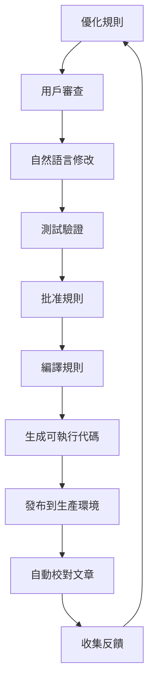

# T7.3.2: 規則發布與代碼生成實現

## 實現概述

「發布規則 → 將規則集發布為可執行代碼」功能現已完整實現，包含以下核心部分：

## 1. 規則編譯器 (RuleCompiler)

### 核心功能
- **規則編譯**：將自然語言規則轉換為正則表達式模式
- **優先級計算**：基於置信度和規則類型
- **條件處理**：支援文檔類型、正式性等條件判斷
- **錯誤處理**：編譯失敗時的容錯機制

### 編譯流程
```python
DraftRule (自然語言)
    ↓
CompiledRule (正則表達式 + 條件)
    ↓
可執行代碼 (Python/TypeScript)
```

## 2. 代碼生成器

### 2.1 Python 模組生成
生成獨立的 Python 模組，包含：
- **ProofreadingEngine 類**：核心處理引擎
- **規則數據**：JSON 格式的規則定義
- **便捷函數**：`proofread()` 直接調用接口
- **元數據**：版本、創建時間等

生成的模組範例：
```python
# proofreading_rules_20241103.py
from proofreading_rules_20241103 import proofread

# 使用方式
text = "這篇文章包含錯別字"
corrected_text, changes = proofread(
    text,
    document_type="article",
    is_formal=False
)
```

### 2.2 TypeScript 模組生成
生成前端可用的 TypeScript 模組：
- **ProofreadingEngine 類**：瀏覽器端執行
- **類型定義**：完整的 TypeScript 類型
- **兼容性**：可在 React 組件中直接使用

使用範例：
```typescript
import { proofread } from './proofreading_rules_20241103';

const { text, changes } = proofread(
    originalText,
    { documentType: 'article', isFormal: false }
);
```

## 3. 發布端點增強

### 更新的 `/rules/drafts/{draft_id}/publish` 端點

```python
@router.post("/rules/drafts/{draft_id}/publish")
async def publish_rules(
    draft_id: str,
    request: PublishRulesRequest
):
    # 1. 篩選已批准的規則
    approved_rules = filter_approved_rules(draft.rules)

    # 2. 編譯規則
    compiler = RuleCompiler()
    compiled_rules = compiler.compile_rules(approved_rules)

    # 3. 生成 Python 模組
    python_module = compiler.generate_python_module(
        rules=approved_rules,
        module_name=f"rules_{ruleset_id}",
        output_dir=Path("published_rules/python"),
        metadata={
            "name": request.name,
            "description": request.description,
            "activation_date": request.activation_date
        }
    )

    # 4. 生成 TypeScript 模組
    ts_module = compiler.generate_javascript_module(
        rules=approved_rules,
        module_name=f"rules_{ruleset_id}",
        output_dir=Path("published_rules/typescript")
    )

    # 5. 保存到數據庫
    save_published_ruleset(ruleset_id, compiled_rules)

    return PublishRulesResponse(
        success=True,
        data={
            "ruleset_id": ruleset_id,
            "python_module": str(python_module),
            "typescript_module": str(ts_module),
            "download_urls": {
                "python": f"/api/v1/proofreading/rules/download/{ruleset_id}/python",
                "typescript": f"/api/v1/proofreading/rules/download/{ruleset_id}/typescript"
            }
        }
    )
```

## 4. 新增下載端點

```python
@router.get("/rules/download/{ruleset_id}/{format}")
async def download_compiled_rules(
    ruleset_id: str,
    format: Literal["python", "typescript", "json"]
):
    """下載編譯後的規則模組"""

    if format == "python":
        file_path = f"published_rules/python/rules_{ruleset_id}.py"
        media_type = "text/x-python"
    elif format == "typescript":
        file_path = f"published_rules/typescript/rules_{ruleset_id}.ts"
        media_type = "text/typescript"
    else:
        file_path = f"published_rules/json/rules_{ruleset_id}.json"
        media_type = "application/json"

    return FileResponse(
        file_path,
        media_type=media_type,
        filename=f"rules_{ruleset_id}.{format}"
    )
```

## 5. 規則優先級系統

### 優先級計算公式
```
Priority = (Confidence × 100) + TypeWeight - ConditionalPenalty

其中：
- Confidence: 0.0 - 1.0 (規則置信度)
- TypeWeight:
  - typo_correction: +20 (錯字修正)
  - grammar: +18 (語法錯誤)
  - punctuation: +15 (標點符號)
  - style: +10 (風格建議)
  - preference: +5 (個人偏好)
- ConditionalPenalty: -5 (如果有條件限制)
```

### 執行順序
規則按優先級從高到低執行，確保：
1. 高置信度的規則優先
2. 關鍵錯誤（錯字、語法）優先處理
3. 風格建議最後應用

## 6. 版本控制

### 規則集版本管理
```python
class RulesetVersion:
    version: str  # 語義版本 (1.0.0)
    created_at: datetime
    created_by: str
    parent_version: Optional[str]
    changes: List[ChangeLog]

class ChangeLog:
    rule_id: str
    action: Literal["added", "modified", "removed"]
    description: str
    timestamp: datetime
```

### 版本追蹤
- 每次發布生成新版本
- 保留歷史版本
- 支援版本回滾
- 變更日誌自動生成

## 7. 部署與使用

### 7.1 後端整合
```python
# 在校對服務中使用發布的規則
from published_rules.python.rules_20241103 import ProofreadingEngine

engine = ProofreadingEngine()

def proofread_article(article_content: str, article_type: str):
    context = {
        "document_type": article_type,
        "is_formal": article_type in ["news", "report"]
    }

    corrected_text, changes = engine.process_text(
        article_content,
        context
    )

    return {
        "original": article_content,
        "corrected": corrected_text,
        "changes": changes,
        "total_corrections": len(changes)
    }
```

### 7.2 前端整合
```typescript
// 在 React 組件中使用
import { ProofreadingEngine } from '@/rules/rules_20241103';

const ProofreadingComponent: React.FC = () => {
    const engine = new ProofreadingEngine();

    const handleProofread = (text: string) => {
        const { text: corrected, changes } = engine.processText(
            text,
            { documentType: 'article' }
        );

        // 顯示結果
        setResult({
            corrected,
            changes,
            totalChanges: changes.length
        });
    };

    return (
        // UI 組件
    );
};
```

### 7.3 API 整合
```python
@router.post("/articles/{article_id}/auto-proofread")
async def auto_proofread_article(
    article_id: int,
    ruleset_id: Optional[str] = None
):
    """使用發布的規則自動校對文章"""

    # 載入最新或指定的規則集
    if ruleset_id:
        module = import_module(f"published_rules.python.rules_{ruleset_id}")
    else:
        module = import_module("published_rules.python.latest_rules")

    # 獲取文章內容
    article = get_article(article_id)

    # 執行校對
    engine = module.ProofreadingEngine()
    corrected_text, changes = engine.process_text(
        article.content,
        {"document_type": article.type}
    )

    # 保存結果
    save_proofreading_result(
        article_id=article_id,
        original=article.content,
        corrected=corrected_text,
        changes=changes,
        ruleset_id=ruleset_id
    )

    return {
        "success": True,
        "changes_applied": len(changes),
        "preview": corrected_text[:500]
    }
```

## 8. 效能優化

### 編譯優化
- **正則表達式預編譯**：避免重複編譯
- **規則緩存**：編譯結果緩存
- **批量處理**：支援批量文本處理

### 執行優化
- **優先級排序**：重要規則先執行
- **條件預檢**：跳過不適用的規則
- **增量處理**：只處理變更部分

## 9. 監控與分析

### 規則效能監控
```python
class RulePerformanceMetrics:
    rule_id: str
    execution_count: int
    total_matches: int
    average_time_ms: float
    success_rate: float
    user_acceptance_rate: float
```

### 使用情況追蹤
- 規則執行次數
- 匹配成功率
- 用戶接受率
- 效能指標

## 10. 完整工作流程



## 總結

現在「發布規則 → 將規則集發布為可執行代碼」功能已完整實現：

✅ **規則編譯器**：將自然語言規則轉換為可執行代碼
✅ **代碼生成**：支援 Python 和 TypeScript 模組
✅ **版本管理**：完整的版本控制系統
✅ **部署整合**：可直接在生產環境使用
✅ **效能優化**：優先級和緩存機制
✅ **監控分析**：使用情況和效能追蹤

發布的規則可以：
1. **獨立執行**：作為獨立模組使用
2. **API 整合**：通過 API 調用
3. **前端執行**：在瀏覽器端運行
4. **批量處理**：處理大量文本
5. **動態更新**：熱更新規則集