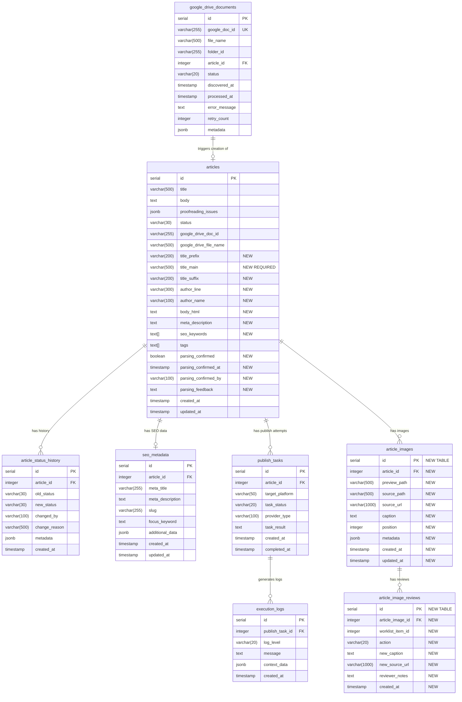

# Phase 7: Article Structured Parsing - Entity Relationship Diagram

**Document Version**: 1.0
**Last Updated**: 2025-11-08
**Status**: Design Document - Phase 7

---

## 1. Overview

This document provides a **visual entity-relationship diagram** for the Phase 7 Article Structured Parsing feature. It shows how the new `article_images` and `article_image_reviews` tables integrate with the existing CMS automation database schema.

---

## 2. Complete ER Diagram



---

## 3. Relationship Details

### 3.1 Phase 7 New Relationships

#### Relationship: `articles` → `article_images`
- **Type**: One-to-Many
- **Cardinality**: `1..N` (One article has zero or more images)
- **Foreign Key**: `article_images.article_id` → `articles.id`
- **Delete Cascade**: `ON DELETE CASCADE` (when article is deleted, all images are deleted)
- **Purpose**: Store all images extracted from an article during parsing

**Example**:
```
Article #123 → [Image #1 (position=0), Image #2 (position=3), Image #3 (position=7)]
```

#### Relationship: `article_images` → `article_image_reviews`
- **Type**: One-to-Many
- **Cardinality**: `1..N` (One image has zero or more review records)
- **Foreign Key**: `article_image_reviews.article_image_id` → `article_images.id`
- **Delete Cascade**: `ON DELETE CASCADE` (when image is deleted, all reviews are deleted)
- **Purpose**: Track user review actions during parsing confirmation (Step 1)

**Example**:
```
Image #5 → [Review #1 (action='keep'), Review #2 (action='replace_caption')]
```

### 3.2 Existing Relationships (Context)

These relationships existed before Phase 7 but provide context:

| Parent Table               | Child Table              | Cardinality | Purpose                          |
|----------------------------|--------------------------|-------------|----------------------------------|
| `articles`                 | `article_status_history` | `1..N`      | Audit trail for status changes   |
| `articles`                 | `seo_metadata`           | `1..1`      | SEO optimization data            |
| `articles`                 | `publish_tasks`          | `1..N`      | Publishing attempts              |
| `publish_tasks`            | `execution_logs`         | `1..N`      | Detailed execution logs          |
| `google_drive_documents`   | `articles`               | `1..1`      | Google Drive source              |

---

## 4. Table Relationship Matrix

| Table                     | Primary Key | Foreign Keys                           | Relationships                          |
|---------------------------|-------------|----------------------------------------|----------------------------------------|
| `articles`                | `id`        | None                                   | Parent to 6 child tables               |
| `article_images`          | `id`        | `article_id` → `articles.id`           | Child of articles, parent of reviews   |
| `article_image_reviews`   | `id`        | `article_image_id` → `article_images.id` | Child of article_images              |
| `article_status_history`  | `id`        | `article_id` → `articles.id`           | Child of articles                      |
| `seo_metadata`            | `id`        | `article_id` → `articles.id`           | Child of articles (1:1)                |
| `publish_tasks`           | `id`        | `article_id` → `articles.id`           | Child of articles                      |
| `execution_logs`          | `id`        | `publish_task_id` → `publish_tasks.id` | Child of publish_tasks                 |
| `google_drive_documents`  | `id`        | `article_id` → `articles.id`           | Parent to articles                     |

---

## 5. Data Flow: Parsing Workflow

This diagram shows how data flows through the new Phase 7 tables during article parsing:

```
┌─────────────────────────────────────────────────────────────────┐
│ 1. Google Doc Ingestion (Phase 6)                              │
│    google_drive_documents (status='processing')                 │
└────────────────┬────────────────────────────────────────────────┘
                 │
                 ▼
┌─────────────────────────────────────────────────────────────────┐
│ 2. Article Creation (NEW: Phase 7 parsing)                     │
│    articles table created with:                                 │
│    - title_main (parsed from doc)                              │
│    - title_prefix, title_suffix (optional)                     │
│    - author_name (extracted)                                    │
│    - body_html (sanitized content)                              │
│    - seo_keywords, meta_description (extracted)                 │
│    - parsing_confirmed = FALSE                                  │
└────────────────┬────────────────────────────────────────────────┘
                 │
                 ├──────────────────────────────────────┐
                 │                                      │
                 ▼                                      ▼
┌────────────────────────────────┐  ┌──────────────────────────────┐
│ 3a. Image Extraction           │  │ 3b. Content Storage          │
│     article_images created for │  │     body_html stored         │
│     each image in doc:         │  │     meta fields populated    │
│     - position (para index)    │  └──────────────────────────────┘
│     - source_url (原圖 link)   │
│     - caption (image caption)  │
│     - metadata (JSONB specs)   │
└────────────────┬───────────────┘
                 │
                 ▼
┌─────────────────────────────────────────────────────────────────┐
│ 4. User Review (Step 1: Parsing Confirmation UI)               │
│    User reviews parsed data in frontend UI                     │
└────────────────┬────────────────────────────────────────────────┘
                 │
                 ├──────────────────────────────────────┐
                 │                                      │
                 ▼                                      ▼
┌────────────────────────────────┐  ┌──────────────────────────────┐
│ 5a. Image Review Actions       │  │ 5b. Parsing Confirmation     │
│     article_image_reviews:     │  │     UPDATE articles SET      │
│     - action='keep'            │  │       parsing_confirmed=TRUE │
│     - action='remove'          │  │       parsing_confirmed_at   │
│     - action='replace_caption' │  │       parsing_confirmed_by   │
│     - action='replace_source'  │  └──────────────────────────────┘
└────────────────────────────────┘
                 │
                 ▼
┌─────────────────────────────────────────────────────────────────┐
│ 6. Ready for Step 2 (Content Proofreading)                     │
│    Article moves to proofreading workflow                       │
└─────────────────────────────────────────────────────────────────┘
```

---

## 6. Index Strategy

### 6.1 Primary Indexes (Performance-Critical)

These indexes support the most common query patterns:

| Index Name                           | Table                   | Columns                | Purpose                              |
|--------------------------------------|-------------------------|------------------------|--------------------------------------|
| `idx_articles_parsing_confirmed`     | `articles`              | `parsing_confirmed`    | Find unparsed articles for worklist  |
| `idx_article_images_article_id`      | `article_images`        | `article_id`           | Fetch all images for an article      |
| `idx_article_images_position`        | `article_images`        | `article_id, position` | Order images by position             |
| `idx_article_image_reviews_article_image` | `article_image_reviews` | `article_image_id` | Get review history for an image      |

### 6.2 Secondary Indexes (Analytics & Reporting)

| Index Name                                  | Table                   | Columns         | Purpose                          |
|---------------------------------------------|-------------------------|-----------------|----------------------------------|
| `idx_articles_parsing_confirmed_at`         | `articles`              | `parsing_confirmed_at DESC` | Recent confirmations |
| `idx_article_images_metadata_gin`           | `article_images`        | `metadata` (GIN)| JSONB queries on image metadata  |
| `idx_article_image_reviews_action`          | `article_image_reviews` | `action`        | Filter by review action type     |

---

## 7. Constraints Summary

### 7.1 Primary Keys

| Table                   | Primary Key Column | Type   |
|-------------------------|-------------------|--------|
| `articles`              | `id`              | SERIAL |
| `article_images`        | `id`              | SERIAL |
| `article_image_reviews` | `id`              | SERIAL |

### 7.2 Foreign Keys

| Foreign Key Constraint                    | Child Table             | Parent Table     | On Delete |
|-------------------------------------------|-------------------------|------------------|-----------|
| `fk_article_images_article`               | `article_images`        | `articles`       | CASCADE   |
| `fk_article_image_reviews_article_image`  | `article_image_reviews` | `article_images` | CASCADE   |

### 7.3 Unique Constraints

| Table           | Columns                | Purpose                                    |
|-----------------|------------------------|--------------------------------------------|
| `article_images`| `article_id, position` | Prevent duplicate images at same position  |

### 7.4 Check Constraints

| Table                   | Constraint                           | Rule                                      |
|-------------------------|--------------------------------------|-------------------------------------------|
| `article_images`        | `article_images_positive_position`   | `position >= 0`                           |
| `article_image_reviews` | `article_image_reviews_valid_action` | `action IN ('keep', 'remove', ...)`       |
| `article_image_reviews` | `article_image_reviews_caption_required` | If action='replace_caption', new_caption must be provided |
| `article_image_reviews` | `article_image_reviews_source_required` | If action='replace_source', new_source_url must be provided |

---

## 8. Query Examples

### 8.1 Get Article with All Images (Parsing Confirmation UI)

```sql
SELECT
    a.id,
    a.title_prefix,
    a.title_main,
    a.title_suffix,
    a.author_line,
    a.author_name,
    a.body_html,
    a.meta_description,
    a.seo_keywords,
    a.tags,
    a.parsing_confirmed,
    json_agg(
        json_build_object(
            'id', ai.id,
            'position', ai.position,
            'preview_path', ai.preview_path,
            'source_url', ai.source_url,
            'caption', ai.caption,
            'metadata', ai.metadata
        ) ORDER BY ai.position
    ) FILTER (WHERE ai.id IS NOT NULL) as images
FROM articles a
LEFT JOIN article_images ai ON a.id = ai.article_id
WHERE a.id = :article_id
GROUP BY a.id;
```

### 8.2 Get Unparsed Articles (Worklist Query)

```sql
SELECT
    a.id,
    a.title_main,
    a.created_at,
    COUNT(ai.id) as image_count,
    a.parsing_confirmed
FROM articles a
LEFT JOIN article_images ai ON a.id = ai.article_id
WHERE a.parsing_confirmed = FALSE
GROUP BY a.id
ORDER BY a.created_at DESC
LIMIT 50;
```

### 8.3 Get Image Review History

```sql
SELECT
    ai.position,
    ai.caption as original_caption,
    air.action,
    air.new_caption,
    air.new_source_url,
    air.reviewer_notes,
    air.created_at
FROM article_image_reviews air
JOIN article_images ai ON air.article_image_id = ai.id
WHERE ai.article_id = :article_id
ORDER BY ai.position, air.created_at DESC;
```

---

## 9. Migration Path

### 9.1 From Phase 6 to Phase 7

**Step 1**: Run Alembic migration to add columns to `articles` table
```bash
alembic upgrade +1  # 20251108_add_article_parsing_fields.py
```

**Step 2**: Run Alembic migration to create `article_images` table
```bash
alembic upgrade +1  # 20251108_create_article_images.py
```

**Step 3**: Run Alembic migration to create `article_image_reviews` table
```bash
alembic upgrade +1  # 20251108_create_article_image_reviews.py
```

### 9.2 Data Backfill (Optional)

For existing articles imported before Phase 7:

```sql
-- Mark old articles as already parsed (skip parsing confirmation)
UPDATE articles
SET parsing_confirmed = TRUE,
    parsing_confirmed_at = NOW(),
    parsing_confirmed_by = 'system_migration',
    parsing_feedback = 'Pre-Phase 7 article, parsing not applicable'
WHERE created_at < '2025-11-08'
  AND parsing_confirmed IS NULL;
```

---

## 10. Related Documentation

- **SQL DDL**: `backend/migrations/manual_sql/phase7_parsing_schema.sql`
- **JSONB Metadata Spec**: `backend/docs/article_images_metadata_spec.md`
- **Data Model**: `specs/001-cms-automation/data-model.md`
- **Implementation Tasks**: `specs/001-cms-automation/tasks.md` T7.1-T7.4
- **API Specification**: `docs/API_PARSING_ENDPOINTS.md`

---

**Document Maintained By**: CMS Automation Team
**Review Cycle**: Before Phase 7 implementation begins
**Last Reviewed**: 2025-11-08
**Approved By**: Tech Lead (Pending)
