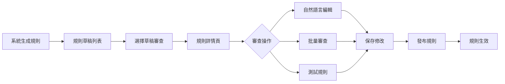

# 規則審查與修改 UI 設計文檔

## 1. 整體架構

### 1.1 頁面結構
```
規則管理系統
├── 規則草稿列表頁
├── 規則詳情與編輯頁
├── 規則測試面板
└── 規則發布確認頁
```

### 1.2 用戶流程


## 2. 組件設計

### 2.1 規則草稿列表 (RuleDraftList)

**佈局設計**：
```
┌─────────────────────────────────────────────────────────────────┐
│  📋 規則管理中心                                               │
├─────────────────────────────────────────────────────────────────┤
│  篩選: [全部 ▼] [待審查] [審查中] [已批准]    🔍 搜索...      │
├─────────────────────────────────────────────────────────────────┤
│ ┌─────────────────────────────────────────────────────────────┐│
│ │ 📄 2024年11月校對規則集                        待審查     ││
│ │ 規則數: 15  |  創建時間: 2024-11-03           [查看詳情]  ││
│ │ 進度: ■■■□□□□□□□ 30% (5/15 已審查)                       ││
│ └─────────────────────────────────────────────────────────────┘│
│ ┌─────────────────────────────────────────────────────────────┐│
│ │ 📄 標點符號優化規則                            審查中     ││
│ │ 規則數: 8   |  創建時間: 2024-11-02           [繼續審查]  ││
│ │ 進度: ■■■■■■□□□□ 60% (5/8 已審查)                        ││
│ └─────────────────────────────────────────────────────────────┘│
└─────────────────────────────────────────────────────────────────┘
```

**功能特性**：
- 顯示所有規則草稿
- 狀態篩選（待審查/審查中/已批准）
- 審查進度可視化
- 快速搜索功能

### 2.2 規則詳情頁 (RuleDetail)

**佈局設計**：
```
┌─────────────────────────────────────────────────────────────────┐
│  ← 返回  |  2024年11月校對規則集                   [發布規則] │
├─────────────────────────────────────────────────────────────────┤
│  進度: 5/15 已審查  |  2 已批准  |  2 已修改  |  1 已拒絕    │
├─────────────────────────────────────────────────────────────────┤
│                                                                 │
│  [批量操作 ▼]  [測試所有規則]  [導出報告]                     │
│                                                                 │
│ ┌─────────────────────────────────────────────────────────────┐│
│ │ 規則 #1                                        ○ 待審查   ││
│ ├─────────────────────────────────────────────────────────────┤│
│ │ 📝 自然語言描述:                                           ││
│ │ 當遇到「錯別字」時，建議替換為「錯誤字」                   ││
│ │                                                             ││
│ │ 🔧 規則代碼:                                                ││
│ │ Pattern: 錯別字                                             ││
│ │ Replace: 錯誤字                                             ││
│ │ Confidence: 92%                                             ││
│ │                                                             ││
│ │ 📊 示例:                                                    ││
│ │ Before: 文章中有錯別字                                      ││
│ │ After:  文章中有錯誤字                                      ││
│ │                                                             ││
│ │ [編輯] [測試] [批准] [修改] [拒絕]                         ││
│ └─────────────────────────────────────────────────────────────┘│
└─────────────────────────────────────────────────────────────────┘
```

**功能特性**：
- 規則卡片式展示
- 自然語言與代碼雙重顯示
- 單個規則操作按鈕
- 批量操作支持

### 2.3 自然語言編輯器 (NaturalLanguageEditor)

**佈局設計**：
```
┌─────────────────────────────────────────────────────────────────┐
│  編輯規則 #1                                         [關閉 ✕] │
├─────────────────────────────────────────────────────────────────┤
│                                                                 │
│  📝 使用自然語言描述規則:                                       │
│  ┌─────────────────────────────────────────────────────────┐  │
│  │ 當看到「因此」在段落開頭時，建議改為「所以」，           │  │
│  │ 但如果是正式文件則保留原樣。                             │  │
│  └─────────────────────────────────────────────────────────┘  │
│                                                                 │
│  📌 添加示例 (可選):                                           │
│  Before: [因此，我們決定...]                                   │
│  After:  [所以，我們決定...]                                   │
│  [+ 添加更多示例]                                              │
│                                                                 │
│  ⚙️ 應用條件:                                                  │
│  □ 只在非正式文檔中應用                                        │
│  □ 只在段落開頭應用                                            │
│  □ 忽略引用內容                                                │
│                                                                 │
│  🔍 預覽生成的規則代碼:                                        │
│  ┌─────────────────────────────────────────────────────────┐  │
│  │ {                                                       │  │
│  │   "pattern": "^因此",                                   │  │
│  │   "replacement": "所以",                                │  │
│  │   "conditions": [                                       │  │
│  │     {"type": "document_type", "value": "informal"}     │  │
│  │   ]                                                     │  │
│  │ }                                                       │  │
│  └─────────────────────────────────────────────────────────┘  │
│                                                                 │
│  [取消]                           [測試規則] [保存修改]        │
└─────────────────────────────────────────────────────────────────┘
```

**功能特性**：
- 富文本編輯器
- 實時代碼生成預覽
- 示例管理
- 條件選擇器
- 即時測試功能

### 2.4 規則測試面板 (RuleTester)

**佈局設計**：
```
┌─────────────────────────────────────────────────────────────────┐
│  測試規則                                            [關閉 ✕] │
├─────────────────────────────────────────────────────────────────┤
│                                                                 │
│  📄 輸入測試文本:                                              │
│  ┌─────────────────────────────────────────────────────────┐  │
│  │ 這段文字包含錯別字，因此需要修正。                       │  │
│  │ 另外，因此這個詞在正式文件中應該保留。                   │  │
│  └─────────────────────────────────────────────────────────┘  │
│                                                                 │
│  [執行測試]                                                    │
│                                                                 │
│  📊 測試結果:                                                  │
│  ┌─────────────────────────────────────────────────────────┐  │
│  │ ✅ 找到 2 處匹配                                          │  │
│  │                                                           │  │
│  │ 1. 位置 [6-9]: "錯別字" → "錯誤字" (置信度: 92%)        │  │
│  │ 2. 位置 [10-12]: "因此" → "所以" (置信度: 85%)          │  │
│  └─────────────────────────────────────────────────────────┘  │
│                                                                 │
│  📝 修改後文本:                                                │
│  ┌─────────────────────────────────────────────────────────┐  │
│  │ 這段文字包含錯誤字，所以需要修正。                       │  │
│  │ 另外，所以這個詞在正式文件中應該保留。                   │  │
│  └─────────────────────────────────────────────────────────┘  │
│                                                                 │
│  [應用到所有相似文本]                         [關閉]          │
└─────────────────────────────────────────────────────────────────┘
```

### 2.5 批量審查面板 (BatchReview)

**佈局設計**：
```
┌─────────────────────────────────────────────────────────────────┐
│  批量審查                                                      │
├─────────────────────────────────────────────────────────────────┤
│  已選擇 5 個規則                                               │
│                                                                 │
│  批量操作:                                                     │
│  ○ 全部批准                                                    │
│  ○ 全部拒絕                                                    │
│  ● 逐個審查                                                    │
│                                                                 │
│  [開始審查]                                                    │
└─────────────────────────────────────────────────────────────────┘
```

## 3. 技術實現

### 3.1 組件結構
```
src/components/proofreading/
├── RuleManagement/
│   ├── RuleDraftList.tsx
│   ├── RuleDraftCard.tsx
│   └── DraftFilters.tsx
├── RuleDetail/
│   ├── RuleDetailPage.tsx
│   ├── RuleCard.tsx
│   └── RuleActions.tsx
├── RuleEditor/
│   ├── NaturalLanguageEditor.tsx
│   ├── ExampleManager.tsx
│   └── ConditionSelector.tsx
├── RuleTester/
│   ├── TestPanel.tsx
│   ├── TestResults.tsx
│   └── DiffViewer.tsx
└── shared/
    ├── ProgressBar.tsx
    ├── StatusBadge.tsx
    └── ConfirmDialog.tsx
```

### 3.2 狀態管理 (Redux)
```typescript
interface RuleManagementState {
  drafts: RuleDraft[];
  currentDraft: RuleDraft | null;
  selectedRules: string[];
  testResults: TestResult | null;
  loading: boolean;
  error: string | null;
}

// Actions
- FETCH_DRAFTS
- SELECT_DRAFT
- UPDATE_RULE
- BATCH_REVIEW
- TEST_RULES
- PUBLISH_RULES
```

### 3.3 API 集成
```typescript
// API Service
class RuleManagementAPI {
  async fetchDrafts(filters?: DraftFilters): Promise<DraftListResponse>
  async getDraftDetail(draftId: string): Promise<DraftDetailResponse>
  async updateRule(draftId: string, ruleId: string, data: ModifyRuleRequest)
  async batchReview(draftId: string, reviews: ReviewItem[])
  async testRules(rules: DraftRule[], content: string)
  async publishRules(draftId: string, config: PublishConfig)
}
```

## 4. 交互設計

### 4.1 拖放支持
- 規則卡片可拖放重新排序
- 拖放規則到測試區域快速測試

### 4.2 鍵盤快捷鍵
- `Ctrl+S`: 保存當前修改
- `Ctrl+T`: 測試當前規則
- `Ctrl+A`: 批准當前規則
- `Ctrl+R`: 拒絕當前規則
- `Esc`: 關閉對話框

### 4.3 實時反饋
- 自然語言輸入時實時生成代碼預覽
- 規則測試結果高亮顯示
- 進度條實時更新

## 5. 響應式設計

### 5.1 移動端適配
- 規則卡片垂直堆疊
- 編輯器全屏顯示
- 底部操作欄固定

### 5.2 平板適配
- 雙欄佈局（列表+詳情）
- 側滑面板編輯

## 6. 性能優化

### 6.1 虛擬滾動
- 規則列表超過50條時啟用虛擬滾動
- 只渲染可視區域內的規則卡片

### 6.2 懶加載
- 規則詳情按需加載
- 測試結果分頁顯示

### 6.3 緩存策略
- 草稿列表緩存5分鐘
- 規則詳情緩存直到修改
- 測試結果緩存10分鐘

## 7. 用戶體驗增強

### 7.1 引導提示
- 首次使用顯示功能引導
- 複雜操作提供工具提示
- 錯誤信息清晰明確

### 7.2 批量操作
- 支持Shift+Click多選
- 提供全選/反選按鈕
- 批量操作前確認

### 7.3 撤銷/重做
- 支持最近10次操作撤銷
- 修改歷史記錄可查看

## 8. 無障礙設計

### 8.1 ARIA標籤
- 所有交互元素添加適當的ARIA標籤
- 表單元素關聯標籤

### 8.2 鍵盤導航
- Tab鍵順序合理
- 支持方向鍵導航列表

### 8.3 顏色對比
- 符合WCAG 2.1 AA標準
- 提供高對比度主題選項