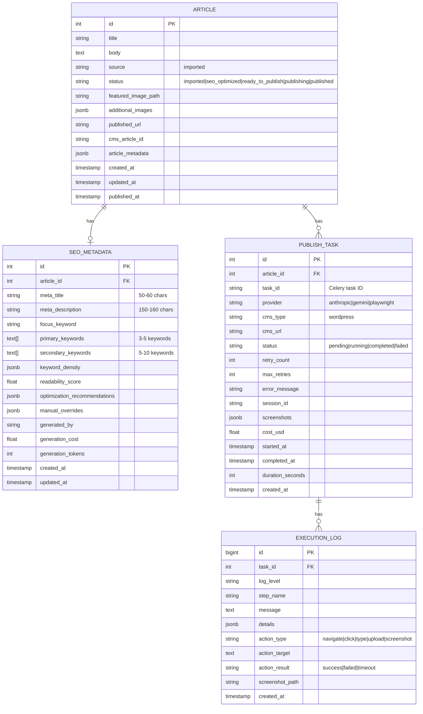

# Data Model: SEO Optimization & Multi-Provider Computer Use Publishing

**Version**: 2.0.0
**Last Updated**: 2025-10-26
**Database**: PostgreSQL 15+ (JSONB support)
**Architecture**: Article Import → SEO Analysis → Multi-Provider Computer Use Publishing

---

## Overview

This document defines the database schema for the CMS automation platform with multi-provider Computer Use support. The model supports:

1. **Article Import**: External content from CSV/JSON or manual entry
2. **SEO Optimization**: Claude Messages API-powered metadata generation
3. **Multi-Provider Publishing**: Computer Use publishing via Anthropic, Gemini, or Playwright
4. **Complete Audit Trail**: Screenshot storage and execution logging

**Key Design Principles**:
- **Single Source of Truth**: All articles stored in unified `articles` table
- **Provider Flexibility**: Abstract provider interface with enum-based selection
- **Observability**: Comprehensive logging with screenshot audit trail
- **Performance**: JSONB for flexible metadata, partitioned logs for scalability
- **Compliance**: Complete audit trail with 90-day retention for sensitive data

---

## Entity Relationship Diagram



---

## Core Entities

### 1. Article

The central content entity representing imported articles ready for SEO optimization and publishing.

**Table**: `articles`

| Column | Type | Constraints | Description |
|--------|------|-------------|-------------|
| id | SERIAL | PRIMARY KEY | Unique article identifier |
| title | VARCHAR(500) | NOT NULL | Article headline (10-500 characters) |
| body | TEXT | NOT NULL | Full article content (HTML or Markdown) |
| excerpt | TEXT | NULLABLE | Brief article summary |
| category | VARCHAR(100) | NULLABLE | Article category/section |
| tags | TEXT[] | DEFAULT '{}' | Article tags/keywords |
| source | VARCHAR(20) | NOT NULL, DEFAULT 'imported' | Content source (always 'imported' in v2.0) |
| status | VARCHAR(30) | NOT NULL, DEFAULT 'imported' | Workflow status (see enum below) |
| featured_image_path | VARCHAR(500) | NULLABLE | Path to featured image |
| additional_images | JSONB | DEFAULT '[]' | Array of additional image objects |
| published_url | VARCHAR(500) | NULLABLE | Final published article URL |
| cms_article_id | VARCHAR(100) | NULLABLE | CMS platform's article ID (e.g., WordPress post ID) |
| article_metadata | JSONB | DEFAULT '{}' | Flexible metadata storage |
| created_at | TIMESTAMP | NOT NULL, DEFAULT NOW() | Article creation timestamp |
| updated_at | TIMESTAMP | NOT NULL, DEFAULT NOW() | Last modification timestamp |
| published_at | TIMESTAMP | NULLABLE | Actual publication timestamp |

**Status Enum**:
```sql
CREATE TYPE article_status_enum AS ENUM (
    'imported',           -- Article imported, pending SEO analysis
    'seo_optimized',      -- SEO analysis complete
    'ready_to_publish',   -- SEO reviewed, ready for publishing
    'publishing',         -- Publishing in progress
    'published'           -- Successfully published to CMS
);
```

**Indexes**:
```sql
CREATE INDEX idx_articles_status ON articles(status);
CREATE INDEX idx_articles_source ON articles(source);
CREATE INDEX idx_articles_created ON articles(created_at DESC);
CREATE INDEX idx_articles_published ON articles(published_at DESC) WHERE published_at IS NOT NULL;
CREATE INDEX idx_articles_metadata ON articles USING GIN(article_metadata);
CREATE INDEX idx_articles_pending_seo ON articles(status) WHERE status = 'imported';
```

**State Transitions**:
```
imported → seo_optimized → ready_to_publish → publishing → published
```

**article_metadata JSONB Schema**:
```json
{
  "import_source": "outsourced_writer_batch_2025_10",
  "original_url": "https://external-site.com/original-article",
  "word_count": 1523,
  "author_name": "John Doe",
  "import_batch_id": "batch_20251026_001"
}
```

**additional_images JSONB Schema**:
```json
[
  {
    "url": "https://cdn.example.com/image1.jpg",
    "alt": "Image description for accessibility",
    "caption": "Optional image caption",
    "position": 0,
    "size_bytes": 245678
  },
  {
    "url": "https://cdn.example.com/image2.jpg",
    "alt": "Another image",
    "position": 1,
    "size_bytes": 189234
  }
]
```

**Constraints**:
```sql
ALTER TABLE articles ADD CONSTRAINT check_title_length
CHECK (char_length(title) BETWEEN 10 AND 500);

ALTER TABLE articles ADD CONSTRAINT check_source
CHECK (source IN ('imported'));

ALTER TABLE articles ADD CONSTRAINT check_cms_article_id_unique
UNIQUE (cms_article_id) WHERE cms_article_id IS NOT NULL;
```

---

### 2. SEO Metadata

Stores SEO analysis results generated by Claude Messages API.

**Table**: `seo_metadata`

| Column | Type | Constraints | Description |
|--------|------|-------------|-------------|
| id | SERIAL | PRIMARY KEY | Unique SEO metadata identifier |
| article_id | INTEGER | NOT NULL, UNIQUE | Article reference (1:1 relationship) |
| meta_title | VARCHAR(60) | NOT NULL | Optimized SEO title (50-60 characters) |
| meta_description | VARCHAR(160) | NOT NULL | Meta description (150-160 characters) |
| focus_keyword | VARCHAR(100) | NOT NULL | Primary target keyword phrase |
| primary_keywords | TEXT[] | NOT NULL, DEFAULT '{}' | 3-5 main keywords |
| secondary_keywords | TEXT[] | NOT NULL, DEFAULT '{}' | 5-10 supporting keywords |
| keyword_density | JSONB | NOT NULL, DEFAULT '{}' | Keyword frequency analysis |
| readability_score | FLOAT | NULLABLE | Flesch-Kincaid grade level (target: 8-12) |
| optimization_recommendations | JSONB | DEFAULT '[]' | Actionable SEO suggestions |
| manual_overrides | JSONB | DEFAULT '{}' | User edits with timestamps |
| generated_by | VARCHAR(50) | NULLABLE | Model used (e.g., "claude-3-5-sonnet-20250101") |
| generation_cost | FLOAT | NULLABLE | API cost in USD |
| generation_tokens | INTEGER | NULLABLE | Total tokens used |
| created_at | TIMESTAMP | NOT NULL, DEFAULT NOW() | Initial analysis timestamp |
| updated_at | TIMESTAMP | NOT NULL, DEFAULT NOW() | Last modification timestamp |

**Indexes**:
```sql
CREATE INDEX idx_seo_metadata_article ON seo_metadata(article_id);
CREATE INDEX idx_seo_metadata_focus_keyword ON seo_metadata(focus_keyword);
CREATE INDEX idx_seo_metadata_created ON seo_metadata(created_at DESC);
```

**Foreign Keys**:
```sql
ALTER TABLE seo_metadata
ADD CONSTRAINT fk_seo_metadata_article
FOREIGN KEY (article_id) REFERENCES articles(id) ON DELETE CASCADE;
```

**Constraints**:
```sql
ALTER TABLE seo_metadata ADD CONSTRAINT check_meta_title_length
CHECK (char_length(meta_title) >= 50 AND char_length(meta_title) <= 60);

ALTER TABLE seo_metadata ADD CONSTRAINT check_meta_description_length
CHECK (char_length(meta_description) >= 150 AND char_length(meta_description) <= 160);

ALTER TABLE seo_metadata ADD CONSTRAINT check_primary_keywords_count
CHECK (array_length(primary_keywords, 1) >= 3 AND array_length(primary_keywords, 1) <= 5);

ALTER TABLE seo_metadata ADD CONSTRAINT check_secondary_keywords_count
CHECK (array_length(secondary_keywords, 1) >= 5 AND array_length(secondary_keywords, 1) <= 10);
```

**keyword_density JSONB Schema**:
```json
{
  "React performance optimization": {
    "count": 15,
    "density": 2.1
  },
  "React optimization": {
    "count": 12,
    "density": 1.7
  },
  "JavaScript performance": {
    "count": 10,
    "density": 1.4
  }
}
```

**optimization_recommendations JSONB Schema**:
```json
[
  {
    "type": "keyword_density",
    "severity": "medium",
    "message": "Focus keyword density is 1.2%, consider increasing to 2-3% for optimal SEO",
    "suggestion": "Add 3-5 more mentions of 'React performance optimization' naturally in the content"
  },
  {
    "type": "readability",
    "severity": "low",
    "message": "Readability grade level is 14.2, slightly above target range",
    "suggestion": "Simplify complex sentences in paragraphs 3, 7, and 12"
  },
  {
    "type": "meta_description",
    "severity": "high",
    "message": "Meta description does not include focus keyword",
    "suggestion": "Rewrite meta description to include 'React performance optimization'"
  }
]
```

**manual_overrides JSONB Schema**:
```json
{
  "meta_title": {
    "original_value": "React Performance Optimization: 10 Best Practices",
    "new_value": "React Performance Optimization | 10 Best Practices 2025",
    "editor_id": 42,
    "edited_at": "2025-10-26T14:30:00Z",
    "reason": "Added year for freshness signal"
  },
  "focus_keyword": {
    "original_value": "React performance",
    "new_value": "React performance optimization",
    "editor_id": 42,
    "edited_at": "2025-10-26T14:32:00Z",
    "reason": "More specific keyword with higher search volume"
  }
}
```

---

### 3. Publish Task

Represents a Computer Use publishing operation with multi-provider support.

**Table**: `publish_tasks`

| Column | Type | Constraints | Description |
|--------|------|-------------|-------------|
| id | SERIAL | PRIMARY KEY | Unique task identifier |
| article_id | INTEGER | NOT NULL | Article to publish |
| task_id | VARCHAR(100) | UNIQUE | Celery task ID for async tracking |
| provider | provider_enum | NOT NULL, DEFAULT 'playwright' | Computer Use provider |
| cms_type | VARCHAR(50) | NOT NULL, DEFAULT 'wordpress' | Target CMS platform |
| cms_url | VARCHAR(500) | NULLABLE | CMS base URL |
| status | VARCHAR(20) | NOT NULL, DEFAULT 'pending' | Task execution status |
| retry_count | INTEGER | NOT NULL, DEFAULT 0 | Number of retry attempts |
| max_retries | INTEGER | NOT NULL, DEFAULT 3 | Maximum retry limit |
| error_message | TEXT | NULLABLE | Failure reason if applicable |
| session_id | VARCHAR(100) | NULLABLE | Browser/API session identifier |
| screenshots | JSONB | DEFAULT '[]' | Screenshot URLs with timestamps |
| cost_usd | FLOAT | NULLABLE | API cost (for Anthropic/Gemini providers) |
| started_at | TIMESTAMP | NULLABLE | Task start time |
| completed_at | TIMESTAMP | NULLABLE | Task completion time |
| duration_seconds | INTEGER | NULLABLE | Total execution time |
| created_at | TIMESTAMP | NOT NULL, DEFAULT NOW() | Task creation time |

**Provider Enum**:
```sql
CREATE TYPE provider_enum AS ENUM (
    'anthropic',   -- Anthropic Computer Use API (AI-driven)
    'gemini',      -- Google Gemini Computer Use API (AI-driven, future)
    'playwright'   -- Traditional Playwright automation (default, free)
);
```

**Status Enum**:
```sql
CREATE TYPE publish_status_enum AS ENUM (
    'pending',     -- Task queued, not started
    'running',     -- Currently executing
    'completed',   -- Successfully published
    'failed'       -- Failed after all retries
);
```

**Indexes**:
```sql
CREATE INDEX idx_publish_tasks_article ON publish_tasks(article_id);
CREATE INDEX idx_publish_tasks_status ON publish_tasks(status);
CREATE INDEX idx_publish_tasks_provider ON publish_tasks(provider);
CREATE INDEX idx_publish_tasks_task_id ON publish_tasks(task_id);
CREATE INDEX idx_publish_tasks_created ON publish_tasks(created_at DESC);
CREATE INDEX idx_publish_tasks_pending ON publish_tasks(status) WHERE status = 'pending';
```

**Foreign Keys**:
```sql
ALTER TABLE publish_tasks
ADD CONSTRAINT fk_publish_tasks_article
FOREIGN KEY (article_id) REFERENCES articles(id) ON DELETE CASCADE;
```

**Constraints**:
```sql
ALTER TABLE publish_tasks ADD CONSTRAINT check_max_retries_positive
CHECK (max_retries > 0);

ALTER TABLE publish_tasks ADD CONSTRAINT check_retry_count_within_max
CHECK (retry_count <= max_retries);

ALTER TABLE publish_tasks ADD CONSTRAINT check_status_valid
CHECK (status IN ('pending', 'running', 'completed', 'failed'));
```

**screenshots JSONB Schema**:
```json
[
  {
    "step": "01_login_success",
    "url": "https://s3.amazonaws.com/bucket/screenshots/task_123/01_login_success.png",
    "timestamp": "2025-10-26T14:25:30Z",
    "description": "WordPress admin login successful"
  },
  {
    "step": "02_editor_loaded",
    "url": "https://s3.amazonaws.com/bucket/screenshots/task_123/02_editor_loaded.png",
    "timestamp": "2025-10-26T14:25:45Z",
    "description": "Gutenberg editor interface loaded"
  },
  {
    "step": "03_content_filled",
    "url": "https://s3.amazonaws.com/bucket/screenshots/task_123/03_content_filled.png",
    "timestamp": "2025-10-26T14:26:10Z",
    "description": "Title and body content populated"
  },
  {
    "step": "04_image_uploaded",
    "url": "https://s3.amazonaws.com/bucket/screenshots/task_123/04_image_uploaded.png",
    "timestamp": "2025-10-26T14:26:30Z",
    "description": "Featured image uploaded successfully"
  },
  {
    "step": "05_seo_fields_filled",
    "url": "https://s3.amazonaws.com/bucket/screenshots/task_123/05_seo_fields.png",
    "timestamp": "2025-10-26T14:26:45Z",
    "description": "Yoast SEO fields configured (title, description, focus keyphrase)"
  },
  {
    "step": "06_categories_set",
    "url": "https://s3.amazonaws.com/bucket/screenshots/task_123/06_categories.png",
    "timestamp": "2025-10-26T14:27:00Z",
    "description": "Categories and tags assigned"
  },
  {
    "step": "07_publish_clicked",
    "url": "https://s3.amazonaws.com/bucket/screenshots/task_123/07_publish_clicked.png",
    "timestamp": "2025-10-26T14:27:15Z",
    "description": "Publish button clicked"
  },
  {
    "step": "08_published_success",
    "url": "https://s3.amazonaws.com/bucket/screenshots/task_123/08_published.png",
    "timestamp": "2025-10-26T14:27:20Z",
    "description": "Article published successfully, viewing live post"
  }
]
```

---

### 4. Execution Log

Detailed operation log for Computer Use actions during publishing. Partitioned by month for performance.

**Table**: `execution_logs` (partitioned)

| Column | Type | Constraints | Description |
|--------|------|-------------|-------------|
| id | BIGSERIAL | PRIMARY KEY | Unique log entry identifier |
| task_id | INTEGER | NOT NULL | Associated publish task (foreign key to publish_tasks.id) |
| log_level | VARCHAR(10) | NOT NULL, DEFAULT 'INFO' | Log severity (DEBUG, INFO, WARNING, ERROR) |
| step_name | VARCHAR(100) | NULLABLE | Human-readable step name |
| message | TEXT | NULLABLE | Log message |
| details | JSONB | DEFAULT '{}' | Structured log data |
| action_type | VARCHAR(50) | NULLABLE | Action type (see enum below) |
| action_target | TEXT | NULLABLE | Element selector or URL |
| action_result | VARCHAR(20) | NULLABLE | Execution result (success, failed, timeout) |
| screenshot_path | VARCHAR(500) | NULLABLE | Path to screenshot for this step |
| created_at | TIMESTAMP | NOT NULL, DEFAULT NOW() | Log entry timestamp |

**Action Type Enum**:
```sql
CREATE TYPE action_type_enum AS ENUM (
    'navigate',    -- Browser navigation to URL
    'click',       -- Mouse click on element
    'type',        -- Keyboard input into element
    'upload',      -- File upload
    'screenshot',  -- Screenshot capture
    'verify',      -- Verification check
    'wait',        -- Wait for condition
    'scroll'       -- Page scroll
);
```

**Indexes**:
```sql
CREATE INDEX idx_execution_logs_task ON execution_logs(task_id);
CREATE INDEX idx_execution_logs_created_at ON execution_logs(created_at DESC);
CREATE INDEX idx_execution_logs_action_type ON execution_logs(action_type);
CREATE INDEX idx_execution_logs_result ON execution_logs(action_result) WHERE action_result = 'failed';
```

**Foreign Keys**:
```sql
ALTER TABLE execution_logs
ADD CONSTRAINT fk_execution_logs_task
FOREIGN KEY (task_id) REFERENCES publish_tasks(id) ON DELETE CASCADE;
```

**Partitioning Strategy**:
```sql
-- Parent table (partitioned by range on created_at)
CREATE TABLE execution_logs (
    id BIGSERIAL,
    task_id INTEGER NOT NULL,
    log_level VARCHAR(10) NOT NULL DEFAULT 'INFO',
    step_name VARCHAR(100),
    message TEXT,
    details JSONB DEFAULT '{}',
    action_type VARCHAR(50),
    action_target TEXT,
    action_result VARCHAR(20),
    screenshot_path VARCHAR(500),
    created_at TIMESTAMP NOT NULL DEFAULT NOW()
) PARTITION BY RANGE (created_at);

-- Create monthly partitions
CREATE TABLE execution_logs_2025_10 PARTITION OF execution_logs
FOR VALUES FROM ('2025-10-01') TO ('2025-11-01');

CREATE TABLE execution_logs_2025_11 PARTITION OF execution_logs
FOR VALUES FROM ('2025-11-01') TO ('2025-12-01');

-- Automated partition creation (run monthly via cron)
CREATE OR REPLACE FUNCTION create_execution_logs_partition()
RETURNS void AS $$
DECLARE
    partition_date date;
    partition_name text;
    start_date text;
    end_date text;
BEGIN
    partition_date := date_trunc('month', CURRENT_DATE + interval '1 month');
    partition_name := 'execution_logs_' || to_char(partition_date, 'YYYY_MM');
    start_date := to_char(partition_date, 'YYYY-MM-DD');
    end_date := to_char(partition_date + interval '1 month', 'YYYY-MM-DD');

    EXECUTE format('CREATE TABLE IF NOT EXISTS %I PARTITION OF execution_logs FOR VALUES FROM (%L) TO (%L)',
        partition_name, start_date, end_date);
END;
$$ LANGUAGE plpgsql;
```

**details JSONB Examples**:

**Navigate action**:
```json
{
  "url": "https://cms.example.com/wp-admin",
  "wait_until": "domcontentloaded",
  "timeout_ms": 30000,
  "user_agent": "Mozilla/5.0..."
}
```

**Type action**:
```json
{
  "selector": "#post-title-0",
  "text": "React Performance Optimization: 10 Best Practices",
  "duration_ms": 250,
  "keystrokes": 52
}
```

**Click action**:
```json
{
  "selector": ".editor-post-publish-button",
  "coordinates": {"x": 1234, "y": 567},
  "element_text": "Publish"
}
```

**Upload action**:
```json
{
  "selector": "input[type='file']",
  "file_path": "/tmp/featured_image_123.jpg",
  "file_size_bytes": 245678,
  "mime_type": "image/jpeg"
}
```

**Verify action**:
```json
{
  "check_type": "element_visible",
  "selector": ".notice-success",
  "expected": true,
  "actual": true,
  "message": "Post published successfully"
}
```

---

## Database Triggers

### Auto-Update Timestamps

```sql
CREATE OR REPLACE FUNCTION update_updated_at()
RETURNS TRIGGER AS $$
BEGIN
    NEW.updated_at = NOW();
    RETURN NEW;
END;
$$ LANGUAGE plpgsql;

CREATE TRIGGER trigger_articles_updated_at
BEFORE UPDATE ON articles
FOR EACH ROW EXECUTE FUNCTION update_updated_at();

CREATE TRIGGER trigger_seo_metadata_updated_at
BEFORE UPDATE ON seo_metadata
FOR EACH ROW EXECUTE FUNCTION update_updated_at();
```

### SEO Optimization Status Update

```sql
CREATE OR REPLACE FUNCTION update_article_status_on_seo()
RETURNS TRIGGER AS $$
BEGIN
    UPDATE articles
    SET status = 'seo_optimized', updated_at = NOW()
    WHERE id = NEW.article_id AND status = 'imported';
    RETURN NEW;
END;
$$ LANGUAGE plpgsql;

CREATE TRIGGER trigger_seo_metadata_created
AFTER INSERT ON seo_metadata
FOR EACH ROW EXECUTE FUNCTION update_article_status_on_seo();
```

### Article Status Update on Publish Success

```sql
CREATE OR REPLACE FUNCTION update_article_status_on_publish()
RETURNS TRIGGER AS $$
BEGIN
    IF NEW.status = 'completed' AND OLD.status != 'completed' THEN
        UPDATE articles
        SET status = 'published',
            published_at = NEW.completed_at,
            updated_at = NOW()
        WHERE id = NEW.article_id;
    END IF;
    RETURN NEW;
END;
$$ LANGUAGE plpgsql;

CREATE TRIGGER trigger_publish_task_completed
AFTER UPDATE ON publish_tasks
FOR EACH ROW EXECUTE FUNCTION update_article_status_on_publish();
```

---

## Migration Script (Phase 1: Multi-Provider Schema)

```sql
-- Enable required extensions
CREATE EXTENSION IF NOT EXISTS "uuid-ossp";

-- Create enums
CREATE TYPE article_status_enum AS ENUM (
    'imported', 'seo_optimized', 'ready_to_publish', 'publishing', 'published'
);

CREATE TYPE provider_enum AS ENUM (
    'anthropic', 'gemini', 'playwright'
);

CREATE TYPE publish_status_enum AS ENUM (
    'pending', 'running', 'completed', 'failed'
);

CREATE TYPE action_type_enum AS ENUM (
    'navigate', 'click', 'type', 'upload', 'screenshot', 'verify', 'wait', 'scroll'
);

-- Create articles table
CREATE TABLE articles (
    id SERIAL PRIMARY KEY,
    title VARCHAR(500) NOT NULL CHECK (char_length(title) BETWEEN 10 AND 500),
    body TEXT NOT NULL,
    excerpt TEXT,
    category VARCHAR(100),
    tags TEXT[] DEFAULT '{}',
    source VARCHAR(20) NOT NULL DEFAULT 'imported' CHECK (source IN ('imported')),
    status article_status_enum NOT NULL DEFAULT 'imported',
    featured_image_path VARCHAR(500),
    additional_images JSONB DEFAULT '[]',
    published_url VARCHAR(500),
    cms_article_id VARCHAR(100),
    article_metadata JSONB DEFAULT '{}',
    created_at TIMESTAMP NOT NULL DEFAULT NOW(),
    updated_at TIMESTAMP NOT NULL DEFAULT NOW(),
    published_at TIMESTAMP,
    CONSTRAINT unique_cms_article_id UNIQUE (cms_article_id) WHERE cms_article_id IS NOT NULL
);

-- Create seo_metadata table
CREATE TABLE seo_metadata (
    id SERIAL PRIMARY KEY,
    article_id INTEGER NOT NULL UNIQUE REFERENCES articles(id) ON DELETE CASCADE,
    meta_title VARCHAR(60) NOT NULL CHECK (char_length(meta_title) >= 50 AND char_length(meta_title) <= 60),
    meta_description VARCHAR(160) NOT NULL CHECK (char_length(meta_description) >= 150 AND char_length(meta_description) <= 160),
    focus_keyword VARCHAR(100) NOT NULL,
    primary_keywords TEXT[] NOT NULL DEFAULT '{}' CHECK (array_length(primary_keywords, 1) >= 3 AND array_length(primary_keywords, 1) <= 5),
    secondary_keywords TEXT[] NOT NULL DEFAULT '{}' CHECK (array_length(secondary_keywords, 1) >= 5 AND array_length(secondary_keywords, 1) <= 10),
    keyword_density JSONB NOT NULL DEFAULT '{}',
    readability_score FLOAT,
    optimization_recommendations JSONB DEFAULT '[]',
    manual_overrides JSONB DEFAULT '{}',
    generated_by VARCHAR(50),
    generation_cost FLOAT,
    generation_tokens INTEGER,
    created_at TIMESTAMP NOT NULL DEFAULT NOW(),
    updated_at TIMESTAMP NOT NULL DEFAULT NOW()
);

-- Create publish_tasks table
CREATE TABLE publish_tasks (
    id SERIAL PRIMARY KEY,
    article_id INTEGER NOT NULL REFERENCES articles(id) ON DELETE CASCADE,
    task_id VARCHAR(100) UNIQUE,
    provider provider_enum NOT NULL DEFAULT 'playwright',
    cms_type VARCHAR(50) NOT NULL DEFAULT 'wordpress',
    cms_url VARCHAR(500),
    status publish_status_enum NOT NULL DEFAULT 'pending',
    retry_count INTEGER NOT NULL DEFAULT 0 CHECK (retry_count <= max_retries),
    max_retries INTEGER NOT NULL DEFAULT 3 CHECK (max_retries > 0),
    error_message TEXT,
    session_id VARCHAR(100),
    screenshots JSONB DEFAULT '[]',
    cost_usd FLOAT,
    started_at TIMESTAMP,
    completed_at TIMESTAMP,
    duration_seconds INTEGER,
    created_at TIMESTAMP NOT NULL DEFAULT NOW()
);

-- Create execution_logs table (partitioned)
CREATE TABLE execution_logs (
    id BIGSERIAL,
    task_id INTEGER NOT NULL REFERENCES publish_tasks(id) ON DELETE CASCADE,
    log_level VARCHAR(10) NOT NULL DEFAULT 'INFO',
    step_name VARCHAR(100),
    message TEXT,
    details JSONB DEFAULT '{}',
    action_type action_type_enum,
    action_target TEXT,
    action_result VARCHAR(20),
    screenshot_path VARCHAR(500),
    created_at TIMESTAMP NOT NULL DEFAULT NOW()
) PARTITION BY RANGE (created_at);

-- Create initial partitions
CREATE TABLE execution_logs_2025_10 PARTITION OF execution_logs
FOR VALUES FROM ('2025-10-01') TO ('2025-11-01');

CREATE TABLE execution_logs_2025_11 PARTITION OF execution_logs
FOR VALUES FROM ('2025-11-01') TO ('2025-12-01');

CREATE TABLE execution_logs_2025_12 PARTITION OF execution_logs
FOR VALUES FROM ('2025-12-01') TO ('2026-01-01');

-- Create indexes
CREATE INDEX idx_articles_status ON articles(status);
CREATE INDEX idx_articles_source ON articles(source);
CREATE INDEX idx_articles_created ON articles(created_at DESC);
CREATE INDEX idx_articles_published ON articles(published_at DESC) WHERE published_at IS NOT NULL;
CREATE INDEX idx_articles_metadata ON articles USING GIN(article_metadata);
CREATE INDEX idx_articles_pending_seo ON articles(status) WHERE status = 'imported';

CREATE INDEX idx_seo_metadata_article ON seo_metadata(article_id);
CREATE INDEX idx_seo_metadata_focus_keyword ON seo_metadata(focus_keyword);
CREATE INDEX idx_seo_metadata_created ON seo_metadata(created_at DESC);

CREATE INDEX idx_publish_tasks_article ON publish_tasks(article_id);
CREATE INDEX idx_publish_tasks_status ON publish_tasks(status);
CREATE INDEX idx_publish_tasks_provider ON publish_tasks(provider);
CREATE INDEX idx_publish_tasks_task_id ON publish_tasks(task_id);
CREATE INDEX idx_publish_tasks_created ON publish_tasks(created_at DESC);
CREATE INDEX idx_publish_tasks_pending ON publish_tasks(status) WHERE status = 'pending';

CREATE INDEX idx_execution_logs_task ON execution_logs(task_id);
CREATE INDEX idx_execution_logs_created_at ON execution_logs(created_at DESC);
CREATE INDEX idx_execution_logs_action_type ON execution_logs(action_type);
CREATE INDEX idx_execution_logs_result ON execution_logs(action_result) WHERE action_result = 'failed';

-- Create triggers
CREATE TRIGGER trigger_articles_updated_at
BEFORE UPDATE ON articles
FOR EACH ROW EXECUTE FUNCTION update_updated_at();

CREATE TRIGGER trigger_seo_metadata_updated_at
BEFORE UPDATE ON seo_metadata
FOR EACH ROW EXECUTE FUNCTION update_updated_at();

CREATE TRIGGER trigger_seo_metadata_created
AFTER INSERT ON seo_metadata
FOR EACH ROW EXECUTE FUNCTION update_article_status_on_seo();

CREATE TRIGGER trigger_publish_task_completed
AFTER UPDATE ON publish_tasks
FOR EACH ROW EXECUTE FUNCTION update_article_status_on_publish();
```

---

## Data Retention Policy

### Screenshot Retention (90 days)

```sql
-- Run weekly to clean up old screenshots
DELETE FROM publish_tasks
WHERE completed_at < NOW() - INTERVAL '90 days'
AND status IN ('completed', 'failed');

-- Alternative: Just clear screenshot URLs, keep task records
UPDATE publish_tasks
SET screenshots = '[]'
WHERE completed_at < NOW() - INTERVAL '90 days'
AND screenshots IS NOT NULL
AND screenshots != '[]';
```

### Execution Log Retention (6 months)

```sql
-- Drop old partitions after 6 months
DROP TABLE IF EXISTS execution_logs_2025_04;
DROP TABLE IF EXISTS execution_logs_2025_05;

-- Automated cleanup function (run monthly)
CREATE OR REPLACE FUNCTION cleanup_old_execution_log_partitions()
RETURNS void AS $$
DECLARE
    partition_date date;
    partition_name text;
BEGIN
    partition_date := date_trunc('month', CURRENT_DATE - interval '6 months');
    partition_name := 'execution_logs_' || to_char(partition_date, 'YYYY_MM');

    EXECUTE format('DROP TABLE IF EXISTS %I CASCADE', partition_name);
END;
$$ LANGUAGE plpgsql;
```

---

## Performance Considerations

### Expected Load

- **Writes**:
  - Article imports: 200-500 articles/day
  - SEO analysis: 250-600 articles/day
  - Publishing tasks: 100-200 tasks/day
  - Execution logs: 150 tasks/day × 50 actions/task = 7,500 log entries/day
  - Average: ~1-2 writes/second

- **Reads**:
  - API queries: 100 concurrent users × 15 queries/minute = ~25 reads/second
  - Dashboard refreshes: ~5 reads/second
  - Total: ~30 reads/second

- **Storage**:
  - Articles: 500 articles/day × 15 KB avg = ~2.7 GB/year
  - Screenshots: 150 tasks/day × 8 screenshots × 200 KB = ~220 GB/year (90-day retention → ~54 GB active)
  - Execution logs: 7,500 logs/day × 500 bytes = ~1.4 GB/year (6-month retention → ~700 MB active)
  - Total active storage: ~60 GB/year

### Optimization Strategy

1. **Connection Pooling**: 20-30 connections for backend API, 10-15 for workers
2. **Query Optimization**: All queries optimized with appropriate indexes
3. **Partitioning**: execution_logs partitioned by month for efficient pruning
4. **Screenshot Storage**: S3/MinIO with lifecycle policies (auto-delete after 90 days)
5. **Read Replicas**: Add read replica when query latency p95 > 500ms
6. **Caching**: Redis for frequently accessed data (article metadata, SEO keywords)

### Monitoring Thresholds

- **Query Latency (p95)**: Alert if > 500ms
- **Connection Pool**: Alert if utilization > 80%
- **Disk Usage**: Alert if > 80% of allocated storage
- **Screenshot Storage**: Alert if > 100 GB (review retention policy)
- **Failed Tasks**: Alert if failure rate > 10% in 1 hour

---

## Schema Validation Checklist

All entities from spec.md v2.0 mapped:

| Spec Entity | Database Table | Status |
|-------------|----------------|--------|
| Article | articles | ✅ Complete |
| SEO Metadata | seo_metadata | ✅ Complete |
| Publish Task | publish_tasks | ✅ Complete with multi-provider support |
| Execution Log | execution_logs | ✅ Complete with partitioning |

**Multi-Provider Features**:
- ✅ Provider enum (anthropic, gemini, playwright)
- ✅ Provider-specific cost tracking
- ✅ Provider selection via task configuration
- ✅ Automatic provider fallback support (handled in application layer)

**Observability Features**:
- ✅ 8+ screenshots per task
- ✅ Complete execution log with action details
- ✅ Screenshot retention (90 days)
- ✅ Structured JSONB for flexible metadata

---

## Example Queries

### Get articles pending SEO analysis
```sql
SELECT id, title, created_at
FROM articles
WHERE status = 'imported'
ORDER BY created_at DESC
LIMIT 50;
```

### Get publishing success rate by provider
```sql
SELECT
    provider,
    COUNT(*) as total_tasks,
    COUNT(*) FILTER (WHERE status = 'completed') as successful_tasks,
    ROUND(100.0 * COUNT(*) FILTER (WHERE status = 'completed') / COUNT(*), 2) as success_rate_pct,
    AVG(duration_seconds) FILTER (WHERE status = 'completed') as avg_duration_seconds,
    SUM(cost_usd) as total_cost_usd
FROM publish_tasks
WHERE created_at > NOW() - INTERVAL '30 days'
GROUP BY provider
ORDER BY success_rate_pct DESC;
```

### Get failed publishing tasks with error details
```sql
SELECT
    pt.id,
    pt.task_id,
    a.title as article_title,
    pt.provider,
    pt.status,
    pt.retry_count,
    pt.error_message,
    pt.created_at
FROM publish_tasks pt
JOIN articles a ON pt.article_id = a.id
WHERE pt.status = 'failed'
ORDER BY pt.created_at DESC
LIMIT 20;
```

### Get execution logs for a specific task
```sql
SELECT
    step_name,
    action_type,
    action_target,
    action_result,
    message,
    created_at
FROM execution_logs
WHERE task_id = 123
ORDER BY created_at ASC;
```

### Get articles with SEO metadata ready for publishing
```sql
SELECT
    a.id,
    a.title,
    sm.meta_title,
    sm.focus_keyword,
    a.created_at
FROM articles a
JOIN seo_metadata sm ON a.id = sm.article_id
WHERE a.status = 'seo_optimized'
AND NOT EXISTS (
    SELECT 1 FROM publish_tasks pt
    WHERE pt.article_id = a.id
    AND pt.status IN ('pending', 'running')
)
ORDER BY a.created_at ASC;
```

---

**End of Data Model Document**
