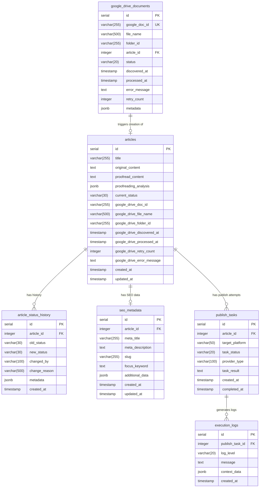

# Data Model Specification - CMS Automation System

**Document Version**: 3.0
**Last Updated**: 2025-10-29
**Status**: Active - Google Drive Integration & Worklist Added

---

## 1. Overview

This document defines the complete database schema for the CMS Automation System, including Google Drive integration, Worklist features, and multi-provider publishing support.

### 1.1 Database Technology

- **RDBMS**: PostgreSQL 14+
- **ORM**: SQLAlchemy 2.0+
- **Migration Tool**: Alembic
- **Key Features Used**: JSONB, Triggers, Partial Indexes, Table Partitioning

### 1.2 Schema Evolution

- **Phase 1-3**: Core article processing, SEO optimization (Computer Use MVP)
- **Phase 4-5**: Multi-provider publishing, hybrid architecture
- **Phase 6** 🆕: Google Drive integration, status tracking, worklist

---

## 2. Entity-Relationship Diagram



---

## 3. Table Definitions

### 3.1 google_drive_documents 🆕

**Purpose**: Tracks documents discovered from Google Drive and their ingestion status.

```sql
CREATE TABLE google_drive_documents (
    id SERIAL PRIMARY KEY,
    google_doc_id VARCHAR(255) UNIQUE NOT NULL,
    file_name VARCHAR(500) NOT NULL,
    folder_id VARCHAR(255),
    article_id INTEGER REFERENCES articles(id) ON DELETE SET NULL,
    status VARCHAR(20) DEFAULT 'discovered' CHECK (status IN (
        'discovered',      -- Initial discovery
        'processing',      -- Being processed
        'completed',       -- Successfully ingested
        'failed',          -- Processing failed
        'skipped'          -- Manually skipped
    )),
    discovered_at TIMESTAMP DEFAULT NOW(),
    processed_at TIMESTAMP,
    error_message TEXT,
    retry_count INTEGER DEFAULT 0,
    metadata JSONB,

    -- Constraints
    CONSTRAINT valid_retry_count CHECK (retry_count >= 0 AND retry_count <= 10),
    CONSTRAINT valid_processing_timestamps CHECK (processed_at IS NULL OR processed_at >= discovered_at)
);

CREATE INDEX idx_google_drive_documents_status ON google_drive_documents(status);
CREATE INDEX idx_google_drive_documents_discovered_at ON google_drive_documents(discovered_at DESC);
CREATE INDEX idx_google_drive_documents_folder_id ON google_drive_documents(folder_id);
CREATE INDEX idx_google_drive_documents_article_id ON google_drive_documents(article_id);
```

**JSONB metadata Structure**:
```json
{
  "file_size": 45678,
  "mime_type": "application/vnd.google-apps.document",
  "created_time": "2025-10-29T10:30:00Z",
  "modified_time": "2025-10-29T14:20:00Z",
  "owner_email": "author@example.com",
  "last_modifying_user": "editor@example.com",
  "shared_with": ["user1@example.com", "user2@example.com"],
  "drive_metadata": {
    "version": 12,
    "web_view_link": "https://docs.google.com/document/d/...",
    "icon_link": "https://..."
  },
  "processing_metadata": {
    "scan_cycle": 1234,
    "scanner_version": "1.0.0",
    "content_hash": "sha256:abc123..."
  }
}
```

---

### 3.2 articles (Modified)

**Purpose**: Core table for article content and workflow status. Extended with Google Drive fields.

```sql
CREATE TABLE articles (
    id SERIAL PRIMARY KEY,
    title VARCHAR(255) NOT NULL,
    original_content TEXT NOT NULL,
    proofread_content TEXT,
    proofreading_analysis JSONB,

    -- Status Management 🆕
    current_status VARCHAR(30) DEFAULT 'pending' CHECK (current_status IN (
        'pending',              -- Awaiting proofreading
        'proofreading',         -- AI proofreading in progress
        'under_review',         -- Human review stage
        'ready_to_publish',     -- Approved, awaiting publish
        'publishing',           -- Publishing in progress
        'published',            -- Successfully published
        'failed'                -- Publishing failed
    )),

    -- Google Drive Integration Fields 🆕
    google_drive_doc_id VARCHAR(255),
    google_drive_file_name VARCHAR(500),
    google_drive_folder_id VARCHAR(255),
    google_drive_discovered_at TIMESTAMP,
    google_drive_processed_at TIMESTAMP,
    google_drive_retry_count INTEGER DEFAULT 0,
    google_drive_error_message TEXT,

    -- Timestamps
    created_at TIMESTAMP DEFAULT NOW(),
    updated_at TIMESTAMP DEFAULT NOW(),

    -- Constraints
    CONSTRAINT unique_google_drive_doc UNIQUE(google_drive_doc_id)
);

-- Indexes
CREATE INDEX idx_articles_current_status ON articles(current_status);
CREATE INDEX idx_articles_created_at ON articles(created_at DESC);
CREATE INDEX idx_articles_google_drive_doc_id ON articles(google_drive_doc_id);
CREATE INDEX idx_articles_updated_at ON articles(updated_at DESC);

-- Composite index for Worklist queries
CREATE INDEX idx_articles_worklist ON articles(current_status, created_at DESC);

-- Trigger for updated_at
CREATE TRIGGER update_articles_updated_at
    BEFORE UPDATE ON articles
    FOR EACH ROW
    EXECUTE FUNCTION update_updated_at_column();
```

**JSONB proofreading_analysis Structure**:
```json
{
  "provider": "anthropic",
  "model": "claude-3.5-sonnet",
  "execution_time_ms": 3421,
  "issues_found": 12,
  "corrections": [
    {
      "type": "grammar",
      "severity": "high",
      "original": "他們去了商店",
      "corrected": "他們去了商店",
      "reason": "Subject-verb agreement",
      "position": {"start": 45, "end": 52}
    }
  ],
  "suggestions": [
    {
      "type": "style",
      "severity": "low",
      "suggestion": "考虑使用更正式的表达",
      "position": {"start": 120, "end": 135}
    }
  ],
  "metrics": {
    "readability_score": 72.5,
    "word_count": 850,
    "avg_sentence_length": 18.3
  }
}
```

---

### 3.3 article_status_history 🆕

**Purpose**: Audit trail for all status changes in the article lifecycle.

```sql
CREATE TABLE article_status_history (
    id SERIAL PRIMARY KEY,
    article_id INTEGER NOT NULL REFERENCES articles(id) ON DELETE CASCADE,
    old_status VARCHAR(30),
    new_status VARCHAR(30) NOT NULL,
    changed_by VARCHAR(100),  -- user_id, 'system', 'google-drive-scanner'
    change_reason VARCHAR(500),
    metadata JSONB,
    created_at TIMESTAMP DEFAULT NOW()
);

-- Indexes
CREATE INDEX idx_article_status_history_article_id ON article_status_history(article_id, created_at DESC);
CREATE INDEX idx_article_status_history_new_status ON article_status_history(new_status);
CREATE INDEX idx_article_status_history_created_at ON article_status_history(created_at DESC);

-- Partitioning by month for large datasets (optional)
-- CREATE TABLE article_status_history_y2025m10 PARTITION OF article_status_history
--     FOR VALUES FROM ('2025-10-01') TO ('2025-11-01');
```

**JSONB metadata Structure**:
```json
{
  "duration_in_status_seconds": 3600,
  "trigger": "manual_approval",
  "user_agent": "Mozilla/5.0...",
  "ip_address": "192.168.1.100",
  "additional_notes": "Approved after fixing grammar issues",
  "system_context": {
    "proofreading_score": 95.5,
    "publish_attempt": 1,
    "provider_used": "anthropic"
  }
}
```

---

### 3.4 seo_metadata

**Purpose**: Stores SEO-related metadata for each article.

```sql
CREATE TABLE seo_metadata (
    id SERIAL PRIMARY KEY,
    article_id INTEGER UNIQUE NOT NULL REFERENCES articles(id) ON DELETE CASCADE,
    meta_title VARCHAR(255),
    meta_description TEXT,
    slug VARCHAR(255) UNIQUE,
    focus_keyword TEXT,
    additional_data JSONB,
    created_at TIMESTAMP DEFAULT NOW(),
    updated_at TIMESTAMP DEFAULT NOW()
);

CREATE INDEX idx_seo_metadata_article_id ON seo_metadata(article_id);
CREATE INDEX idx_seo_metadata_slug ON seo_metadata(slug);

CREATE TRIGGER update_seo_metadata_updated_at
    BEFORE UPDATE ON seo_metadata
    FOR EACH ROW
    EXECUTE FUNCTION update_updated_at_column();
```

**JSONB additional_data Structure**:
```json
{
  "canonical_url": "https://example.com/articles/my-article",
  "og_image": "https://cdn.example.com/images/article-123.jpg",
  "og_title": "Open Graph Title",
  "og_description": "Social media description",
  "twitter_card": "summary_large_image",
  "schema_org": {
    "@context": "https://schema.org",
    "@type": "Article",
    "headline": "Article Headline"
  },
  "keywords": ["keyword1", "keyword2", "keyword3"],
  "readability": {
    "flesch_score": 65.2,
    "target_audience": "general"
  }
}
```

---

### 3.5 publish_tasks

**Purpose**: Tracks publishing attempts to various platforms (WordPress, Medium, etc.).

```sql
CREATE TABLE publish_tasks (
    id SERIAL PRIMARY KEY,
    article_id INTEGER NOT NULL REFERENCES articles(id) ON DELETE CASCADE,
    target_platform VARCHAR(50) NOT NULL,  -- 'wordpress', 'medium', etc.
    task_status VARCHAR(20) DEFAULT 'pending' CHECK (task_status IN (
        'pending',
        'in_progress',
        'completed',
        'failed'
    )),
    provider_type VARCHAR(100),  -- 'anthropic_computer_use', 'playwright', etc.
    task_result TEXT,
    created_at TIMESTAMP DEFAULT NOW(),
    completed_at TIMESTAMP
);

CREATE INDEX idx_publish_tasks_article_id ON publish_tasks(article_id);
CREATE INDEX idx_publish_tasks_status ON publish_tasks(task_status);
CREATE INDEX idx_publish_tasks_created_at ON publish_tasks(created_at DESC);
```

---

### 3.6 execution_logs

**Purpose**: Detailed logs for each publish task execution.

```sql
CREATE TABLE execution_logs (
    id SERIAL PRIMARY KEY,
    publish_task_id INTEGER NOT NULL REFERENCES publish_tasks(id) ON DELETE CASCADE,
    log_level VARCHAR(20) NOT NULL CHECK (log_level IN (
        'DEBUG', 'INFO', 'WARNING', 'ERROR', 'CRITICAL'
    )),
    message TEXT NOT NULL,
    context_data JSONB,
    created_at TIMESTAMP DEFAULT NOW()
);

CREATE INDEX idx_execution_logs_publish_task_id ON execution_logs(publish_task_id, created_at);
CREATE INDEX idx_execution_logs_level ON execution_logs(log_level);
CREATE INDEX idx_execution_logs_created_at ON execution_logs(created_at DESC);
```

**JSONB context_data Structure**:
```json
{
  "step": "upload_featured_image",
  "screenshot_path": "/tmp/screenshots/step5.png",
  "browser_console": ["Warning: Slow network detected"],
  "network_requests": [
    {
      "url": "https://wordpress.example.com/wp-admin/post.php",
      "method": "POST",
      "status": 200,
      "duration_ms": 1234
    }
  ],
  "timing": {
    "start": "2025-10-29T14:30:00Z",
    "end": "2025-10-29T14:30:05Z"
  }
}
```

---

## 4. Database Constraints & Rules

### 4.1 Foreign Key Constraints

```sql
-- Enforce referential integrity
ALTER TABLE article_status_history
    ADD CONSTRAINT fk_article_status_history_article
    FOREIGN KEY (article_id) REFERENCES articles(id) ON DELETE CASCADE;

ALTER TABLE seo_metadata
    ADD CONSTRAINT fk_seo_metadata_article
    FOREIGN KEY (article_id) REFERENCES articles(id) ON DELETE CASCADE;

ALTER TABLE publish_tasks
    ADD CONSTRAINT fk_publish_tasks_article
    FOREIGN KEY (article_id) REFERENCES articles(id) ON DELETE CASCADE;

ALTER TABLE execution_logs
    ADD CONSTRAINT fk_execution_logs_publish_task
    FOREIGN KEY (publish_task_id) REFERENCES publish_tasks(id) ON DELETE CASCADE;

ALTER TABLE google_drive_documents
    ADD CONSTRAINT fk_google_drive_documents_article
    FOREIGN KEY (article_id) REFERENCES articles(id) ON DELETE SET NULL;
```

### 4.2 Check Constraints

```sql
-- Ensure valid status transitions
ALTER TABLE articles
    ADD CONSTRAINT valid_current_status
    CHECK (current_status IN (
        'pending', 'proofreading', 'under_review',
        'ready_to_publish', 'publishing', 'published', 'failed'
    ));

-- Ensure processed_at is after discovered_at
ALTER TABLE google_drive_documents
    ADD CONSTRAINT valid_processing_timestamps
    CHECK (processed_at IS NULL OR processed_at >= discovered_at);

-- Ensure retry_count is reasonable
ALTER TABLE google_drive_documents
    ADD CONSTRAINT reasonable_retry_count
    CHECK (retry_count >= 0 AND retry_count <= 10);
```

---

## 5. Database Functions & Triggers

### 5.1 Updated At Trigger

```sql
-- Function to auto-update updated_at column
CREATE OR REPLACE FUNCTION update_updated_at_column()
RETURNS TRIGGER AS $$
BEGIN
    NEW.updated_at = NOW();
    RETURN NEW;
END;
$$ LANGUAGE plpgsql;

-- Apply to articles table
CREATE TRIGGER update_articles_updated_at
    BEFORE UPDATE ON articles
    FOR EACH ROW
    EXECUTE FUNCTION update_updated_at_column();

-- Apply to seo_metadata table
CREATE TRIGGER update_seo_metadata_updated_at
    BEFORE UPDATE ON seo_metadata
    FOR EACH ROW
    EXECUTE FUNCTION update_updated_at_column();
```

### 5.2 Status Change Trigger 🆕

```sql
-- Function to automatically record status changes
CREATE OR REPLACE FUNCTION record_status_change()
RETURNS TRIGGER AS $$
BEGIN
    IF OLD.current_status IS DISTINCT FROM NEW.current_status THEN
        INSERT INTO article_status_history (
            article_id,
            old_status,
            new_status,
            changed_by,
            change_reason,
            metadata
        ) VALUES (
            NEW.id,
            OLD.current_status,
            NEW.current_status,
            'system',  -- Can be overridden by application
            'Status changed via UPDATE',
            jsonb_build_object(
                'trigger_time', NOW(),
                'old_updated_at', OLD.updated_at,
                'new_updated_at', NEW.updated_at
            )
        );
    END IF;
    RETURN NEW;
END;
$$ LANGUAGE plpgsql;

-- Apply trigger to articles table
CREATE TRIGGER track_article_status_changes
    AFTER UPDATE ON articles
    FOR EACH ROW
    EXECUTE FUNCTION record_status_change();
```

---

## 6. Migration Strategy

### 6.1 Alembic Migration File

**File**: `migrations/versions/20251029_add_google_drive_worklist.py`

```python
"""Add Google Drive and Worklist features

Revision ID: 20251029_001
Revises: 20251025_001
Create Date: 2025-10-29 10:00:00.000000

"""
from alembic import op
import sqlalchemy as sa
from sqlalchemy.dialects import postgresql

# revision identifiers
revision = '20251029_001'
down_revision = '20251025_001'
branch_labels = None
depends_on = None


def upgrade():
    # 1. Create google_drive_documents table
    op.create_table(
        'google_drive_documents',
        sa.Column('id', sa.Integer(), nullable=False),
        sa.Column('google_doc_id', sa.String(255), nullable=False),
        sa.Column('file_name', sa.String(500), nullable=False),
        sa.Column('folder_id', sa.String(255), nullable=True),
        sa.Column('article_id', sa.Integer(), nullable=True),
        sa.Column('status', sa.String(20), server_default='discovered', nullable=False),
        sa.Column('discovered_at', sa.TIMESTAMP(), server_default=sa.text('NOW()'), nullable=False),
        sa.Column('processed_at', sa.TIMESTAMP(), nullable=True),
        sa.Column('error_message', sa.Text(), nullable=True),
        sa.Column('retry_count', sa.Integer(), server_default='0', nullable=False),
        sa.Column('metadata', postgresql.JSONB(astext_type=sa.Text()), nullable=True),
        sa.PrimaryKeyConstraint('id'),
        sa.UniqueConstraint('google_doc_id'),
        sa.ForeignKeyConstraint(['article_id'], ['articles.id'], ondelete='SET NULL'),
        sa.CheckConstraint(
            "status IN ('discovered', 'processing', 'completed', 'failed', 'skipped')",
            name='valid_status'
        ),
        sa.CheckConstraint(
            'retry_count >= 0 AND retry_count <= 10',
            name='valid_retry_count'
        ),
        sa.CheckConstraint(
            'processed_at IS NULL OR processed_at >= discovered_at',
            name='valid_processing_timestamps'
        )
    )
    op.create_index('idx_google_drive_documents_status', 'google_drive_documents', ['status'])
    op.create_index('idx_google_drive_documents_discovered_at', 'google_drive_documents', [sa.text('discovered_at DESC')])
    op.create_index('idx_google_drive_documents_folder_id', 'google_drive_documents', ['folder_id'])
    op.create_index('idx_google_drive_documents_article_id', 'google_drive_documents', ['article_id'])

    # 2. Create article_status_history table
    op.create_table(
        'article_status_history',
        sa.Column('id', sa.Integer(), nullable=False),
        sa.Column('article_id', sa.Integer(), nullable=False),
        sa.Column('old_status', sa.String(30), nullable=True),
        sa.Column('new_status', sa.String(30), nullable=False),
        sa.Column('changed_by', sa.String(100), nullable=True),
        sa.Column('change_reason', sa.String(500), nullable=True),
        sa.Column('metadata', postgresql.JSONB(astext_type=sa.Text()), nullable=True),
        sa.Column('created_at', sa.TIMESTAMP(), server_default=sa.text('NOW()'), nullable=False),
        sa.PrimaryKeyConstraint('id'),
        sa.ForeignKeyConstraint(['article_id'], ['articles.id'], ondelete='CASCADE')
    )
    op.create_index('idx_article_status_history_article_id', 'article_status_history', ['article_id', sa.text('created_at DESC')])
    op.create_index('idx_article_status_history_new_status', 'article_status_history', ['new_status'])
    op.create_index('idx_article_status_history_created_at', 'article_status_history', [sa.text('created_at DESC')])

    # 3. Add Google Drive columns to articles table
    op.add_column('articles', sa.Column('google_drive_doc_id', sa.String(255), nullable=True))
    op.add_column('articles', sa.Column('google_drive_file_name', sa.String(500), nullable=True))
    op.add_column('articles', sa.Column('google_drive_folder_id', sa.String(255), nullable=True))
    op.add_column('articles', sa.Column('google_drive_discovered_at', sa.TIMESTAMP(), nullable=True))
    op.add_column('articles', sa.Column('google_drive_processed_at', sa.TIMESTAMP(), nullable=True))
    op.add_column('articles', sa.Column('google_drive_retry_count', sa.Integer(), server_default='0', nullable=False))
    op.add_column('articles', sa.Column('google_drive_error_message', sa.Text(), nullable=True))

    op.create_unique_constraint('unique_google_drive_doc', 'articles', ['google_drive_doc_id'])
    op.create_index('idx_articles_google_drive_doc_id', 'articles', ['google_drive_doc_id'])

    # 4. Update current_status column to include new statuses
    # First, alter the column to remove CHECK constraint temporarily
    op.execute("ALTER TABLE articles DROP CONSTRAINT IF EXISTS valid_current_status;")

    # Then add new CHECK constraint with all statuses
    op.create_check_constraint(
        'valid_current_status',
        'articles',
        "current_status IN ('pending', 'proofreading', 'under_review', 'ready_to_publish', 'publishing', 'published', 'failed')"
    )

    # 5. Create composite index for Worklist queries
    op.create_index('idx_articles_worklist', 'articles', ['current_status', sa.text('created_at DESC')])

    # 6. Create trigger function for status tracking
    op.execute("""
        CREATE OR REPLACE FUNCTION record_status_change()
        RETURNS TRIGGER AS $$
        BEGIN
            IF OLD.current_status IS DISTINCT FROM NEW.current_status THEN
                INSERT INTO article_status_history (
                    article_id,
                    old_status,
                    new_status,
                    changed_by,
                    change_reason,
                    metadata
                ) VALUES (
                    NEW.id,
                    OLD.current_status,
                    NEW.current_status,
                    'system',
                    'Status changed via UPDATE',
                    jsonb_build_object(
                        'trigger_time', NOW(),
                        'old_updated_at', OLD.updated_at,
                        'new_updated_at', NEW.updated_at
                    )
                );
            END IF;
            RETURN NEW;
        END;
        $$ LANGUAGE plpgsql;
    """)

    # 7. Apply trigger to articles table
    op.execute("""
        CREATE TRIGGER track_article_status_changes
            AFTER UPDATE ON articles
            FOR EACH ROW
            EXECUTE FUNCTION record_status_change();
    """)


def downgrade():
    # Drop trigger
    op.execute("DROP TRIGGER IF EXISTS track_article_status_changes ON articles;")
    op.execute("DROP FUNCTION IF EXISTS record_status_change();")

    # Drop indexes
    op.drop_index('idx_articles_worklist', 'articles')
    op.drop_index('idx_articles_google_drive_doc_id', 'articles')

    # Drop constraints
    op.drop_constraint('unique_google_drive_doc', 'articles', type_='unique')
    op.drop_constraint('valid_current_status', 'articles', type_='check')

    # Drop columns from articles
    op.drop_column('articles', 'google_drive_error_message')
    op.drop_column('articles', 'google_drive_retry_count')
    op.drop_column('articles', 'google_drive_processed_at')
    op.drop_column('articles', 'google_drive_discovered_at')
    op.drop_column('articles', 'google_drive_folder_id')
    op.drop_column('articles', 'google_drive_file_name')
    op.drop_column('articles', 'google_drive_doc_id')

    # Drop tables
    op.drop_table('article_status_history')
    op.drop_table('google_drive_documents')

    # Restore original status constraint
    op.create_check_constraint(
        'valid_current_status',
        'articles',
        "current_status IN ('pending', 'proofreading', 'completed', 'failed')"
    )
```

### 6.2 Migration Execution

```bash
# Generate migration
alembic revision --autogenerate -m "Add Google Drive and Worklist features"

# Review generated migration
cat migrations/versions/20251029_add_google_drive_worklist.py

# Apply migration
alembic upgrade head

# Rollback if needed
alembic downgrade -1
```

---

## 7. Performance Optimization

### 7.1 Common Query Patterns

**Query 1: Worklist with Pagination**
```sql
-- Optimized with idx_articles_worklist composite index
SELECT
    a.id,
    a.title,
    a.current_status,
    a.google_drive_file_name,
    a.created_at,
    a.updated_at,
    COUNT(ash.id) as status_change_count
FROM articles a
LEFT JOIN article_status_history ash ON a.id = ash.article_id
WHERE a.current_status = 'under_review'
GROUP BY a.id
ORDER BY a.created_at DESC
LIMIT 20 OFFSET 0;
```

**Query 2: Status History Timeline**
```sql
-- Optimized with idx_article_status_history_article_id
SELECT
    ash.old_status,
    ash.new_status,
    ash.changed_by,
    ash.change_reason,
    ash.created_at,
    ash.metadata
FROM article_status_history ash
WHERE ash.article_id = 123
ORDER BY ash.created_at DESC
LIMIT 50;
```

**Query 3: Google Drive Scan - Unprocessed Documents**
```sql
-- Optimized with idx_google_drive_documents_status and idx_google_drive_documents_discovered_at
SELECT
    gdd.id,
    gdd.google_doc_id,
    gdd.file_name,
    gdd.folder_id,
    gdd.retry_count,
    gdd.discovered_at
FROM google_drive_documents gdd
WHERE gdd.status IN ('discovered', 'failed')
  AND gdd.retry_count < 3
ORDER BY gdd.discovered_at ASC
LIMIT 10;
```

**Query 4: Dashboard Statistics**
```sql
-- Optimized with idx_articles_current_status
SELECT
    current_status,
    COUNT(*) as count,
    AVG(EXTRACT(EPOCH FROM (updated_at - created_at))) as avg_duration_seconds
FROM articles
WHERE created_at >= NOW() - INTERVAL '7 days'
GROUP BY current_status;
```

### 7.2 Index Usage Analysis

```sql
-- Check index usage
SELECT
    schemaname,
    tablename,
    indexname,
    idx_scan as index_scans,
    idx_tup_read as tuples_read,
    idx_tup_fetch as tuples_fetched
FROM pg_stat_user_indexes
WHERE schemaname = 'public'
ORDER BY idx_scan DESC;

-- Identify missing indexes
SELECT
    schemaname,
    tablename,
    seq_scan,
    seq_tup_read,
    idx_scan,
    seq_tup_read / seq_scan as avg_seq_tup_read
FROM pg_stat_user_tables
WHERE schemaname = 'public'
  AND seq_scan > 0
ORDER BY seq_tup_read DESC;
```

### 7.3 Table Partitioning (Optional for Large Scale)

For systems processing >100K articles, consider partitioning `article_status_history`:

```sql
-- Convert to partitioned table
CREATE TABLE article_status_history_partitioned (
    LIKE article_status_history INCLUDING ALL
) PARTITION BY RANGE (created_at);

-- Create monthly partitions
CREATE TABLE article_status_history_y2025m10
    PARTITION OF article_status_history_partitioned
    FOR VALUES FROM ('2025-10-01') TO ('2025-11-01');

CREATE TABLE article_status_history_y2025m11
    PARTITION OF article_status_history_partitioned
    FOR VALUES FROM ('2025-11-01') TO ('2025-12-01');

-- Migrate data
INSERT INTO article_status_history_partitioned
SELECT * FROM article_status_history;
```

---

## 8. Data Integrity & Validation

### 8.1 Application-Level Validation (SQLAlchemy)

```python
# models/article.py
from sqlalchemy import CheckConstraint
from enum import Enum

class ArticleStatus(str, Enum):
    PENDING = "pending"
    PROOFREADING = "proofreading"
    UNDER_REVIEW = "under_review"
    READY_TO_PUBLISH = "ready_to_publish"
    PUBLISHING = "publishing"
    PUBLISHED = "published"
    FAILED = "failed"

class Article(Base):
    __tablename__ = "articles"

    id = Column(Integer, primary_key=True)
    current_status = Column(String(30), nullable=False, default=ArticleStatus.PENDING)

    @validates('current_status')
    def validate_status(self, key, value):
        if value not in [s.value for s in ArticleStatus]:
            raise ValueError(f"Invalid status: {value}")
        return value
```

### 8.2 Status Transition Rules

```python
# services/status_manager.py
VALID_TRANSITIONS = {
    ArticleStatus.PENDING: [ArticleStatus.PROOFREADING, ArticleStatus.FAILED],
    ArticleStatus.PROOFREADING: [ArticleStatus.UNDER_REVIEW, ArticleStatus.FAILED],
    ArticleStatus.UNDER_REVIEW: [ArticleStatus.READY_TO_PUBLISH, ArticleStatus.PROOFREADING, ArticleStatus.FAILED],
    ArticleStatus.READY_TO_PUBLISH: [ArticleStatus.PUBLISHING, ArticleStatus.UNDER_REVIEW],
    ArticleStatus.PUBLISHING: [ArticleStatus.PUBLISHED, ArticleStatus.FAILED],
    ArticleStatus.PUBLISHED: [],  # Terminal state
    ArticleStatus.FAILED: [ArticleStatus.PENDING, ArticleStatus.PROOFREADING]  # Retry allowed
}

def can_transition(from_status: ArticleStatus, to_status: ArticleStatus) -> bool:
    return to_status in VALID_TRANSITIONS.get(from_status, [])
```

---

## 9. Backup & Recovery

### 9.1 Backup Strategy

```bash
# Full database backup (daily)
pg_dump -U cms_user -d cms_automation -F c -f backup_$(date +%Y%m%d).dump

# Table-specific backup (before migration)
pg_dump -U cms_user -d cms_automation -t articles -t article_status_history -F c -f articles_backup.dump

# JSONB data export (for analysis)
psql -U cms_user -d cms_automation -c "COPY (
    SELECT id, google_drive_doc_id, metadata
    FROM google_drive_documents
) TO '/tmp/google_drive_metadata.csv' CSV HEADER;"
```

### 9.2 Recovery Procedures

```bash
# Restore full database
pg_restore -U cms_user -d cms_automation -c backup_20251029.dump

# Restore specific table
pg_restore -U cms_user -d cms_automation -t articles articles_backup.dump
```

---

## 10. Data Model Version History

| Version | Date       | Changes                                                    |
|---------|------------|------------------------------------------------------------|
| 1.0     | 2025-10-20 | Initial schema: articles, seo_metadata, publish_tasks      |
| 2.0     | 2025-10-26 | Added multi-provider support, execution logs               |
| 3.0     | 2025-10-29 | Added Google Drive integration, Worklist, status tracking  |

---

## 11. Related Documentation

- **Functional Requirements**: See `spec.md` sections FR-071 to FR-087
- **API Endpoints**: See `plan.md` section 7.2.4
- **Implementation Tasks**: See `tasks.md` Phase 6 (T6.1-T6.20)
- **UI Components**: See `UI_IMPLEMENTATION_TASKS.md` Task Group 4.1-4.2

---

**Document Maintained By**: CMS Automation Team
**Review Cycle**: Quarterly or before major schema changes
**Contact**: tech-lead@example.com
