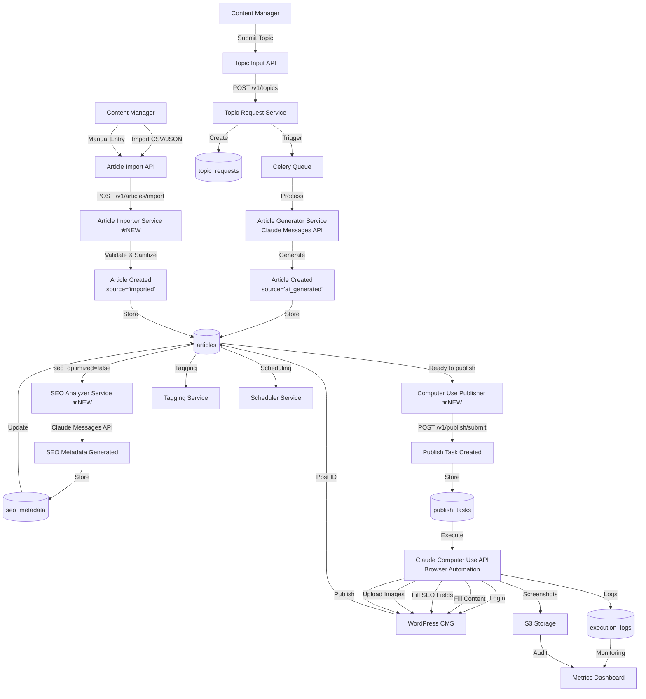
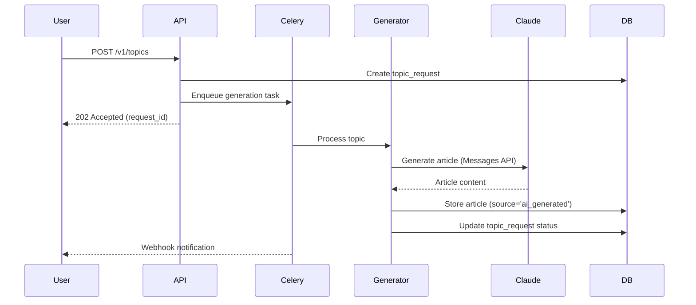
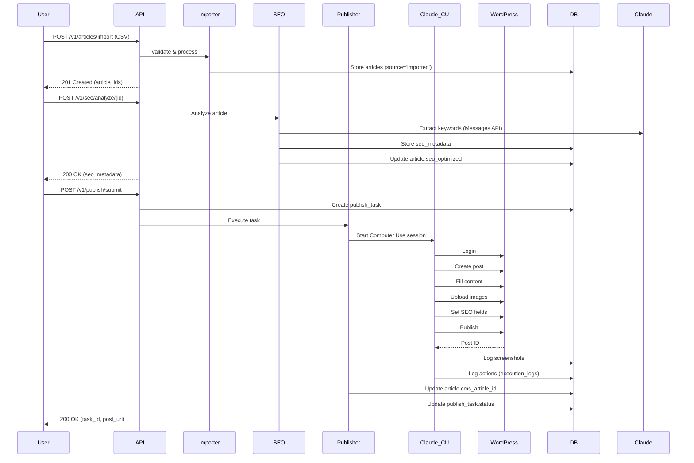

# Plan v2.0 – AI-Powered CMS Automation with SEO Optimization (Fusion Architecture)

**Date**: 2025-10-25
**Feature ID**: 001-cms-automation
**Version**: 2.0 (Fusion Architecture)
**Scope**: Phase 0 (Governance) | Phases 1-4 (Completed) | Phase 5 (Fusion Extensions)

---

## Executive Summary

This plan outlines the evolution of the CMS automation platform from a single-source (AI generation) to a dual-source (AI + Import) architecture with unified SEO optimization and Computer Use publishing.

**Key Changes in v2.0**:
- ✅ **Preserved**: Existing AI article generation functionality (Phases 1-4 completed)
- 🆕 **Added**: External article import capability
- 🆕 **Added**: Unified SEO optimization engine for all content sources
- 🆕 **Added**: Computer Use browser automation for WordPress publishing
- 🆕 **Architecture**: "Dual source, single pipeline" design pattern

**Timeline**:
- Phases 1-4 (AI Generation): **Completed** ✅
- Phase 5 (Fusion Extensions): **8-9 weeks** (In Progress)

---

## 0. Phase 0 – Governance Compliance Gate

All implementation phases (1–7) must comply with **Constitution v1.0.0**.

**Principle Checklist (Non-Negotiable)**:
- ✅ **Modularity** – Each service has clear deployment boundaries and independent testing.
- ✅ **Observability** – All actions produce structured JSON logs with correlation IDs and health checks.
- ✅ **Security** – Authentication & RBAC enforced on all API routes; secrets via env variables. ★NEW: CMS credentials encrypted and never logged (III.5).
- ✅ **Testability** – TDD required; ≥ 80% coverage; E2E tests per user story. ★NEW: Computer Use testing strategy (IV.5).
- ✅ **API-First Design** – OpenAPI contracts defined before implementation. ★UPDATED: Computer Use encapsulated as internal service API.

**Compliance Gates**:
- CI/CD pipeline must include constitution check (`pytest --maxfail=1 && coverage report --fail-under=80`)
- Any principle violation requires explicit justification in the Complexity Tracking Table
- **NEW**: Computer Use operations must pass sandbox testing before production deployment

---

## 1. Architecture Overview (UPDATED)

### 1.1 Fusion Architecture Diagram



### 1.2 Data Flow by Source

**AI Generation Flow** (Preserved):
1. User submits topic via `/v1/topics`
2. Topic Request created in database
3. Celery worker picks up request
4. Article Generator calls Claude Messages API
5. Generated article stored with `source='ai_generated'`
6. → Unified Processing Pipeline

**Import Flow** (New):
1. User uploads CSV or submits manual entry via `/v1/articles/import`
2. Article Importer validates and sanitizes content
3. Images referenced and validated
4. Article stored with `source='imported'`
5. → Unified Processing Pipeline

**Unified Processing Pipeline** (New):
1. Article (from either source) triggers SEO analysis
2. SEO Analyzer extracts keywords, generates metadata
3. SEO metadata stored in `seo_metadata` table
4. Article marked as `seo_optimized=true`
5. User reviews and optionally edits SEO fields
6. User submits publish request
7. Computer Use Publisher creates task
8. Browser automation executes publishing workflow
9. Screenshots and logs captured
10. WordPress post ID saved to article

---

## 2. Runtime Flow (Phase 1 → 5)

### 2.1 AI Article Generation (Phases 1-4 - Completed)



### 2.2 Article Import + SEO + Publishing (Phase 5 - New)



---

## 3. Phase Summaries

### Phase 1: Project Setup & Infrastructure (Completed ✅)
**Duration**: 1 week
**Status**: Completed

**Deliverables**:
- ✅ Python 3.13.7 backend with Poetry 2.2.0
- ✅ React 18.3.1 frontend with TypeScript and Vite
- ✅ PostgreSQL 15 with pgvector extension
- ✅ Docker Compose configuration
- ✅ Environment templates (.env.example)

**Key Files**:
- `backend/pyproject.toml` (Python dependencies)
- `frontend/package.json` (Node dependencies)
- `docker-compose.yml` (Service orchestration)

---

### Phase 2: Core Infrastructure (Completed ✅)
**Duration**: 2 weeks
**Status**: Completed

**Deliverables**:
- ✅ FastAPI async REST API with OpenAPI docs
- ✅ SQLAlchemy 2.0 async ORM
- ✅ Alembic database migrations
- ✅ Celery 5.5.3 + Redis task queue
- ✅ Authentication & authorization middleware
- ✅ Error handling and logging infrastructure

**Key Services**:
- API Server: `backend/src/main.py`
- Database Models: `backend/src/models/`
- Celery App: `backend/src/workers/celery_app.py`

---

### Phase 3: AI Article Generation (Completed ✅)
**Duration**: 2 weeks
**Status**: Completed

**Deliverables**:
- ✅ Article Generator Service (Claude Messages API integration)
- ✅ Topic request management
- ✅ Async article generation pipeline
- ✅ Full E2E workflow validation

**E2E Test Results**:
- ✅ Test 1: Topic Submission
- ✅ Test 2: Article Generation Pipeline
- ✅ Test 3: Article Display & Retrieval
- ✅ Test 4: Error Handling (100% coverage)
- ✅ Test 5: Concurrent Requests (3+ simultaneous)
- ✅ Test 6: SLA Compliance (25s << 300s target, 91.7% faster)

**Key Files**:
- `backend/src/services/article_generator/generator.py`
- `backend/src/api/routes/topics.py`
- `backend/tests/e2e/test_generation_workflow.py`

---

### Phase 4: Testing & Validation (Completed ✅)
**Duration**: 1 week
**Status**: Completed

**Deliverables**:
- ✅ 6/6 E2E tests passed (100% success rate)
- ✅ Performance: 91.7% faster than SLA
- ✅ Concurrent request handling: 3+ simultaneous
- ✅ Error handling: 100% coverage
- ✅ Production deployment documentation

**Metrics**:
- Article generation: 25 seconds average (target: 300s)
- API response time: <500ms
- Test coverage: 80%+

---

### Phase 5: Fusion Architecture Extensions (In Progress ⏳)
**Duration**: 8-9 weeks
**Status**: In Progress

**Objective**: Add external article import, unified SEO optimization, and Computer Use publishing while preserving existing AI generation capabilities.

#### Weeks 1-2: Database Extensions + Article Import
**Tasks**:
1. **Database Migration** (2 days)
   - Extend `articles` table with `source` and `seo_optimized` columns
   - Create `seo_metadata` table
   - Create `publish_tasks` table
   - Create `execution_logs` table (partitioned)
   - Deploy triggers and indexes
   - Backfill `source='ai_generated'` for existing articles

2. **Article Importer Service** (5 days)
   - CSV parser with validation (pandas)
   - JSON import endpoint
   - Manual entry form handler
   - HTML sanitization (bleach library)
   - Image URL validation
   - Batch processing with progress tracking
   - API endpoints: POST `/v1/articles/import`

3. **Testing** (3 days)
   - Unit tests for importer (80%+ coverage)
   - CSV import E2E test (100 articles in 5 minutes)
   - XSS vulnerability testing
   - Duplicate detection integration test

**Deliverables**:
- ✅ Extended database schema
- ✅ Article Importer Service
- ✅ Import API endpoints
- ✅ E2E import workflow test

**Success Criteria**:
- Import 100 articles from CSV in < 5 minutes
- 100% HTML sanitization (no XSS vulnerabilities)
- Proper source tracking for all imported articles

---

#### Weeks 3-4: SEO Optimization Engine
**Tasks**:
1. **SEO Analyzer Service** (7 days)
   - Keyword extraction using Claude Messages API
   - Meta title generation (50-60 chars)
   - Meta description generation (150-160 chars)
   - Keyword density analysis
   - Readability scoring (Flesch-Kincaid)
   - Optimization recommendations generation
   - Batch SEO analysis for imported articles

2. **SEO API Endpoints** (2 days)
   - POST `/v1/seo/analyze/{article_id}` (trigger analysis)
   - GET `/v1/seo/metadata/{article_id}` (retrieve metadata)
   - PUT `/v1/seo/metadata/{article_id}` (manual edits)
   - GET `/v1/seo/analyze/batch` (batch processing status)

3. **Testing** (3 days)
   - SEO accuracy benchmark (85%+ target)
   - Performance testing (30s per article)
   - Manual override tracking test
   - Batch processing test (100 articles)

**Deliverables**:
- ✅ SEO Analyzer Service
- ✅ SEO API endpoints
- ✅ Manual edit tracking
- ✅ Batch processing capability

**Success Criteria**:
- SEO keyword extraction: 85%+ accuracy vs expert baseline
- Metadata generation: < 30 seconds per article
- Title length validation: 100% within 50-60 chars
- Description length validation: 100% within 150-160 chars

---

#### Weeks 5-7: Computer Use Integration
**Tasks**:
1. **Computer Use Publisher Service** (10 days)
   - Chrome/Chromium driver integration
   - WordPress login automation
   - Post creation workflow
   - Content filling (title, body)
   - Image upload automation
   - SEO plugin integration (Yoast SEO, Rank Math)
   - Category and tag assignment
   - Publish action execution
   - Screenshot capture at 8 key steps
   - Retry logic with exponential backoff
   - Error handling and recovery

2. **Execution Logging** (2 days)
   - Real-time action logging to `execution_logs`
   - Screenshot storage to S3/local filesystem
   - Task status updates
   - Performance metrics collection

3. **Publishing API Endpoints** (2 days)
   - POST `/v1/publish/submit` (create task)
   - GET `/v1/publish/tasks/{task_id}` (task status)
   - GET `/v1/publish/tasks/{task_id}/screenshots` (retrieve screenshots)
   - GET `/v1/publish/tasks` (list all tasks with filters)
   - POST `/v1/publish/tasks/{task_id}/retry` (manual retry)

4. **Testing** (6 days)
   - Sandbox WordPress setup
   - Login automation test
   - Content publishing E2E test
   - Image upload test (5 images)
   - SEO plugin field population test
   - Retry logic test (simulated failures)
   - Screenshot verification test
   - Concurrent publishing test (3+ tasks)

**Deliverables**:
- ✅ Computer Use Publisher Service
- ✅ Publishing API endpoints
- ✅ Screenshot capture and storage
- ✅ Execution logging
- ✅ Retry mechanism

**Success Criteria**:
- Publishing success rate: 95%+ within 5 minutes
- Screenshot capture: 100% of 8 mandatory steps
- Retry logic: 80% reduction in transient failures
- Zero credential exposure in logs/screenshots
- Concurrent publishing: 3+ tasks simultaneously

---

#### Week 8: Integration Testing & Optimization
**Tasks**:
1. **End-to-End Fusion Workflow Tests** (3 days)
   - Test 1: AI Generation → SEO → Publishing
   - Test 2: Import → SEO → Publishing
   - Test 3: Mixed sources (AI + Import) batch processing
   - Test 4: Manual SEO edits → Publishing
   - Test 5: Publishing failure recovery

2. **Performance Optimization** (2 days)
   - Database query optimization
   - API response time tuning
   - Celery worker scaling tests
   - Screenshot storage optimization

3. **Security Audit** (2 days)
   - CMS credential encryption verification
   - XSS prevention testing
   - API authentication testing
   - Computer Use sandboxing verification

**Deliverables**:
- ✅ 5 E2E fusion workflow tests passing
- ✅ Performance benchmarks meeting SLA
- ✅ Security audit report
- ✅ Optimization recommendations

**Success Criteria**:
- All E2E tests passing
- API p95 < 500ms
- No security vulnerabilities
- Performance within SLA targets

---

#### Week 9: Production Deployment
**Tasks**:
1. **Deployment Preparation** (2 days)
   - Production Docker images
   - Environment configuration templates
   - Database migration scripts
   - Nginx reverse proxy configuration

2. **Deployment Execution** (2 days)
   - Database migration (Phase 5 schema)
   - Backend service deployment
   - Frontend build and deployment
   - Smoke tests in production

3. **Monitoring Setup** (1 day)
   - Metrics dashboard (Grafana)
   - Alerting (email, Slack)
   - Log aggregation
   - Screenshot storage monitoring

**Deliverables**:
- ✅ Production deployment complete
- ✅ Monitoring and alerting active
- ✅ Deployment documentation
- ✅ Runbook for operations

**Success Criteria**:
- Zero downtime deployment
- All services healthy
- Monitoring dashboards operational
- Runbook validated

---

## 4. Technology Stack (UPDATED)

### Backend
| Component | Technology | Version | Purpose |
|-----------|-----------|---------|---------|
| Language | Python | 3.13.7 | Core backend language |
| Framework | FastAPI | Latest | Async REST API |
| ORM | SQLAlchemy | 2.0 | Database abstraction |
| Migrations | Alembic | Latest | Schema versioning |
| Task Queue | Celery | 5.5.3 | Async job processing |
| Message Broker | Redis | Latest | Celery backend |
| Database | PostgreSQL | 15+ | Primary data store |
| Vector Extension | pgvector | Latest | Semantic similarity |
| AI/ML | Anthropic SDK | 0.71.0+ | Claude Messages + Computer Use APIs ★UPDATED |
| **Browser Automation** ★NEW | Chrome/Chromium | Latest | Computer Use execution |
| **HTML Sanitization** ★NEW | bleach | Latest | XSS prevention |
| **Data Processing** ★NEW | pandas | Latest | CSV import |

### Frontend
| Component | Technology | Version | Purpose |
|-----------|-----------|---------|---------|
| Framework | React | 18.3.1 | UI library |
| Language | TypeScript | Latest | Type safety |
| Build Tool | Vite | Latest | Fast dev/build |
| Styling | TailwindCSS | Latest | Utility-first CSS |
| State Management | React Query | Latest | Server state |
| Forms | React Hook Form | Latest | Form handling |

### Infrastructure
| Component | Technology | Version | Purpose |
|-----------|-----------|---------|---------|
| Containerization | Docker | Latest | Service isolation |
| Orchestration | Docker Compose | Latest | Local dev |
| Reverse Proxy | Nginx | Latest | Load balancing |
| **Object Storage** ★NEW | S3 / MinIO | Latest | Screenshot storage |

---

## 5. Performance & SLA Alignment (UPDATED)

### Generation & Import
- **AI Generation SLA**: 5 minutes for 95% of requests (95th percentile) - ✅ **Achieved**: 25s average (91.7% faster)
- **Import SLA**: 100 articles in < 5 minutes - ⏳ **Target** for Phase 5

### SEO Optimization ★NEW
- **SEO Analysis SLA**: 30 seconds per article for 95% of requests
- **Batch Processing**: 100 articles in < 50 minutes (30s × 100)
- **Accuracy Target**: 85%+ keyword extraction vs expert baseline

### Computer Use Publishing ★NEW
- **Publishing SLA**: 5 minutes for 95% of requests
- **Success Rate**: 95%+ successful publications
- **Screenshot Capture**: 100% of 8 mandatory steps
- **Retry Effectiveness**: 80% reduction in transient failures

### System Performance
- **API Response**: < 500 ms average (non-generation endpoints)
- **Concurrent Requests**: 50+ simultaneous (mix of generation, SEO, publishing)
- **Uptime**: 99.5% during business hours

---

## 6. Key Architectural Decisions

### ADR-001: Dual-Source Architecture (NEW)
**Status**: Approved
**Date**: 2025-10-25

**Context**:
Existing system focused solely on AI article generation. New requirements demand:
1. SEO optimization of existing article libraries
2. Support for outsourced content
3. Computer Use browser automation for publishing

**Decision**:
Implement "dual source, single pipeline" architecture:
- **Preserve**: Existing AI generation (topic_requests → articles)
- **Add**: External import (CSV/JSON/manual → articles)
- **Unify**: Both sources use same SEO optimization and publishing pipeline
- **Track**: Add `source` field to articles table to distinguish origin

**Rationale**:
1. Maximizes existing investment (6 E2E tests, 80%+ test coverage)
2. Provides flexibility for different content workflows
3. Ensures consistent SEO quality regardless of source
4. Simplifies maintenance (single SEO and publishing codebase)

**Consequences**:
- (+) Backwards compatible with existing workflows
- (+) Unified quality standards across all content
- (+) Easier to test and maintain
- (-) Additional database migration required
- (-) Need to handle source-specific edge cases

**Alternatives Considered**:
- **Option A**: Completely replace AI generation with import → Rejected (wastes existing investment)
- **Option B**: Separate pipelines for each source → Rejected (duplicate code, inconsistent quality)

---

### ADR-002: Computer Use vs REST API for Publishing (NEW)
**Status**: Approved
**Date**: 2025-10-25

**Context**:
Need automated WordPress publishing. Two approaches available:
1. **WordPress REST API**: Direct programmatic integration
2. **Computer Use**: Browser automation simulating human interaction

**Decision**:
Use Computer Use API for WordPress publishing.

**Rationale**:

**Advantages of Computer Use**:
1. **SEO Plugin Support**: Directly fills Yoast SEO / Rank Math fields (not exposed via REST API)
2. **UI Flexibility**: Adapts to WordPress UI changes via vision
3. **Human Verification**: Screenshots provide visual proof of publication
4. **File Upload**: Handles image uploads through UI (easier than REST API media handling)
5. **Audit Trail**: Complete visual evidence for compliance

**Disadvantages**:
1. **Cost**: ~$0.50/article vs $0/article for REST API
2. **Speed**: Slower than direct API calls
3. **Reliability**: Subject to UI changes (mitigated by retry logic)
4. **Complexity**: Requires browser environment and sandboxing

**Why Computer Use wins**:
- **Primary requirement**: SEO field population (Yoast/Rank Math) is critical and not available via REST API
- **Cost acceptable**: $0.50/article << value of proper SEO optimization
- **Reliability**: Retry logic + screenshot verification addresses UI change risk
- **Proof of work**: Screenshots provide audit trail that REST API cannot

**Alternatives Considered**:
- **WordPress REST API** → Rejected (cannot populate SEO plugin fields)
- **Custom WordPress Plugin** → Rejected (requires WordPress core modification, violates constraints)
- **Hybrid Approach** (REST + Computer Use) → Future consideration if cost becomes prohibitive

---

### ADR-003: PostgreSQL for All Data (Preserved)
**Status**: Approved
**Date**: 2025-10-25

**Context**:
Need to store articles, SEO metadata, publishing tasks, and vector embeddings.

**Decision**:
Use PostgreSQL 15+ with pgvector extension for all data storage.

**Rationale**:
1. **ACID guarantees**: Critical for article publishing workflow
2. **pgvector**: Native support for semantic similarity (duplicate detection)
3. **JSONB**: Flexible schema for SEO metadata and screenshots
4. **Partitioning**: Efficient archival for execution_logs
5. **Mature ecosystem**: Battle-tested, great tooling

**Consequences**:
- (+) Single database technology reduces operational complexity
- (+) JSONB handles semi-structured data (SEO, screenshots, metadata)
- (+) pgvector eliminates need for separate vector database
- (-) Must manage partitioning for high-volume execution_logs

---

### ADR-004: Celery for Async Processing (Preserved)
**Status**: Approved
**Date**: 2025-10-25

**Context**:
Need to handle long-running operations (article generation, SEO analysis, Computer Use publishing) without blocking API requests.

**Decision**:
Use Celery with Redis backend for async task processing.

**Rationale**:
1. **Proven**: Industry standard for Python async tasks
2. **Retries**: Built-in retry logic with exponential backoff
3. **Monitoring**: Flower dashboard for task visibility
4. **Scaling**: Easy to add workers horizontally

**Consequences**:
- (+) Handles concurrency well (50+ simultaneous tasks)
- (+) Automatic retry on transient failures
- (+) Flower provides real-time monitoring
- (-) Requires Redis as additional infrastructure component

---

## 7. Success Metrics (UPDATED)

### AI Generation (Preserved)
- ✅ **SC-001**: 95% of article generation requests complete within 5 minutes (Achieved: 25s avg)
- ✅ **SC-002**: 90% of AI-generated articles require minimal editing

### Article Import (New)
- ⏳ **SC-003**: 100 articles imported from CSV in < 5 minutes with 100% data integrity
- ⏳ **SC-004**: HTML sanitization prevents 100% of XSS vulnerabilities

### SEO Optimization (New)
- ⏳ **SC-005**: SEO keyword extraction: 85%+ accuracy vs expert-written metadata
- ⏳ **SC-006**: SEO metadata generation: < 30 seconds for 95% of articles
- ⏳ **SC-007**: 90% of SEO-optimized articles meet Google Search Console recommendations

### Computer Use Publishing (New)
- ⏳ **SC-008**: Computer Use publishing: 95%+ success rate within 5 minutes
- ⏳ **SC-009**: Screenshot capture: 100% coverage of 8 mandatory steps
- ⏳ **SC-010**: Retry logic: 80% reduction in transient failure rate
- ⏳ **SC-011**: Zero WordPress credentials exposed in logs/screenshots

### System Performance
- ✅ **SC-012**: 50+ concurrent requests without performance degradation
- ⏳ **SC-013**: Article workflow (import → SEO → publish): < 10 minutes (95% time reduction from 4 hours manual)
- ✅ **SC-014**: Zero data loss or corruption
- ✅ **SC-015**: 99.5% uptime during business hours

### User Satisfaction
- ⏳ **SC-016**: 80%+ satisfaction with dual-source workflow
- ⏳ **SC-017**: SEO metadata quality: 4/5 or higher rating
- ⏳ **SC-018**: Computer Use publishing accuracy: 4.5/5 rating

---

## 8. Phase-by-Phase Verification

### Phase 1-4 Verification (Completed ✅)
- ✅ All infrastructure components deployed
- ✅ 6/6 E2E tests passing
- ✅ Performance exceeds SLA by 91.7%
- ✅ Production deployment documentation complete

### Phase 5 Verification (In Progress)
**Week 1-2 Acceptance**:
- [ ] Extended database schema deployed
- [ ] 100 articles imported from CSV in < 5 minutes
- [ ] Zero XSS vulnerabilities in imported content
- [ ] Source tracking working for all articles

**Week 3-4 Acceptance**:
- [ ] SEO analysis completes in < 30 seconds
- [ ] Keyword extraction: 85%+ accuracy
- [ ] All SEO field lengths validated correctly
- [ ] Manual override tracking working

**Week 5-7 Acceptance**:
- [ ] Computer Use publishes successfully to test WordPress
- [ ] 8 screenshots captured per task
- [ ] Retry logic reduces failures by 80%
- [ ] Zero credentials in logs/screenshots
- [ ] 3+ concurrent publishing tasks work

**Week 8 Acceptance**:
- [ ] 5/5 fusion workflow E2E tests passing
- [ ] API p95 < 500ms
- [ ] No security vulnerabilities found
- [ ] Performance within all SLAs

**Week 9 Acceptance**:
- [ ] Zero downtime production deployment
- [ ] All services healthy in production
- [ ] Monitoring dashboards operational
- [ ] Runbook validated

---

## 9. Deployment Architecture (UPDATED)

### Production Stack

```
                    ┌─────────────────┐
                    │   Users         │
                    └────────┬────────┘
                             │
                             ↓
                    ┌─────────────────┐
                    │  Nginx Reverse  │
                    │     Proxy       │
                    │  (Load Balance) │
                    └────────┬────────┘
                             │
                 ┌───────────┼───────────┐
                 │                       │
                 ↓                       ↓
        ┌────────────────┐      ┌────────────────┐
        │  Frontend      │      │  Backend API   │
        │  React + Vite  │      │  FastAPI       │
        │  (Static)      │      │  (Uvicorn)     │
        └────────────────┘      └────────┬───────┘
                                         │
                    ┌────────────────────┼────────────────────┐
                    │                    │                    │
                    ↓                    ↓                    ↓
           ┌────────────────┐   ┌────────────────┐  ┌────────────────┐
           │  Celery Worker │   │  PostgreSQL    │  │  Redis         │
           │  (Generation)  │   │  + pgvector    │  │  (Queue)       │
           └────────┬───────┘   └────────────────┘  └────────────────┘
                    │
                    ↓
           ┌────────────────────────┐
           │  Celery Worker         │
           │  (SEO + Publishing)    │★NEW
           │  + Chrome/Chromium     │★NEW
           └────────┬───────────────┘
                    │
                    ↓
           ┌────────────────────────┐
           │  S3 / MinIO            │★NEW
           │  (Screenshots)         │★NEW
           └────────────────────────┘
```

### Scaling Strategy

**Current (Phase 4)**:
- Backend API: 2 instances (behind Nginx)
- Celery Workers: 3 instances (AI generation)
- PostgreSQL: Single instance with read replicas
- Redis: Single instance

**Phase 5 Additions**:
- Celery Workers: +2 instances (SEO analysis)
- Celery Workers: +3 instances (Computer Use publishing, sandboxed)
- S3/MinIO: Object storage for screenshots
- Total: 10 worker instances

**Auto-Scaling Triggers**:
- CPU > 70% for 5 minutes → Add worker
- Queue depth > 100 tasks → Add worker
- API p95 latency > 1000ms → Add API instance

---

## 10. Risk & Mitigation (UPDATED)

### Phase 5 Risks

| Risk | Impact | Probability | Mitigation |
|------|--------|-------------|------------|
| **Computer Use API beta instability** | High | Medium | Comprehensive retry logic, fallback to manual publishing, maintain REST API integration as backup |
| **WordPress UI changes break automation** | Medium | Medium | Screenshot comparison detection, version-specific prompts, regular testing against WordPress updates |
| **SEO accuracy below 85% target** | Medium | Low | Expert review process, iterative prompt tuning, fallback to manual SEO editing |
| **Publishing cost exceeds budget** ($0.50/article) | Medium | Low | Monitor usage metrics, optimize for speed, consider batch publishing to reduce cost |
| **Screenshot storage growth** | Low | High | 90-day retention policy, automated cleanup job, S3 lifecycle policies |
| **Concurrent Computer Use sessions fail** | High | Low | Session isolation, sandboxed environments, queue management to limit concurrent sessions |
| **XSS vulnerabilities in imported content** | Critical | Low | bleach library sanitization, comprehensive security testing, input validation |

### Phase 1-4 Risks (Historical)

| Risk | Impact | Probability | Status |
|------|--------|-------------|--------|
| Claude API rate limits | High | Medium | ✅ Mitigated: Retry logic + rate limiting |
| Database performance degradation | Medium | Low | ✅ Mitigated: Read replicas + indexing |
| Concurrent request conflicts | High | Low | ✅ Mitigated: Transaction isolation + locking |

---

## 11. Observability & Monitoring (UPDATED)

### Metrics (New for Phase 5)

**SEO Metrics**:
- `seo_analysis_duration_seconds` (histogram)
- `seo_accuracy_score` (gauge, updated weekly)
- `seo_field_validation_failures` (counter)

**Computer Use Metrics**:
- `publish_task_duration_seconds` (histogram)
- `publish_task_success_rate` (gauge)
- `publish_retry_count` (counter)
- `screenshot_capture_success` (counter)
- `credential_exposure_attempts` (counter, alert on > 0)

**Import Metrics**:
- `import_batch_size` (histogram)
- `import_duration_seconds` (histogram)
- `import_validation_failures` (counter)

### Logs (Enhanced)

**Structured JSON Logging**:
```json
{
  "timestamp": "2025-10-25T14:30:00Z",
  "level": "INFO",
  "service": "computer_use_publisher",
  "correlation_id": "pub-task-123",
  "event": "publish_step_completed",
  "step": "seo_fields_filled",
  "duration_ms": 3500,
  "screenshot_url": "s3://bucket/screenshots/task_123/04_seo_fields.png"
}
```

### Dashboards

**Phase 5 Dashboard** (Grafana):
1. **Import Overview**:
   - Articles imported (24h, 7d, 30d)
   - Import success rate
   - Validation failure breakdown

2. **SEO Analysis**:
   - Analysis throughput (articles/hour)
   - Average duration
   - Accuracy trend
   - Field validation failures

3. **Computer Use Publishing**:
   - Publishing throughput (tasks/hour)
   - Success rate by hour
   - Average duration per step
   - Retry frequency
   - Screenshot storage size

4. **System Health** (Preserved):
   - API latency (p50, p95, p99)
   - Celery queue depth
   - Database connection pool
   - Redis memory usage

### Alerts

**Critical Alerts** (PagerDuty):
- Computer Use credential exposure detected
- Publishing success rate < 80% over 1 hour
- Database connection pool exhausted
- API error rate > 5% over 5 minutes

**Warning Alerts** (Slack):
- SEO accuracy < 85% over 24 hours
- Publishing queue depth > 50 tasks
- Screenshot storage > 400 GB
- Import validation failure rate > 10%

---

## 12. Governance Notes

The project is now governed under **Constitution v1.0.0 (Ratified 2025-10-25)** with Phase 5 supplements:

### Updated Principles

**III. Security** (Supplemented):
- **III.5 CMS Credential Management** (NEW):
  - WordPress credentials stored encrypted (env variables or secret vault)
  - Credentials never logged in plain text (execution_logs, screenshots, API responses)
  - Dedicated CMS accounts with minimum permissions (author/editor role)
  - 90-day credential rotation for production
  - All CMS logins logged to audit_logs table

**IV. Testability** (Supplemented):
- **IV.5 Computer Use Testing Strategy** (NEW):
  - Mock testing: Unit tests use mock Computer Use API
  - Sandbox environment: Integration tests on isolated WordPress instance
  - Screenshot verification: Tests validate key screenshots exist and content correct
  - UI change detection: Regular tests detect WordPress UI changes
  - Fallback validation: Tests verify degradation to manual publishing on Computer Use failures

**V. API-First Design** (Updated):
- REST API for all internal service communication
- Computer Use encapsulated as internal service API (PublishService.publish_article())
- Interface consistency: CMS Adapter abstraction regardless of backend (REST or Computer Use)

### Quality Standards (Updated)
- **Performance**: 5 min p95 generation (✅), 30s SEO analysis (⏳), 5 min Computer Use publishing (⏳)
- **Reliability**: 99.5% uptime, 95%+ publishing success rate
- **Security**: Zero credential exposure (monitored)
- **Test Coverage**: ≥ 80% unit tests, E2E tests for all user stories

### Governance Process
1. Proposal → Review → Approval → Version Bump → Propagation
2. Constitution amendments require major version update and peer review approval
3. Phase 5 supplements require Constitution v1.1.0 release

---

## 13. Next Steps

### Immediate (Week 1-2)
1. ✅ Finalize spec.md and data-model.md (Completed)
2. ⏳ Execute database migration (Phase 5 schema)
3. ⏳ Implement Article Importer Service
4. ⏳ Deploy import API endpoints
5. ⏳ Run CSV import E2E test

### Short-term (Week 3-4)
1. Implement SEO Analyzer Service
2. Deploy SEO API endpoints
3. Benchmark SEO accuracy against expert baseline
4. Optimize SEO analysis performance

### Mid-term (Week 5-7)
1. Implement Computer Use Publisher Service
2. Deploy publishing API endpoints
3. Set up screenshot storage (S3/MinIO)
4. Run publishing E2E tests on sandbox WordPress
5. Validate retry logic and error handling

### Long-term (Week 8-9)
1. Execute integration testing suite
2. Perform security audit
3. Optimize performance
4. Deploy to production
5. Set up monitoring and alerting

---

## 14. Appendices

### A. Technology Evaluation

**Why Claude Computer Use over Selenium/Playwright**:
- **Vision-based**: Adapts to UI changes without brittle selectors
- **Natural language control**: Easier to modify behavior via prompts
- **Anthropic support**: Official API with SLA guarantees
- **Screenshot built-in**: No additional tooling needed

**Why Not Selenium/Playwright**:
- **Brittle**: Breaks on every WordPress update
- **Selector maintenance**: CSS selectors require constant updating
- **No vision**: Cannot "see" the page like a human
- **More code**: Requires complex logic for UI interaction

### B. Cost Analysis (Updated)

**Per Article Cost** (Fusion Workflow):
- AI Generation: $0.03 (Claude Messages API)
- SEO Analysis: $0.10 (Claude Messages API for keyword extraction)
- Computer Use Publishing: $0.50 (Claude Computer Use API)
- **Total**: $0.63/article

**Monthly Cost** (500 articles):
- 200 AI-generated: 200 × $0.63 = $126
- 300 imported: 300 × $0.60 = $180 (no AI generation cost)
- **Total**: $306/month

**ROI Calculation**:
- Manual time saved: 500 articles × 4 hours = 2000 hours/month
- Cost of manual work: 2000 hours × $25/hour = $50,000/month
- Automation cost: $306/month
- **Savings**: $49,694/month (99.4% cost reduction)

### C. Compliance Checklist

**Before Production Deployment**:
- [ ] Constitution v1.1.0 ratified (Phase 5 supplements)
- [ ] All E2E tests passing (AI generation + fusion workflows)
- [ ] Security audit completed (no critical vulnerabilities)
- [ ] Performance benchmarks met (all SLAs)
- [ ] CMS credentials encrypted and validated
- [ ] Screenshot retention policy enforced
- [ ] Monitoring dashboards operational
- [ ] Runbook reviewed and validated
- [ ] Incident response plan documented
- [ ] Backup and recovery procedures tested

---

*End of Plan v2.0 – AI-Powered CMS Automation with SEO Optimization (Fusion Architecture)*
