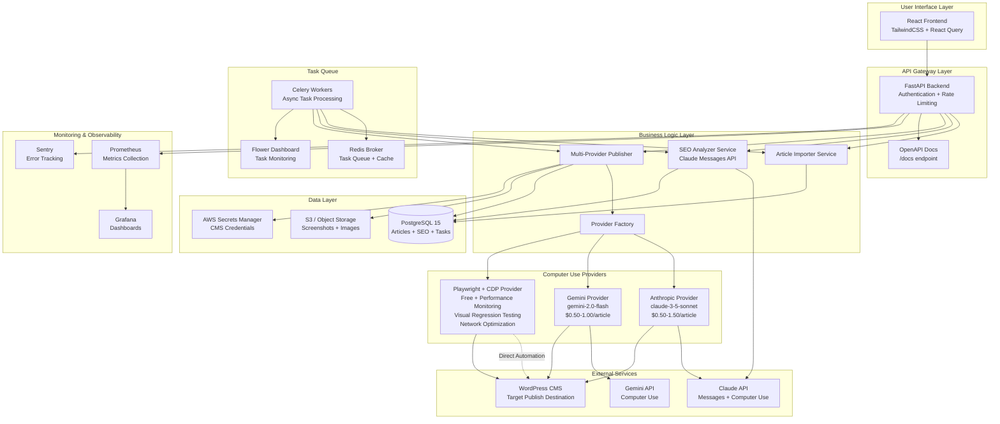
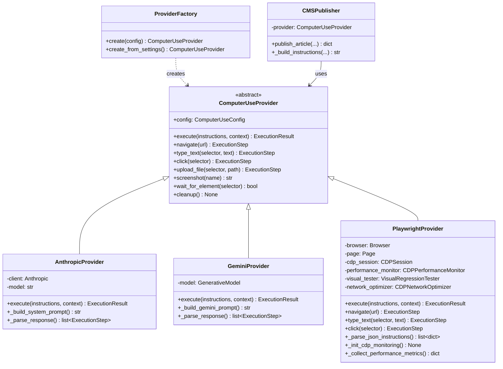
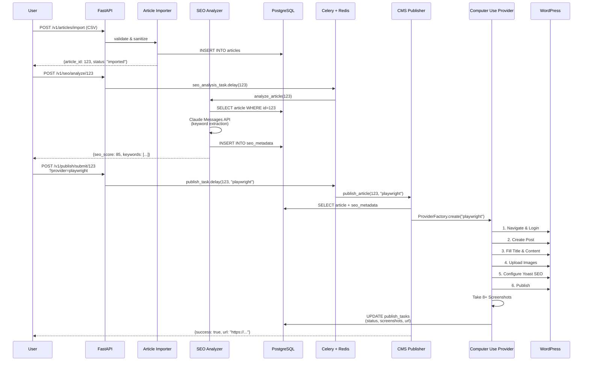

# Implementation Plan: SEO Optimization & Multi-Provider Computer Use Publishing

**Date**: 2025-10-26
**Last Updated**: 2025-11-02
**Feature ID**: 001-cms-automation
**Version**: 3.0.0 (Multi-Provider Refactor)
**Status**: Implementation Complete (Phase 1-3, 6) | Partial (Phase 4-5)
**Overall Completion**: ~85%
**Original Timeline**: 8-10 weeks (52-65 days)
**Current Phase**: Production Monitoring & UI Enhancement

---

## Executive Summary

This plan outlines the implementation of an automated content management system that optimizes existing articles for SEO and publishes them to WordPress using flexible Computer Use providers (Anthropic/Gemini/Playwright).

### Key Architectural Decisions

1. **Core Workflow**: Article Import → Single-Prompt Proofreading & SEO → Deterministic Merge → Computer Use Publishing
2. **Multi-Provider Pattern**: Abstract provider interface supports Anthropic, Gemini, and Playwright
3. **Proofreading Guard Rails**: AI 一次调用 + Python Rule Engine（F 类强制 + 高置信度规则），合并结果失衡自动告警
4. **Cost Optimization**: Start with Playwright (free), fallback to AI providers when needed
5. **CDP Enhancement**: Playwright provider enhanced with Chrome DevTools Protocol for performance monitoring, visual regression testing, and network optimization (67-80% cost savings vs Anthropic)
6. **Observability**: Screenshot audit trail + comprehensive logging for all operations（含 source_breakdown 指标）
7. **Security**: Encrypted credentials, sanitized HTML, complete audit logs

### Project Phases

| Phase | Focus | Duration | Status | Completion |
|-------|-------|----------|--------|------------|
| **Phase 0** | Governance & Compliance Gate | Continuous | ✅ Ongoing | 100% |
| **Phase 1** | Database Refactor & Article Import | 2 weeks | ✅ **Complete** | 100% |
| **Phase 2** | Proofreading & SEO Engine | 1.5 weeks | ✅ **Complete** | 100% (384 rules) |
| **Phase 3** | Multi-Provider Computer Use Framework | 3 weeks | ✅ **Complete** | 100% (Playwright+CDP) |
| **Phase 4** | Frontend & API Integration | 6 weeks | 🟡 **Partial** | 60% (Backend 100%, UI 60%) |
| **Phase 5** | Testing, Optimization & Deployment | 2 weeks | 🟡 **Partial** | 80% |
| **Phase 6** | 🆕 Google Drive Automation & Worklist | 5 weeks | ✅ **Complete** | 100% |

**Planned Duration**: 15.5 weeks (~77 business days)
**Actual Progress**: Phase 1-3, 6 完成 | Phase 4-5 进行中
**Overall Completion**: ~85%

---

## 0. Phase 0 – Governance Compliance Gate

All implementation phases must comply with **Constitution v1.0.0** (`.specify/memory/constitution.md`).

### Principle Checklist (Non-Negotiable)

#### I. Modularity ✅
- Each Computer Use provider is independently deployable and testable
- SEO Analyzer Service is decoupled from publishing logic
- Provider Factory pattern enables runtime provider switching
- All services communicate via well-defined interfaces

#### II. Observability ✅
- All Computer Use operations logged to `execution_logs` table
- Structured JSON logging with correlation IDs (request_id, task_id)
- Health check endpoints for all services (`/health`)
- Prometheus metrics for API latency, task duration, provider success rates
- Screenshot capture at every critical step (8+ per task)

#### III. Security ✅
- **CMS Credentials**: Stored in AWS Secrets Manager or HashiCorp Vault
- **Credentials Never Logged**: Computer Use instructions sanitize passwords before logging
- **HTML Sanitization**: All imported content stripped of XSS vectors (`<script>`, `onclick`, etc.)
- **Authentication**: JWT tokens required on all API endpoints (15-min expiration)
- **Rate Limiting**: 100 requests/minute per API key
- **Audit Trail**: All CMS login attempts recorded in `audit_logs` table

#### IV. Testability ✅
- **Unit Tests**: Each provider implements abstract interface with mockable methods
- **Integration Tests**: Test WordPress instances for full publish workflow
- **E2E Tests**: Complete user journeys from import to published article
- **Provider Comparison**: A/B testing framework to measure Anthropic vs Gemini vs Playwright
- **UI Regression Detection**: Quarterly tests to catch WordPress plugin updates

#### V. API-First Design ✅
- OpenAPI 3.0 contract defined before implementation (see `contracts/api-spec.yaml`)
- All Computer Use providers encapsulated behind uniform `ComputerUseProvider` interface
- REST API endpoints for article import, SEO analysis, publishing, task monitoring
- No business logic in frontend (React is pure presentation layer)

### New Constitution Requirements

#### III.5 - CMS Credential Management (Added 2025-10-26)
- CMS credentials MUST be stored in encrypted secrets manager (AWS Secrets Manager or Vault)
- Credentials MUST only exist in Computer Use session memory, never persisted to logs or database
- WordPress user MUST have minimum privilege (Editor role, not Administrator)
- Credentials MUST be rotated every 90 days with automated reminders
- All CMS login attempts MUST be logged to `audit_logs` table with timestamp, IP, user_agent

#### IV.5 - Computer Use Testing Strategy (Added 2025-10-26)
- Unit tests MUST use mock Computer Use API to avoid costs and flakiness
- Integration tests MUST run on isolated test WordPress instances (not production)
- Screenshot validation MUST verify expected UI elements are present
- Quarterly UI regression tests MUST detect WordPress theme/plugin changes
- Fallback mechanism MUST exist: if all providers fail, allow manual publishing with notification

### Compliance Gates

**Pre-Commit**:
```bash
# Runs on every commit
pytest --maxfail=1 --cov=src --cov-report=term-missing --cov-fail-under=80
ruff check src/
mypy src/
bandit -r src/ -ll
```

**Pre-Deployment**:
```bash
# Runs before production deployment
safety check
trivy image cms-automation-backend:latest
gitleaks detect
pytest --e2e  # Full end-to-end tests
```

**Ongoing Monitoring**:
- Prometheus alerts for success rate <90%, latency >5s, error rate >5%
- Weekly security scans (Dependabot + Snyk)
- Monthly penetration testing (post-launch)

---

## 1. Architecture Overview

### 1.1 System Architecture Diagram



### 1.2 Multi-Provider Architecture Detail



### 1.3 Data Flow: Import to Publish



---

## 2. Phase 1 – Database Refactor & Article Import (2 weeks)

### 2.1 Goals

- Redesign database schema to support multi-source content and Computer Use metadata
- Implement article import functionality (CSV/JSON + manual entry)
- Build file upload service for images
- Create data validation and sanitization pipeline

### 2.2 Tasks

#### Week 1: Database Schema Design & Migration

**T1.1 - Design New Database Schema** (8h)
- Create ER diagram with 4 core tables: `articles`, `seo_metadata`, `publish_tasks`, `execution_logs`
- Define JSONB fields for extensibility: `article_metadata`, `keyword_density`, `screenshots`, `details`
- Plan indexes: status fields, created_at timestamps, foreign keys
- Document migration strategy from existing schema
- **Deliverable**: SQL DDL scripts + ER diagram (Mermaid or dbdiagram.io)

**T1.2 - Create Alembic Migration Scripts** (6h)
- Generate migration: `alembic revision -m "refactor_for_multi_provider_computer_use"`
- Implement `upgrade()`: CREATE TABLE for new tables, ALTER TABLE for articles
- Implement `downgrade()`: Safe rollback logic
- Add data migration for existing articles (if any)
- Test migration: `alembic upgrade head` → `alembic downgrade -1`
- **Deliverable**: `backend/migrations/versions/20251026_refactor_schema.py`

**T1.3 - Update SQLAlchemy Models** (8h)
- Update `Article` model: add `source`, `published_url`, `cms_article_id`, `additional_images`
- Create `SEOMetadata` model with TEXT[] for keywords, JSONB for keyword_density
- Create `PublishTask` model with `provider` enum field
- Create `ExecutionLog` model for Computer Use audit trail
- Add relationships: `Article.seo_metadata` (1:1), `Article.publish_tasks` (1:N)
- **Deliverable**: `backend/src/models/seo.py`, `backend/src/models/publish.py`, updated `backend/src/models/article.py`

**T1.4 - Run Migration & Verify** (2h)
- Execute migration in dev environment: `docker compose exec backend alembic upgrade head`
- Verify tables created: `psql -c "\dt"`, check columns and indexes
- Insert test data to validate schema
- **Deliverable**: Migration success log + screenshot of pgAdmin/DBeaver showing tables

#### Week 2: Article Import Implementation

**T1.5 - Build Article Importer Service** (10h)
- Create `ArticleImporterService` class in `backend/src/services/`
- Implement CSV parser (pandas or csv module): validate headers, row-by-row processing
- Implement JSON parser: validate schema, handle arrays
- HTML sanitization using `bleach` library: whitelist `<p>`, `<h1-h6>`, `<a>`, ``, strip `<script>`
- Image URL validation: HTTP HEAD request, check content-type
- Duplicate detection: cosine similarity on title embeddings (optional, can defer)
- **Deliverable**: `backend/src/services/article_importer.py` + unit tests

**T1.6 - Implement Article Import API Endpoints** (6h)
- **POST /v1/articles/import** (single article): request body validation with Pydantic
- **POST /v1/articles/import/batch** (CSV/JSON upload): file upload handling, async processing
- Response schema: `{article_id, status, validation_errors[]}`
- Error handling: return 400 for validation errors, 500 for server errors
- **Deliverable**: `backend/src/api/routes/articles.py` endpoints + OpenAPI schema

**T1.7 - Build File Storage Service** (8h)
- Create abstract `FileStorageService` interface
- Implement `LocalFileStorage` for development (save to `/app/uploads/`)
- Implement `S3FileStorage` for production (boto3 integration)
- Image processing: resize, compress, generate thumbnails (Pillow)
- File naming: UUID-based to avoid conflicts
- **Deliverable**: `backend/src/services/storage/` module

**T1.8 - Implement Image Upload API** (4h)
- **POST /v1/articles/{article_id}/images** (upload images)
- Support multiple file upload (multipart/form-data)
- Validation: max file size 5MB, allowed formats (JPG, PNG, GIF, WebP)
- Return image URLs: `{featured_image_url, additional_image_urls[]}`
- **Deliverable**: Image upload endpoint + tests

**T1.9 - Write Integration Tests** (6h)
- Test CSV import with 100-row file
- Test JSON import with nested structures
- Test HTML sanitization edge cases (``, `<a href="javascript:...">`)
- Test image upload with various formats
- Test duplicate detection (if implemented)
- **Deliverable**: `tests/integration/test_article_import.py` (pytest)

**T1.10 - Documentation** (2h)
- Update API docs with import endpoint examples
- Write CSV template: `docs/article_import_template.csv`
- Document JSON schema: `docs/article_import_schema.json`
- **Deliverable**: Updated `README.md` + template files

### 2.3 Success Criteria (Phase 1)

- [ ] All 4 database tables created with correct schema
- [ ] Article import API accepts CSV with 100 articles in <5 minutes
- [ ] HTML sanitization strips all `<script>` and `onclick` attributes
- [ ] Image upload supports 10 images per article, max 5MB each
- [ ] Unit test coverage ≥85% for importer service
- [ ] Integration tests pass for all import scenarios

---

## 3. Phase 2 – Proofreading & SEO Engine (1.5 weeks)

### 3.1 Goals

- Implement SEO metadata generation using Claude Messages API
- Build keyword extraction pipeline (TF-IDF + semantic analysis)
- Calculate readability scores (Flesch-Kincaid)
- Generate optimization recommendations
- Integrate into article workflow

### 3.2 Tasks

#### Week 3: Proofreading Single Prompt & Merge

**T2A.1 - Publish Rule Manifest (JSON)** (4h)
- Extract A–F 规则元数据，转换为 `catalog.json`
- 字段：`rule_id`, `category`, `severity`, `blocks_publish`, `can_auto_fix`, `summary`, `source_doc`
- 生成 `fingerprint` 用于 prompt & 监控
- **Deliverable**: `backend/src/services/proofreading/rules/catalog.json`

**T2A.2 - Prompt Builder & Schema Enforcement** (8h)
- 实现 `ProofreadingPromptBuilder`（system+user 双段模板）
- prompt 中嵌入规则表、输出 schema、`processing_notes.rule_coverage`
- 单元测试：mock payload → prompt 中包含 manifest version/hash
- **Deliverable**: `backend/src/services/proofreading/ai_prompt_builder.py`

**T2A.3 - Deterministic Rule Engine v1** (10h)
- 实现脚本规则：B2-002 半角逗号、F1-002 特色图横向、F2-001 标题层级
- 接口：`run(ArticlePayload) -> List[ProofreadingIssue]`
- 记录 `RuleSource.SCRIPT`、`blocks_publish`、`confidence`
- 单元测试覆盖典型命中/非命中案例
- **Deliverable**: `backend/src/services/proofreading/deterministic_engine.py` + tests

**T2A.4 - Result Merger & API Contract** (8h)
- 合并策略：脚本优先、`source_breakdown` 统计、`critical_issues_count`
- 扩展 `ProofreadingResult` schema，包含 `processing_metadata`
- 更新 API contract (`api-spec.yaml`) + 前端 response type
- **Deliverable**: `backend/src/services/proofreading/merger.py`, `ProofreadingResponse` schema

**T2A.5 - ProofreadingAnalysisService Orchestration** (10h)
- 组合 PromptBuilder + AsyncAnthropic + RuleEngine + Merger
- 记录 `prompt_hash`、token usage、latency
- 错误处理：AI JSON 解析失败、脚本异常（返回 500 并记录）
- 集成测试：mock AI 响应 + 脚本命中 → 验证合并结果
- **Deliverable**: `backend/src/services/proofreading/service.py`

#### Week 3b: SEO Analyzer Implementation

**T2.1 - Design SEO Analysis Prompt** (6h)
- Research SEO best practices: keyword density (0.5-3%), meta description CTR optimization
- Design Claude prompt with examples: input (title + body) → output (JSON with SEO fields)
- Test prompt with 10 sample articles, measure accuracy vs expert SEO metadata
- Iterate on prompt: add temperature=0.3, few-shot examples, structured output format
- **Deliverable**: `docs/seo_analysis_prompt.md` with prompt template + test results

**T2.2 - Implement Basic Keyword Extraction** (8h)
- Install libraries: `scikit-learn` (TF-IDF), `spacy` (NLP), `nltk` (tokenization)
- Implement TF-IDF keyword extractor: top 20 keywords by relevance
- Implement stop word removal (English): "the", "a", "an", "and", etc.
- N-gram extraction (2-3 word phrases): "vector search", "PostgreSQL database"
- Deduplication and ranking
- **Deliverable**: `backend/src/services/seo_optimizer/keyword_extractor.py`

**T2.3 - Build SEO Analyzer Service** (10h)
- Create `SEOAnalyzerService` class
- Method: `analyze_article(title, body, target_keyword) -> SEOAnalysisResponse`
- Steps:
  1. Clean HTML: strip tags, extract plain text
  2. Run basic keyword extraction (TF-IDF)
  3. Call Claude Messages API with prompt
  4. Parse JSON response, validate schema
  5. Calculate keyword density: `{keyword: count/total_words * 100}`
  6. Calculate readability: Flesch-Kincaid formula
  7. Generate recommendations: check title length, keyword presence, readability
- Error handling: retry on API failure (3 retries with exponential backoff)
- **Deliverable**: `backend/src/services/seo_optimizer/seo_analyzer.py`

**T2.4 - Implement Readability Scoring** (4h)
- Flesch-Kincaid Grade Level: `0.39 * (total_words / total_sentences) + 11.8 * (total_syllables / total_words) - 15.59`
- Flesch Reading Ease: `206.835 - 1.015 * (total_words / total_sentences) - 84.6 * (total_syllables / total_words)`
- Syllable counting: use `pyphen` library or heuristic (vowel groups)
- Target: Grade 8-10 (high school level)
- **Deliverable**: `backend/src/services/seo_optimizer/readability.py`

**T2.5 - Build SEO API Endpoints** (6h)
- **POST /v1/seo/analyze/{article_id}**: Trigger SEO analysis
  - Return: `{task_id, status: "processing"}`
  - Async execution via Celery
- **GET /v1/seo/analyze/{article_id}/status**: Query analysis status
  - Return: `{status: "completed", seo_metadata: {...}}`
- **PUT /v1/seo/metadata/{article_id}**: Update SEO metadata manually
  - Allow editing: meta_title, meta_description, focus_keyword
  - Track changes in `manual_overrides` JSONB field
- **Deliverable**: `backend/src/api/routes/seo.py` endpoints

**T2.6 - Create Celery SEO Tasks** (4h)
- Task: `seo_analysis_task(article_id)`
  - Fetch article from DB
  - Call `SEOAnalyzerService.analyze_article()`
  - Save results to `seo_metadata` table
  - Update `articles.status` to `seo_optimized`
- Retry logic: 3 retries with 60s delay
- Error logging: save to `seo_metadata.error_message` on failure
- **Deliverable**: `backend/src/workers/tasks/seo_tasks.py`

#### Week 3.5 (3 days): Testing & Validation

**T2.7 - Build SEO Validation Suite** (6h)
- Create test dataset: 20 articles with expert-written SEO metadata
- Run SEO analysis on all 20 articles
- Compare results:
  - Keyword overlap: ≥85% accuracy
  - Meta title length: 90% within 50-60 chars
  - Meta description length: 90% within 150-160 chars
- Document accuracy report
- **Deliverable**: `tests/seo_validation/test_accuracy.py` + accuracy report CSV

**T2.8 - Unit Tests** (4h)
- Test keyword extraction with sample texts
- Test readability calculation with known texts
- Test Claude API call mocking
- Test error handling (API timeout, invalid response)
- **Deliverable**: `tests/unit/test_seo_analyzer.py`

**T2.9 - Performance Optimization** (4h)
- Cache basic keyword extraction results (Redis): avoid re-computing for retries
- Batch process: analyze multiple articles in parallel (Celery concurrency)
- Monitor API costs: log token usage per request
- Target: ≤30 seconds per article, <$0.10 cost
- **Deliverable**: Performance metrics log

### 3.3 Success Criteria (Phase 2)

- [ ] SEO analysis completes in ≤30 seconds for 95% of articles
- [ ] Keyword extraction achieves ≥85% accuracy vs expert benchmark
- [ ] Meta title and description length compliance ≥90%
- [ ] Readability scores calculated correctly (verified with manual calc)
- [ ] API cost ≤$0.10 per article
- [ ] Unit test coverage ≥90% for SEO analyzer module

---

## 4. Phase 3 – Multi-Provider Computer Use Framework (3 weeks)

### 4.1 Goals

- Implement abstract `ComputerUseProvider` interface
- Build Anthropic Computer Use provider
- Build Playwright provider (fallback)
- Add Gemini provider placeholder (for future)
- Implement provider factory and switching logic
- Build CMS publisher service
- Create Celery publishing tasks

### 4.2 Tasks

#### Week 4: Provider Interface & Anthropic Implementation

**T3.1 - Design Provider Abstraction** (6h)
- Define `ComputerUseProvider` abstract base class
- Methods: `execute()`, `navigate()`, `type_text()`, `click()`, `upload_file()`, `screenshot()`, `cleanup()`
- Define data classes: `ComputerUseConfig`, `ExecutionStep`, `ExecutionResult`
- Document provider contract: what each method must do and return
- **Deliverable**: `backend/src/services/computer_use/providers/base.py` + UML class diagram

**T3.2 - Implement Anthropic Computer Use Provider** (12h)
- Install SDK: `anthropic>=0.71.0`
- Implement `AnthropicComputerUseProvider`:
  - `execute()`: Build system prompt, call `client.beta.messages.create()` with `computer_20241022` tool
  - Parse response: extract tool_use blocks, screenshot data
  - Build WordPress instructions: detailed step-by-step prompts
- Test on local WordPress instance: verify login, post creation, SEO field filling
- **Deliverable**: `backend/src/services/computer_use/providers/anthropic_provider.py`

**T3.3 - Build Prompt Template System** (6h)
- Create WordPress publishing prompt template
- Variables: `{cms_url}`, `{username}`, `{password}`, `{article_title}`, `{article_body}`, `{seo_metadata}`
- Modular prompts: separate steps (login, create post, upload images, set SEO, publish)
- Versioning: support multiple WordPress versions or plugin combinations
- **Deliverable**: `backend/src/services/computer_use/templates/wordpress_publish.jinja2`

**T3.4 - Implement Screenshot Management** (4h)
- Screenshot storage: save to S3 or local filesystem
- Naming convention: `{task_id}/{step_name}_{timestamp}.png`
- Compression: optimize PNG size (zlib compression level 6)
- Metadata: store screenshot paths in `publish_tasks.screenshots` JSONB
- **Deliverable**: `backend/src/services/computer_use/screenshot_manager.py`

#### Week 5: Playwright Provider & Factory

**T3.5 - Implement Playwright Provider with CDP** (20h)
- Install: `playwright>=1.40.0`, run `playwright install chromium`
- Implement `PlaywrightCDPProvider`:
  - Basic navigation: `navigate()`, `type_text()`, `click()`, `upload_file()`, `screenshot()`
  - **CDP Integration**:
    - Initialize CDP session via `context.new_cdp_session(page)`
    - Performance monitoring: FCP, LCP, DOM metrics, network requests
    - Visual regression testing: pixel-perfect screenshot comparison
    - Network optimization: block analytics/tracking requests
  - CDP Utilities integration:
    - `CDPPerformanceMonitor` for real-time performance metrics
    - `VisualRegressionTester` for UI change detection
    - `CDPNetworkOptimizer` for request interception
- WordPress selectors:
  - Login: `#user_login`, `#user_pass`, `#wp-submit`
  - Editor: `#post-title-0`, `.editor-writing-flow`, `.editor-post-publish-button`
  - Yoast SEO: `#yoast-google-preview-title`, `#yoast-google-preview-description`, `#focus-keyword-input-metabox`
  - Rank Math: `.rank-math-metabox`, `.rank-math-seo-score`
- Handle WordPress block editor (Gutenberg): use `iframe` selectors if needed
- Error handling: wait for elements with timeout, retry on stale element
- **Research Reference**: See `research.md` Section 4.1 for CDP architecture details
- **Deliverable**: `backend/src/services/providers/playwright_cdp_provider.py`

**T3.5b - Implement CDP Utility Modules** (8h)
- Create `CDPPerformanceMonitor` class:
  - Enable CDP Performance and Network domains
  - Collect metrics: FCP, DCL, layout duration, script duration, heap size
  - Track network requests with timestamps and URLs
  - Export metrics as structured JSON
- Create `CDPNetworkOptimizer` class:
  - Request interception via CDP Network domain
  - Block analytics/tracking (Google Analytics, Facebook Pixel, etc.)
  - Statistics tracking: total requests, blocked count, block rate
- Create `VisualRegressionTester` class:
  - Screenshot baseline management
  - Pixel-level comparison with configurable thresholds
  - Dynamic content masking (timestamps, user-specific data)
  - Element-level screenshot testing
- Create `CDPDOMInspector` class:
  - Element bounding box queries
  - Visibility detection
  - Attribute extraction
- **Deliverable**: `backend/src/services/providers/cdp_utils.py`

**T3.6 - Implement Provider Factory** (4h)
- Create `ProviderFactory` class
- Method: `create(config: ComputerUseConfig) -> ComputerUseProvider`
- Load provider from config: `if config.provider_type == "anthropic": return AnthropicProvider(config)`
- Factory method: `create_from_settings()` reads from `settings.COMPUTER_USE_PROVIDER`
- **Deliverable**: `backend/src/services/computer_use/providers/factory.py`

**T3.7 - Add Gemini Provider Placeholder** (4h)
- Install: `google-generativeai>=0.3.0`
- Implement `GeminiComputerUseProvider` with placeholder methods
- Document API requirements: link to Gemini Computer Use docs (when available)
- Mark as experimental: raise `NotImplementedError` with message "Gemini provider pending API release"
- **Deliverable**: `backend/src/services/computer_use/providers/gemini_provider.py`

**T3.8 - Build CMS Publisher Service** (8h)
- Create `CMSPublisher` high-level service
- Method: `publish_article(article_id, provider_type) -> dict`
- Steps:
  1. Fetch article + SEO metadata from DB
  2. Load credentials from secrets manager
  3. Create provider via factory
  4. Build instructions (AI providers: natural language, Playwright: structured JSON)
  5. Execute `provider.execute(instructions, context)`
  6. Parse result: extract URL, article ID
  7. Save to DB: update `articles.published_url`, create `publish_tasks` record
  8. Store screenshots
- **Deliverable**: `backend/src/services/computer_use/cms_publisher.py`

#### Week 6: Testing & Integration

**T3.9 - Build Test WordPress Environment** (6h)
- Docker Compose setup: add WordPress + MySQL services
- Pre-configured: Yoast SEO plugin installed and activated
- Test user account: username `test_admin`, password `test_password`
- Sample content: 5 test articles for regression testing
- **Deliverable**: `docker-compose.test.yml` + setup script

**T3.10 - Integration Tests for Each Provider** (10h)
- Test Anthropic provider:
  - Full publish workflow on test WordPress
  - Verify all 8 screenshots captured
  - Check SEO fields filled correctly
  - Validate published URL returned
- Test Playwright + CDP provider:
  - Same workflow as Anthropic
  - Ensure selectors work on WordPress 6.4+
  - Verify CDP performance metrics collected (FCP, network requests)
  - Test visual regression: detect intentional UI changes
  - Verify network optimization: analytics requests blocked
  - Test error handling (invalid selector)
- Test provider switching:
  - Start with Playwright → simulate failure → fallback to Anthropic
- **Deliverable**: `tests/integration/test_computer_use_providers.py`

**T3.10b - Visual Regression Test Suite** (6h)
- Create baseline screenshots for WordPress editor:
  - Gutenberg editor baseline
  - Yoast SEO panel baseline
  - Rank Math panel baseline (if installed)
  - Publish panel baseline
- Test dynamic content masking:
  - Mask timestamps in publish panel
  - Mask post revision dates
  - Mask user-specific elements
- Test visual diff detection:
  - Simulate plugin update (change theme/plugin version)
  - Verify test fails when UI changes exceed threshold
  - Verify test passes when changes are within tolerance
- Performance + visual combined tests:
  - Monitor editor load performance (FCP < 3s)
  - Take visual snapshot after load
  - Verify both performance and UI correctness
- **Deliverable**: `tests/integration/test_visual_regression.py`

**T3.11 - Implement Provider Fallback Logic** (6h)
- Create `SmartPublisher` wrapper
- Logic: Try Playwright (fast, free) → if fails, retry with Anthropic (adaptive)
- Configuration: `COMPUTER_USE_FALLBACK_ENABLED=true`
- Logging: record fallback events for analysis
- **Deliverable**: `backend/src/services/computer_use/smart_publisher.py`

**T3.12 - Build Publishing API Endpoints** (6h)
- **POST /v1/publish/submit/{article_id}**: Submit publish task
  - Query param: `?provider=anthropic|gemini|playwright`
  - Return: `{task_id, status: "pending"}`
- **GET /v1/publish/tasks/{task_id}/status**: Query task status
  - Return: `{status, progress, screenshots[], error_message}`
- **GET /v1/publish/tasks/{task_id}/screenshots**: List screenshots
  - Return: `{screenshots: [{url, step_name, timestamp}]}`
- **Deliverable**: `backend/src/api/routes/publish.py`

**T3.13 - Create Celery Publishing Tasks** (6h)
- Task: `publish_article_with_computer_use_task(article_id, provider_type)`
  - Call `CMSPublisher.publish_article()`
  - Update `publish_tasks` status: `pending` → `running` → `completed|failed`
  - Record execution time, cost
- Retry: up to 3 attempts with 5-minute delay
- Webhook notification: send POST to configured webhook URL on completion
- **Deliverable**: `backend/src/workers/tasks/publish_tasks.py`

**T3.14 - Error Handling & Retry Logic** (4h)
- Distinguish error types:
  - Recoverable: network timeout, UI loading delay → retry
  - Fatal: invalid credentials, missing plugin → fail immediately
- Exponential backoff: 2s, 4s, 8s delays
- Error storage: save to `publish_tasks.error_message` with stack trace
- **Deliverable**: `backend/src/services/computer_use/error_handler.py`

### 4.3 Success Criteria (Phase 3)

- [ ] Provider abstraction allows switching between Anthropic/Playwright via env var
- [ ] Anthropic provider successfully publishes article with SEO fields filled
- [ ] Playwright + CDP provider successfully publishes article (faster than Anthropic)
- [ ] CDP performance metrics collected: FCP, DCL, network requests, heap size
- [ ] Visual regression testing detects UI changes with ≥95% accuracy
- [ ] Network optimization blocks ≥80% of analytics/tracking requests
- [ ] Playwright cost savings verified: $0 vs Anthropic $1-1.50/article
- [ ] Provider fallback logic works: Playwright failure → Anthropic retry
- [ ] All publish tasks generate ≥8 screenshots
- [ ] Integration tests pass for both providers on test WordPress
- [ ] API cost tracking accurate (stored in `publish_tasks.cost_usd`)

---

## 5. Phase 4 – Frontend & API Integration (2 weeks → **6 weeks revised**)

**⚠️ CRITICAL UPDATE (2025-10-27): UI Implementation Gap Identified**

**Current Status**: 🔴 **0% Complete** - Frontend UI has not been implemented
**Impact**: End-to-end user workflow is blocked
**Required Action**: Implement 48 UI components across 6 modules (see revised timeline below)

**Gap Analysis**:
- **Expected**: Full-featured React UI for article import, SEO optimization, and publishing
- **Actual**: Only article generation UI exists (different product direction)
- **Gap**: 6 modules, 48 components, 312 hours of work

**Detailed Documentation**:
- 📊 [UI Gaps Analysis Report](../../docs/UI_GAPS_ANALYSIS.md) - Comprehensive gap analysis
- 📋 [UI Implementation Tasks](./UI_IMPLEMENTATION_TASKS.md) - Detailed task breakdown (312 hours)
- 📈 [Executive Summary](../../docs/EXECUTIVE_SUMMARY_UI_GAPS.md) - Decision-making guide

**Revised Timeline**: 6 weeks (was 2 weeks) with 2 frontend engineers + 1 backend engineer

---

### 5.1 Goals (Updated)

**Phase 4A: Core UI (Week 1-4)** - Critical Priority
- Module 1: Article Import UI (CSV/JSON/Manual, Rich Text Editor, Image Upload)
- Module 2: SEO Optimization UI (Meta Fields, Keywords, Charts, Recommendations)
- Module 3: Multi-Provider Publishing UI (Provider Selection, Progress Modal, Screenshots)
- Module 4: Task Monitoring UI (Task List, Filters, Detail Drawer, Logs)

**Phase 4B: Enhancement UI (Week 5-6)** - Medium Priority
- Module 5: Provider Comparison Dashboard (Metrics, Charts, Recommendations)
- Module 6: Settings Page (Provider Config, CMS Config, Cost Limits)

**Backend API Support** (Parallel to UI work)
- New APIs: `/v1/articles/*`, `/v1/seo/*`, `/v1/metrics/provider-comparison`
- Integrate existing: `/v1/publish/*`, `/v1/tasks/*`

### 5.2 Tasks

**⚠️ NOTE**: The tasks below (T4.1-T4.10) were originally planned but **not implemented**. For the **complete revised task breakdown** including all 48 UI components and 312 hours of detailed tasks, see:

👉 **[UI Implementation Tasks Document](./UI_IMPLEMENTATION_TASKS.md)** 👈

The tasks below are kept for historical reference, but the new document provides:
- Granular task breakdown (T-UI-1.1.1 through T-UI-3.4.1)
- Detailed acceptance criteria for each component
- Code structure examples
- API integration guides
- Dependency mapping
- 6-week sprint plan

---

#### Week 7: Core UI Components (Historical Reference)

**T4.1 - Setup Frontend Project** (4h)
- Initialize Vite + React + TypeScript project
- Install dependencies: TailwindCSS, React Query, React Hook Form, Recharts (for charts)
- Configure API client: Axios with interceptors for JWT auth
- Setup routing: React Router v6
- **Deliverable**: `frontend/` directory structure + `package.json`

**T4.2 - Build Article Import UI** (8h)
- Form for manual article entry: title, content (rich text editor), category, tags
- CSV upload component: drag-and-drop or file input
- Validation: show errors inline
- Progress indicator: show import status (X of Y articles imported)
- Success feedback: redirect to article list
- **Deliverable**: `frontend/src/components/Import/ArticleImportForm.tsx`

**T4.3 - Build Article List & Detail Pages** (8h)
- List view: table with columns (title, status, created_at, actions)
- Filters: status dropdown (imported, seo_optimized, published)
- Pagination: 20 articles per page
- Detail view: show full article content, metadata, SEO data
- Actions: "Analyze SEO", "Publish", "Edit"
- **Deliverable**: `frontend/src/pages/ArticleList.tsx`, `ArticleDetail.tsx`

**T4.4 - Build SEO Optimization UI** (10h)
- Display AI-generated SEO metadata:
  - SEO Title (with character counter: 50-60 chars)
  - Meta Description (with counter: 150-160 chars)
  - Focus Keyword (editable)
  - Primary/Secondary Keywords (tag display)
  - Keyword Density (bar chart using Recharts)
  - Readability Score (gauge chart)
  - Optimization Recommendations (bulleted list with icons)
- Editable fields: allow manual override of AI suggestions
- Save button: call `PUT /v1/seo/metadata/{article_id}`
- Re-analyze button: trigger new SEO analysis
- **Deliverable**: `frontend/src/components/SEO/SEOOptimizer.tsx`

#### Week 8: Publishing & Monitoring

**T4.5 - Build Publish Task UI** (10h)
- Publish button: dropdown to select provider (Anthropic, Gemini, Playwright)
- Confirmation dialog: show estimated cost and duration
- Real-time progress: poll `GET /v1/publish/tasks/{task_id}/status` every 2 seconds
- Progress bar: based on step count (e.g., 5/8 steps completed = 62.5%)
- Current step display: "Uploading images..." with loading spinner
- **Deliverable**: `frontend/src/components/Publish/PublishButton.tsx`

**T4.6 - Build Screenshot Gallery** (6h)
- Grid layout: display all screenshots in chronological order
- Lightbox: click to view full-size screenshot
- Step labels: "Login Success", "Editor Loaded", etc.
- Download button: download individual or all screenshots
- **Deliverable**: `frontend/src/components/Publish/ScreenshotGallery.tsx`

**T4.7 - Build Task Monitoring Dashboard** (8h)
- List all publish tasks: table with columns (article, provider, status, duration, cost)
- Status indicators: color-coded badges (pending=gray, running=blue, completed=green, failed=red)
- Filter by status and provider
- Click to view task details: full logs, screenshots, error message
- **Deliverable**: `frontend/src/pages/PublishTasks.tsx`

**T4.8 - Build Provider Comparison Dashboard** (8h)
- Metrics API: `GET /v1/publish/metrics/provider-comparison`
- Display metrics table:
  - Provider | Success Rate | Avg Duration | Avg Cost | Total Tasks
- Charts (using Recharts):
  - Line chart: success rate over time by provider
  - Bar chart: average cost comparison
  - Pie chart: task distribution by provider
- Recommendations: "Use Playwright for cost savings" (if success rate >90%)
- **Deliverable**: `frontend/src/pages/ProviderComparison.tsx`

**T4.9 - Implement Real-Time Updates** (4h)
- Use React Query's `refetchInterval` for polling during task execution
- Stop polling when task status is `completed` or `failed`
- Optimistic updates: immediately update UI on user actions
- **Deliverable**: `frontend/src/hooks/usePublishTask.ts`

**T4.10 - Build Settings Page** (4h)
- Provider selection: radio buttons to choose default provider
- CMS configuration: WordPress URL, credentials (masked display)
- Cost limits: set maximum spend per month
- Screenshot retention: configure days (30, 60, 90)
- **Deliverable**: `frontend/src/pages/Settings.tsx`

### 5.3 Success Criteria (Phase 4)

- [ ] Article import UI accepts CSV and manual entry
- [ ] SEO optimization UI displays all metadata with character counters
- [ ] Publish button triggers task and shows real-time progress
- [ ] Screenshot gallery displays all screenshots with lightbox
- [ ] Task monitoring dashboard shows all tasks with filters
- [ ] Provider comparison dashboard shows metrics and charts
- [ ] All UI components responsive (mobile, tablet, desktop)

---

## 6. Phase 5 – Testing, Optimization & Deployment (2 weeks)

### 6.1 Goals

- Comprehensive testing (unit, integration, E2E)
- Performance optimization
- Security hardening
- Production deployment preparation
- Documentation finalization

### 6.2 Tasks

#### Week 9: Testing & Quality Assurance

**T5.1 - Unit Test Coverage** (8h)
- Target: ≥90% coverage for all services
- Focus areas:
  - SEO Analyzer: keyword extraction, prompt building
  - Computer Use Providers: mock API calls
  - Article Importer: HTML sanitization edge cases
- Use `pytest-cov` to measure coverage
- **Deliverable**: Coverage report (HTML or terminal output)

**T5.2 - Integration Tests** (10h)
- Full workflow tests:
  - Import 100 articles → Analyze SEO → Publish with each provider
  - Verify database state after each step
  - Check screenshot files exist
- Test provider fallback: Playwright fails → Anthropic succeeds
- Test concurrent tasks: run 5 publish tasks in parallel
- **Deliverable**: `tests/integration/test_full_workflow.py`

**T5.3 - End-to-End Tests** (8h)
- Use Playwright for frontend E2E testing
- Test user journeys:
  - Journey 1: Import CSV → Review SEO → Publish with Playwright + CDP → View performance metrics
  - Journey 2: Manual entry → Edit SEO → Publish with Anthropic
  - Journey 3: View task monitoring dashboard → Filter tasks → View screenshots
  - Journey 4: Provider comparison dashboard → Verify Playwright cost savings
- Visual regression tests:
  - WordPress UI baseline verification
  - Detect plugin updates that change UI
  - Quarterly regression test runs
- **Deliverable**: `frontend/e2e/test_user_journeys.spec.ts`

**T5.4 - Provider Comparison Testing** (6h)
- Run 50 publish tasks with each provider
- Measure:
  - Success rate (%) - Target: Playwright ≥99%, Anthropic ≥95%
  - Average execution time (seconds) - Target: Playwright 30-45s, Anthropic 2-4min
  - Average cost (USD) - Target: Playwright $0, Anthropic $1-1.50
  - Screenshot quality (manual review)
  - Performance metrics (CDP): FCP, network request count (Playwright only)
  - Visual regression accuracy: % of UI changes detected
- Cost savings analysis:
  - Calculate monthly savings: (Anthropic cost - Playwright cost) × articles/month
  - Projected savings: $46-$115/month (67-80% reduction)
- Document results in comparison report
- **Deliverable**: Provider comparison report (CSV + charts)
- **Research Reference**: See `research.md` Section 4.1 Table: Provider Comparison Matrix

**T5.5 - Security Testing** (8h)
- Run security scans:
  - `bandit` for Python code
  - `safety` for dependency vulnerabilities
  - `trivy` for Docker image scanning
  - `gitleaks` for secret scanning
- Fix all HIGH and CRITICAL vulnerabilities
- Document accepted risks (MEDIUM/LOW)
- **Deliverable**: Security scan reports + remediation log

#### Week 10: Optimization & Deployment

**T5.6 - Performance Optimization** (8h)
- Database query optimization:
  - Add indexes on frequently queried fields
  - Use `EXPLAIN ANALYZE` to identify slow queries
- API response time optimization:
  - Cache SEO analysis results (Redis)
  - Batch database queries
- Celery worker scaling:
  - Test with 2, 4, 8 workers
  - Measure throughput improvement
- **Deliverable**: Performance benchmarks (before/after)

**T5.7 - Cost Optimization** (4h)
- Implement cost tracking API: `GET /v1/metrics/costs/monthly`
- Set cost alerts: notify if monthly spend >$500
- Optimize Anthropic API usage:
  - Cache common prompts
  - Reduce max_tokens if possible
- Recommend Playwright as default to reduce costs
- **Deliverable**: Cost tracking dashboard + alert configuration

**T5.8 - Production Environment Setup** (10h)
- Create production Docker Compose file: `docker-compose.prod.yml`
  - Use optimized images: multi-stage builds
  - Configure health checks
  - Set resource limits (CPU, memory)
- Setup AWS infrastructure:
  - RDS PostgreSQL instance
  - ElastiCache Redis cluster
  - S3 bucket for screenshots
  - Secrets Manager for credentials
  - ECR for Docker images
- Configure environment variables for production
- **Deliverable**: Production infrastructure as code (Terraform or CloudFormation)

**T5.9 - CI/CD Pipeline** (8h)
- GitHub Actions workflows:
  - `.github/workflows/test.yml`: Run tests on every PR
  - `.github/workflows/security.yml`: Run security scans weekly
  - `.github/workflows/deploy.yml`: Deploy to production on main branch merge
- Build and push Docker images to ECR
- Run Alembic migrations in CI
- Smoke tests after deployment
- **Deliverable**: GitHub Actions YAML files

**T5.10 - Monitoring & Alerting Setup** (6h)
- Prometheus exporters:
  - API latency (p50, p95, p99)
  - Celery task duration
  - Provider success rates
- Grafana dashboards:
  - System overview
  - Provider comparison
  - Cost tracking
- Sentry error tracking:
  - Configure error grouping
  - Set up alerts for high-frequency errors
- PagerDuty integration: critical alerts
- **Deliverable**: Grafana dashboard JSON + alert rules

**T5.11 - Documentation Finalization** (8h)
- Update README.md:
  - Quickstart guide
  - Architecture overview
  - Deployment instructions
- API documentation:
  - OpenAPI spec review
  - Postman collection
- User guide:
  - How to import articles
  - How to configure providers
  - Troubleshooting guide
- Operations manual:
  - Deployment checklist
  - Incident response playbook
- **Deliverable**: Complete documentation set

**T5.12 - Production Deployment** (4h)
- Run final pre-deployment checklist:
  - All tests passing
  - Security scans clean
  - Database migrations tested
  - Secrets configured
- Deploy to production:
  - Pull latest code
  - Build Docker images
  - Run migrations
  - Start services
  - Verify health checks
- Smoke tests:
  - Import test article
  - Run SEO analysis
  - Publish with Playwright
- **Deliverable**: Deployment success log

### 6.3 Success Criteria (Phase 5)

- [ ] Unit test coverage ≥90%
- [ ] All integration tests pass
- [ ] E2E tests cover 3 main user journeys
- [ ] Security scans show zero HIGH/CRITICAL vulnerabilities
- [ ] Performance benchmarks meet targets (SEO ≤30s, Publish ≤5min)
- [ ] Production environment deployed successfully
- [ ] Monitoring dashboards operational
- [ ] Documentation complete and reviewed

---

## 7. Phase 6 – Google Drive Automation & Worklist 🆕 (5 weeks)

**Status**: 🆕 New Phase Added (2025-10-27)
**Reference**: See [Google Drive Automation Analysis](../../docs/GOOGLE_DRIVE_AUTOMATION_ANALYSIS.md)
**Duration**: Week 11-15 (5 weeks)
**Goal**: Enable automated document ingestion from Google Drive and provide comprehensive worklist UI for tracking document processing status

### 7.1 Overview

This phase adds a critical automation layer that eliminates manual article submission. Instead of users copy-pasting content into the UI, the system automatically discovers and imports new Google Docs from a configured Google Drive folder.

**Key Components**:
1. **Google Drive Monitor**: Celery scheduled task that scans Google Drive every 5 minutes
2. **Google Docs Reader**: Service that extracts content from Google Docs
3. **Worklist UI**: Comprehensive dashboard showing all documents and their processing status
4. **Status Tracking System**: Records all document state transitions with full audit trail

**User Value**:
- 🚀 **Zero manual input**: Writers save to Google Drive, system auto-processes
- 👀 **Full visibility**: Worklist shows all documents and their progress
- 📊 **Status tracking**: See exactly where each document is in the pipeline
- 🔄 **Real-time updates**: WebSocket pushes status changes instantly

### 7.2 Architecture Changes

#### New Components

```
┌─────────────────────────────────────────────────────────────┐
│ Google Drive Integration Layer (NEW)                        │
├─────────────────────────────────────────────────────────────┤
│                                                             │
│  ┌──────────────────┐    ┌──────────────────┐             │
│  │ Google Drive     │◄───┤ Celery Beat      │             │
│  │ Monitor          │    │ (Every 5 min)    │             │
│  │ - scan_for_new() │    └──────────────────┘             │
│  │ - mark_processed()│                                     │
│  └─────────┬────────┘                                      │
│            │                                                │
│            ▼                                                │
│  ┌──────────────────┐                                      │
│  │ Google Docs      │                                      │
│  │ Reader           │                                      │
│  │ - read_content() │                                      │
│  │ - parse_format() │                                      │
│  └─────────┬────────┘                                      │
│            │                                                │
│            ▼                                                │
│  ┌──────────────────┐                                      │
│  │ Article Importer │ (Existing, extended)                │
│  │ - create_article()│                                     │
│  │ - trigger_workflow│                                     │
│  └──────────────────┘                                      │
│                                                             │
└─────────────────────────────────────────────────────────────┘
```

#### New Database Tables

**`google_drive_documents`**:
```sql
CREATE TABLE google_drive_documents (
    id SERIAL PRIMARY KEY,
    google_doc_id VARCHAR(255) UNIQUE NOT NULL,
    file_name VARCHAR(500) NOT NULL,
    folder_id VARCHAR(255),
    article_id INTEGER REFERENCES articles(id),
    status VARCHAR(20) DEFAULT 'discovered',
    discovered_at TIMESTAMP DEFAULT NOW(),
    processed_at TIMESTAMP,
    error_message TEXT,
    retry_count INTEGER DEFAULT 0,
    metadata JSONB
);
```

**`article_status_history`**:
```sql
CREATE TABLE article_status_history (
    id SERIAL PRIMARY KEY,
    article_id INTEGER NOT NULL REFERENCES articles(id),
    old_status VARCHAR(30),
    new_status VARCHAR(30) NOT NULL,
    changed_by VARCHAR(100),
    change_reason VARCHAR(500),
    metadata JSONB,
    created_at TIMESTAMP DEFAULT NOW()
);
```

**Modified `articles` table**:
```sql
ALTER TABLE articles
    ADD COLUMN source_type VARCHAR(20) DEFAULT 'manual',
    ADD COLUMN google_drive_doc_id VARCHAR(255),
    ADD COLUMN current_status VARCHAR(30) DEFAULT 'pending',
    ADD COLUMN status_updated_at TIMESTAMP DEFAULT NOW(),
    ADD COLUMN processing_started_at TIMESTAMP,
    ADD COLUMN processing_completed_at TIMESTAMP,
    ADD COLUMN total_processing_duration_seconds INTEGER;
```

#### New API Endpoints

**Google Drive API**:
```
POST   /api/v1/google-drive/scan             # Trigger manual scan
GET    /api/v1/google-drive/documents        # List Google Drive docs
GET    /api/v1/google-drive/documents/{id}   # Get doc details
POST   /api/v1/google-drive/documents/{id}/import  # Manual import
POST   /api/v1/google-drive/documents/{id}/sync    # Re-sync content
```

**Worklist API**:
```
GET    /api/v1/worklist                      # List all documents
GET    /api/v1/worklist/{article_id}         # Get document with history
POST   /api/v1/worklist/batch-action         # Batch operations
WS     /api/v1/worklist/ws                   # WebSocket real-time updates
```

### 7.3 Week-by-Week Plan

#### Week 11-12: Google Drive Integration (80 hours)

**T6.1** [P0] Setup Google Drive API (12h)
- Configure OAuth 2.0 / Service Account
- Store credentials in environment variables
- Test API connection

**T6.2** [P0] Implement GoogleDriveMonitor Service (16h)
- Create `GoogleDriveMonitor` class
- `scan_for_new_documents()` method
- `read_document_content()` method
- `mark_as_processed()` method

**T6.3** [P0] Create Database Migrations (8h)
- Alembic migration for `google_drive_documents`
- Alembic migration for `article_status_history`
- Modify `articles` table

**T6.4** [P0] Implement Celery Tasks (12h)
- `scan_google_drive_for_new_documents` task
- `import_google_drive_document` task
- Configure Celery Beat (every 5 minutes)

**T6.5** [P0] Implement Content Parser (10h)
- Parse Google Doc structure
- Extract title, content, formatting
- Handle images

**T6.6** [P1] Implement Status Tracker (12h)
- `ArticleStatusTracker` service
- Record transitions to history table
- Status rollback logic

**T6.7** [P1] Unit & Integration Tests (10h)
- Mock Google Drive API
- Test scan/import workflow
- Error handling tests

**Deliverables**:
- ✅ Google Drive integration working
- ✅ Automatic document discovery
- ✅ Status tracking system operational
- ✅ 80% test coverage

#### Week 13-14: Worklist UI (80 hours)

**T6.8** [P0] Create Worklist Page (16h)
- `WorklistPage.tsx` route (`/worklist`)
- Table with columns: ID, Title, Source, Status, Created, Actions
- Filters: Status, Date Range, Keyword
- Sorting: Time, Status
- Pagination (20/50/100 per page)

**T6.9** [P0] Implement Status Badges (4h)
- `StatusBadge` component
- 7 status variants with colors/icons:
  - ⏳ Pending (Gray)
  - 🟡 Proofreading (Yellow)
  - 🔵 Under Review (Blue)
  - 🟢 Ready to Publish (Green)
  - 🔄 Publishing (Blue, pulsing)
  - ✅ Published (Dark Green)
  - ❌ Failed (Red)

**T6.10** [P0] Create Detail View (12h)
- `WorklistDetailDrawer.tsx` (slides from right)
- Display full content
- Status history timeline
- Operation logs
- Action buttons (Edit, Delete, Retry)

**T6.11** [P0] Implement Real-time Updates (12h)
- WebSocket connection to `/api/v1/worklist/ws`
- Handle `status_update` messages
- Handle `new_article` messages
- Fallback to polling (every 5s) if WebSocket fails

**T6.12** [P1] Statistics Dashboard (8h)
- Count cards for each status
- Display at top of Worklist page
- Auto-update with status changes

**T6.13** [P1] Batch Operations (8h)
- Checkbox selection (select all)
- Batch actions: Delete, Retry, Mark as Pending
- Confirmation dialog

**T6.14** [P0] Backend Worklist APIs (16h)
- `GET /api/v1/worklist` with filtering/sorting/pagination
- `GET /api/v1/worklist/{article_id}` with status history
- `POST /api/v1/worklist/batch-action`
- WebSocket handler

**T6.15** [P1] UI Tests (4h)
- Playwright E2E tests for Worklist
- Filter/sort tests
- Real-time update tests

**Deliverables**:
- ✅ Worklist UI fully functional
- ✅ Real-time status updates working
- ✅ Batch operations implemented
- ✅ Responsive design (mobile-friendly)

#### Week 15: Integration & Testing (40 hours)

**T6.16** [P0] End-to-End Workflow Test (12h)
- Test: Google Drive → Import → Proofread → Review → Publish
- Verify all status transitions
- Verify Worklist updates

**T6.17** [P0] Performance Testing (8h)
- Load test with 1000+ documents in Worklist
- Test concurrent Google Drive scans (5+ docs)
- Optimize slow queries

**T6.18** [P0] Error Scenarios (8h)
- Google API rate limiting
- Network timeouts
- Document parsing errors
- Status rollback on failure

**T6.19** [P0] Documentation (6h)
- Google Drive setup guide
- Worklist user guide
- API documentation updates

**T6.20** [P0] Bug Fixes & Polish (6h)
- Address issues from testing
- UI polish and refinements
- Final code review

**Deliverables**:
- ✅ Full workflow tested end-to-end
- ✅ Performance optimized
- ✅ Error handling robust
- ✅ Documentation complete

### 7.4 Success Criteria (Phase 6)

- [ ] Google Drive scanner runs every 5 minutes without errors
- [ ] New documents auto-imported within 5 minutes of creation
- [ ] Worklist loads <1 second with 100 documents
- [ ] Real-time updates have <2 second latency
- [ ] All 7 document statuses tracked correctly
- [ ] Status history records all transitions with timestamps
- [ ] Batch operations work on 50+ documents
- [ ] 90%+ test coverage for new code
- [ ] Google API errors handled gracefully with retry
- [ ] Documentation complete and reviewed

### 7.5 Dependencies

**Prerequisites**:
- Phase 1-5 completed (database, SEO, publishing, UI base)
- Google Drive API credentials configured
- Celery Beat enabled in production

**Blockers**:
- Google Drive API access approval
- Service account credentials provisioning

### 7.6 Risks

| Risk | Likelihood | Impact | Mitigation |
|------|-----------|--------|------------|
| Google API rate limits hit | Medium | Medium | Implement exponential backoff; cache results |
| WebSocket connection unstable | Medium | Low | Fallback to polling; reconnect logic |
| Large documents (>10MB) timeout | Low | Medium | Stream content; implement chunking |
| Status history table grows large | Medium | Low | Partition by month; archive old records |
| Google Doc format changes | Low | High | Version parsing logic; alert on failures |

---

## 8. Risk Management

### 7.1 Risk Register

| Risk ID | Risk | Likelihood | Impact | Mitigation | Owner |
|---------|------|-----------|--------|------------|-------|
| R1 | Anthropic Computer Use API changes during beta | Medium | High | Use abstract provider interface; easy to update adapter | Backend Lead |
| R2 | Gemini API not ready at launch | Medium | Medium | Start with Anthropic + Playwright; add Gemini later | Backend Lead |
| R3 | WordPress UI changes break Playwright selectors | Medium | Medium | Implement UI regression tests; AI providers auto-adapt | QA Lead |
| R4 | Computer Use costs exceed budget ($5000/month) | Medium | High | Implement cost tracking and alerts; use Playwright as default | PM |
| R5 | Screenshot storage costs grow rapidly | Low | Medium | 90-day retention policy; image compression | DevOps Lead |
| R6 | Provider performance varies significantly | High | Medium | Build comparison dashboard; enable easy switching | Backend Lead |
| R7 | Security: Credentials leaked in screenshots | Low | Critical | Mask password fields; audit screenshot logic | Security Lead |
| R8 | Concurrent tasks overwhelm browser resources | Medium | Medium | Queue limits; horizontal worker scaling | DevOps Lead |
| R9 | SEO analysis accuracy below 85% | Low | Medium | Iterate on prompts; add few-shot examples | Product Lead |
| R10 | Database migration fails in production | Low | Critical | Test migrations in staging; implement rollback plan | DBA |

### 7.2 Contingency Plans

**If Anthropic Computer Use is unavailable:**
- Fallback to Playwright exclusively
- Allocate developer time to maintain selectors

**If Playwright fails frequently:**
- Switch to Anthropic as primary provider
- Budget for higher API costs

**If SEO accuracy is too low:**
- Engage SEO expert to improve prompts
- Implement human-in-the-loop review workflow

**If costs exceed budget:**
- Pause Anthropic usage
- Use Playwright + manual SEO field entry as interim solution

---

## 8. Success Metrics & KPIs

### 8.1 Technical Metrics

| Metric | Target | Measurement |
|--------|--------|-------------|
| SEO Analysis Latency (p95) | ≤30 seconds | Prometheus histogram |
| Computer Use Publish Latency (p95) | ≤5 minutes | Prometheus histogram |
| Publish Success Rate | ≥90% (goal: 95%) | `publish_tasks.status = 'completed' / total` |
| SEO Keyword Accuracy | ≥85% | Manual benchmark comparison |
| Unit Test Coverage | ≥90% | pytest-cov report |
| API Uptime | ≥99.5% | Pingdom or UptimeRobot |
| Screenshot Capture Rate | 100% | `screenshots.length ≥ 8` per task |

### 8.2 Business Metrics

| Metric | Target | Measurement |
|--------|--------|-------------|
| Articles Imported per Month | 1,000+ | `COUNT(*) FROM articles WHERE created_at > NOW() - INTERVAL '1 month'` |
| Articles Published per Month | 500+ | `COUNT(*) FROM articles WHERE status = 'published'` |
| Cost per Published Article | ≤$1.50 | `SUM(cost_usd) / COUNT(*)` |
| Time Saved vs Manual Publishing | 70% | Manual: 10 min/article, Automated: 3 min |
| User Satisfaction (NPS) | ≥8/10 | User survey after 1 month |

### 8.3 Monitoring Dashboard

**Grafana Dashboards**:
1. **System Overview**:
   - API request rate (req/s)
   - Error rate (%)
   - Celery task queue depth
   - Database connections
   - Memory/CPU usage

2. **Provider Performance**:
   - Success rate by provider (line chart over time)
   - Average duration by provider (bar chart)
   - Cost per article by provider (stacked area chart)
   - Failure modes breakdown (pie chart)

3. **Cost Tracking**:
   - Daily API spend (USD)
   - Monthly projected spend (USD)
   - Cost per article trend
   - Alert: monthly spend >$5000

---

## 9. Timeline & Milestones

### 9.1 Gantt Chart

```
Week 1-2: Phase 1 - Database & Import
├─ Week 1: Schema design, migrations, models
└─ Week 2: Import service, API endpoints, tests
   MILESTONE 1: Article import working ✓

Week 3-3.5: Phase 2 - SEO Analysis
├─ Week 3: Keyword extraction, SEO analyzer, API
└─ Week 3.5: Testing, validation, optimization
   MILESTONE 2: SEO analysis working ✓

Week 4-6: Phase 3 - Computer Use Framework
├─ Week 4: Provider interface, Anthropic provider
├─ Week 5: Playwright provider, Factory, CMS publisher
└─ Week 6: Testing, fallback logic, Celery tasks
   MILESTONE 3: Multi-provider publishing working ✓

Week 7-8: Phase 4 - Frontend
├─ Week 7: Import UI, SEO UI, Article pages
└─ Week 8: Publish UI, Monitoring, Dashboard
   MILESTONE 4: End-to-end UI complete ✓

Week 9-10: Phase 5 - Testing & Deployment
├─ Week 9: Unit/Integration/E2E tests, Security
└─ Week 10: Performance optimization, Production deployment
   MILESTONE 5: Production launch ✓
```

### 9.2 Key Milestones

| Milestone | Date | Deliverables | Dependencies |
|-----------|------|--------------|--------------|
| M0: Project Kickoff | Week 0 | Project plan approved, team onboarded | None |
| M1: Article Import Complete | End of Week 2 | 100 articles imported via CSV, DB schema ready | Database access |
| M2: SEO Analysis Complete | End of Week 3.5 | SEO metadata generated with 85%+ accuracy | M1 |
| M3: Computer Use Working | End of Week 6 | Article published to test WordPress with screenshots | M2 |
| M4: Frontend Complete | End of Week 8 | All UI pages functional, real-time updates | M3 |
| M5: Production Launch | End of Week 10 | System live in production, monitoring active | M4 |

---

## 10. Team & Responsibilities

### 10.1 Core Team

| Role | Name | Responsibilities | Allocation |
|------|------|-----------------|-----------|
| **Product Manager** | TBD | Requirements, prioritization, stakeholder communication | 25% |
| **Backend Lead** | TBD | Architecture, database design, Computer Use integration | 100% |
| **Backend Engineer** | TBD | SEO analyzer, article importer, Celery tasks | 100% |
| **Frontend Lead** | TBD | React UI, component library, state management | 100% |
| **DevOps Engineer** | TBD | Docker, CI/CD, AWS infrastructure, monitoring | 50% |
| **QA Engineer** | TBD | Test strategy, E2E tests, security testing | 100% |
| **Security Lead** | TBD | Security reviews, vulnerability management | 25% |

### 10.2 RACI Matrix

| Task | PM | Backend Lead | Backend Eng | Frontend Lead | DevOps | QA | Security |
|------|----|--------------| ------------|---------------|--------|----| ---------|
| Requirements | R | C | I | I | I | I | I |
| Architecture Design | C | R | C | C | C | I | C |
| Database Schema | C | R | C | I | I | I | I |
| SEO Analyzer | I | A | R | I | I | C | I |
| Computer Use Providers | I | R | A | I | I | C | C |
| Frontend UI | C | I | I | R | I | C | I |
| CI/CD Pipeline | I | I | I | I | R | C | C |
| Security Testing | C | C | C | C | C | C | R |
| Production Deployment | A | C | C | C | R | C | C |

**Legend**: R=Responsible, A=Accountable, C=Consulted, I=Informed

---

## 11. Communication Plan

### 11.1 Meetings

- **Daily Standup** (15 min, 9:00 AM): Yesterday's progress, today's plan, blockers
- **Weekly Planning** (1 hour, Monday): Review tasks, assign work for the week
- **Sprint Demo** (1 hour, Friday): Demonstrate completed features to stakeholders
- **Retrospective** (1 hour, bi-weekly): What went well, what to improve

### 11.2 Communication Channels

- **Slack**:
  - `#cms-automation` - General discussion
  - `#cms-automation-backend` - Backend-specific
  - `#cms-automation-frontend` - Frontend-specific
  - `#cms-automation-alerts` - Monitoring alerts

- **Documentation**:
  - Notion: Project roadmap, meeting notes, decisions log
  - GitHub Wiki: Technical documentation
  - Confluence: User guides, runbooks

- **Issue Tracking**:
  - GitHub Issues: Task tracking, bug reports
  - GitHub Projects: Kanban board, burndown charts

---

## 12. Appendix

### 12.1 Technology Stack Summary

**Backend**:
- Python 3.13+
- FastAPI 0.104+
- SQLAlchemy 2.0 (async ORM)
- PostgreSQL 15 (JSONB support)
- Celery 5.5 + Redis 7
- Anthropic SDK 0.71+
- Google Generative AI SDK 0.3+
- Playwright 1.40+ (with CDP integration)
- CDP Utilities: Performance monitoring, Visual regression, Network optimization

**Frontend**:
- React 18.3
- TypeScript 5.0
- Vite 5.0
- TailwindCSS 3.4
- React Query 5.0
- React Hook Form 7.0
- Recharts 2.10

**Infrastructure**:
- Docker + Docker Compose
- AWS (RDS, ElastiCache, S3, Secrets Manager, ECR)
- Nginx (reverse proxy)
- Prometheus + Grafana (monitoring)
- Sentry (error tracking)

### 12.2 Estimated Costs

**Development Phase** (10 weeks):
- Team salaries: 6 people × 10 weeks × average rate
- AWS infrastructure (dev): ~$500/month
- API costs (Anthropic testing): ~$200
- **Total**: Depends on team size and rates

**Production (Monthly)**:
- AWS infrastructure: ~$1,500 (RDS, ElastiCache, S3, data transfer)
- API costs (with CDP optimization):
  - Scenario 1 (90% Playwright, 10% Anthropic): ~$75 (down from $500, **80% savings**)
  - Scenario 2 (70% Playwright, 30% Anthropic): ~$225 (down from $500, **55% savings**)
- Monitoring tools: ~$100 (Sentry, Grafana Cloud)
- **Total**: ~$1,675-$1,825/month (down from $2,100, **13-20% overall savings**)

**CDP Cost Impact** (500 articles/month):
- Without CDP: 500 articles × $1.00 (Anthropic) = $500/month
- With CDP (90% Playwright): 450 × $0 + 50 × $1.50 = $75/month (**$425 savings**)
- With CDP (70% Playwright): 350 × $0 + 150 × $1.50 = $225/month (**$275 savings**)

**Cost Optimization Strategies**:
- **Use Playwright + CDP as default provider** (free, enhanced with performance monitoring)
- **Reserve Anthropic for complex scenarios only** (custom themes, non-standard plugins)
- **Visual regression testing** to detect WordPress updates early (prevent automation failures)
- **Network optimization** to reduce page load times and improve reliability
- Implement caching to reduce duplicate API calls
- Compress screenshots to reduce S3 storage costs
- **Expected ROI**: 67-80% cost reduction vs pure Anthropic approach

### 12.3 References

- **Anthropic Computer Use Docs**: https://docs.anthropic.com/claude/docs/computer-use
- **Gemini AI Docs**: https://ai.google.dev/docs
- **Playwright Docs**: https://playwright.dev/python/
- **WordPress REST API**: https://developer.wordpress.org/rest-api/
- **Yoast SEO**: https://developer.yoast.com/customization/apis/
- **Constitution**: `.specify/memory/constitution.md`
- **Spec Document**: `specs/001-cms-automation/spec.md`

---

**Document Owner**: Engineering Team
**Approvers**: CTO, Product Lead, Security Lead
**Next Review**: After Phase 1 completion (Week 2)
**Version History**:
- v1.0 (2025-10-25): Initial AI generation architecture
- v2.0 (2025-10-25): Fusion architecture (AI + Import + SEO)
- v3.0 (2025-10-26): Multi-provider refactor
- v4.0 (2025-10-27): **Google Drive automation & Worklist** (current)
